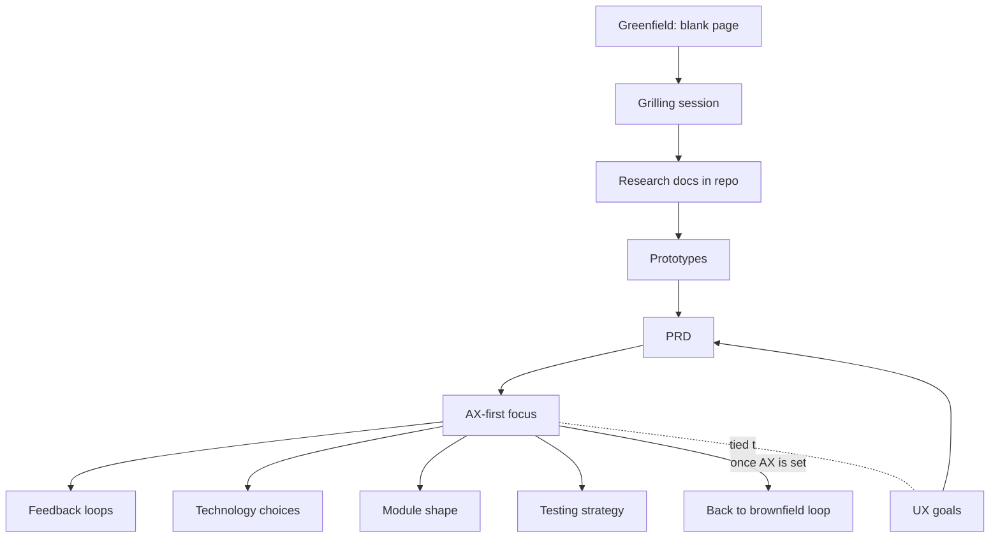

# Appendix: Greenfield Projects
Source: AI Hero — "AI coding for real engineers" workshop (appendix) · Course: Mattpock/AI coding for real engineers · Added: 2026-06-11

## Summary
Part of Matt Pocock's AI Hero workshop. Most of the cohort's work was **brownfield** (building inside an existing app); this appendix tackles the opposite — **greenfield**, starting from a blank page. The core insight: the hard part of greenfield isn't the product, it's setting up **agent experience (AX)** first — feedback loops, technology choices, module shape, and testing strategy — often via its own PRD *before* the user-facing one. The recommended path is grill → research docs → prototypes → AX-focused PRD. Once AX is nailed, the project collapses back into the familiar brownfield loop. Watch this for how to bootstrap a new codebase so an agent can work in it well from day one.

## Glossary

**Greenfield**:
Starting a brand-new project with nothing built before you — a blank, unbuilt field.
_Avoid_: from scratch, new build

**Brownfield**:
Building inside an existing setup — a legacy or established codebase whose patterns and constraints shape what you do.
_Avoid_: legacy work, existing codebase

**UX (User Experience)**:
The experience of the end user of the product.

**AX (Agent Experience)**:
The experience of the *agent* working in the codebase — how easy it is for an AI agent to produce quality code, governed by feedback loops, tech choices, module shape, and testing strategy.
_Avoid_: dev experience, DX

**Grilling session**:
An interactive Q&A with the agent at the start of work, used to hammer out a vague idea into something concrete.

**Research documentation**:
Markdown files committed to the repo capturing the output of grilling sessions — a growing "codebase of decisions" that records the project's evolution and reasoning.

**PRD (Product Requirements Document)**:
The spec for what you're building. In greenfield you may write an **AX-first PRD** (tech, feedback loops, module shape) before a UX-facing one.

**Feedback loops**:
The automated checks — types, tests, pre-commit hooks, formatters — that keep the agent producing high-quality code from day one.

**Module shape / deep modules**:
The initial architecture: how modules are carved up and how much each one hides behind a simple interface. Crucial to AX and hard to change later.

## Key Notes

### Greenfield vs brownfield
- **Brownfield** = building inside an existing app, reusing its patterns and constraints (most of the cohort's work).
- **Greenfield** = nothing exists yet; you start from a blank page. The challenge is having no patterns to lean on.

### The greenfield startup sequence
1. **Grilling session** — chat with an agent to hammer out a vague idea and capture initial thinking.
2. **Research documentation** — save grilling output as markdown docs committed to the repo. Run *multiple* sessions, continually refining; you build up a "codebase" of decision documents.
3. **Prototype** — turn research questions into prototypes. They may be reused later or just kept as reference; iterating clarifies what you actually want to build.
4. **Write the PRD** — once the picture is clear. In greenfield this looks different from brownfield (see AX below).

### Why greenfield PRDs are different: AX before UX
- In **brownfield**, fundamentals are already nailed down, so you focus on **UX** (the user).
- In **greenfield**, the first thing to think about is **AX** — the agent experience. You probably need a PRD for AX *before* you even look at UX.
- The first PRD must still state some user-facing UX goals, but it leans heavily on AX: feedback loops, languages, and technologies.

### Agent experience essentials
- **Feedback loops** — types, tests, pre-commit hooks, formatters so the agent produces quality code from day one.
- **Technology choices** — language, front-end framework, etc. Hard to swap out later, so grill thoroughly with the agent.
- **Module shape** — the initial shape of modules and deep modules; code architecture is crucial to AX, so get it right early.
- **Testing strategies** — tied to module shape: what to mock, whether to use a test database, etc.

### The AX-first principle
- You can't sacrifice AX for UX — they're tied together. *What* you build influences tech choice, testing strategy, and module shape, so the thing you build must feed into *how* you build it.

### Back to brownfield
- Once AX is sorted (often via its own PRD), you start implementing issues, grabbing them, doing reviews — i.e. you're back in the familiar brownfield loop from the rest of the course.
- **Bottom line:** the difficulty of greenfield *is* setting up the agent experience. Once that's done, the normal loop takes over.

## Understanding Diagram

