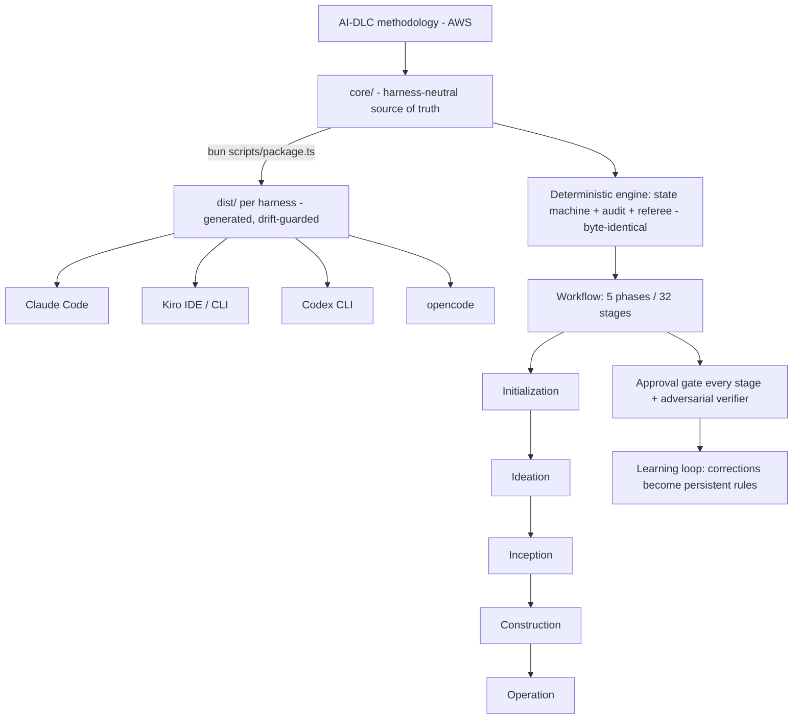

# AWS AI-DLC Workflows 2.0 - AWS Labs
Source: https://github.com/awslabs/aidlc-workflows/tree/v2 · Course: AI in SDLC · Added: 2026-07-27

Additional source (roadmap): https://awslabs.github.io/aidlc-workflows/roadmap/

## Summary
**AI-DLC (AI-Driven Development Life Cycle)** is an AWS-defined methodology for structured, gated, AI-driven software development; this repo (`awslabs/aidlc-workflows`, v2 / 2.0 GA) is its **native multi-harness implementation** — one harness-neutral `core/` rendered natively across Claude Code, Kiro IDE, Kiro CLI, Codex CLI, and opencode. It turns AI agents into "verifiable, self-correcting engineering workflows": **5 phases / 32 stages**, a **14-agent roster**, an **approval gate at every stage**, a learning loop that turns your corrections into persistent rules, and a 74-event audit trail. The goal is to stop context drift and unrecorded decisions once "the project gets real." The roadmap tracks progress against **7 north-star goals** (real-world ensemble, customization, adaptiveness, adversarial verifier, cyclic flows, traceability, org-wide artefact repo), with 2.4.0 declaring Full GA.

## Glossary

**AI-DLC (AI-Driven Development Life Cycle)**:
An AWS-defined **methodology** — a structured, gated approach to AI-driven software development. The methodology is the *what*; this repo is a native rendering of it. Each stage has a clear owner and passes an approval gate before the next begins.

**Harness-neutral `core/`**:
The single source of truth where the methodology lives once (tools, stage protocol, agents, knowledge, skills, templates). Every harness distribution is *generated* from it via `bun scripts/package.ts` — no harness gets special treatment.

**Harness**:
A runtime the methodology is rendered onto — today **Claude Code, Kiro IDE, Kiro CLI, Codex CLI, opencode** (and any capable harness you port to). The deterministic engine (state machine, audit log, parallel-agent referee) is **byte-identical** across harnesses; only the thin surface shell differs.

**5 phases / 32 stages**:
The lifecycle: **Initialization → Ideation → Inception → Construction → Operation**, subdivided into 32 stages. Depth and scope control how many stages run and how deeply.

**14-agent roster**:
11 domain experts + 2 review-only (quality-gate) agents + the **adaptive-workflows composer**. The two reviewers cover all 11 reviewer-declared stages.

**Adaptive scopes (9)**:
From enterprise down to workshop, auto-detected from freeform intent. Plus the **composer** (`/aidlc compose`) that proposes a tailored stage plan from your task, a scan report, or the running workflow (scale-in to a compact Fix/Test/PR; scale-out to decide next stages at boundaries).

**Depth levels (3) & test-strategy levels (3)**:
Minimal / Standard / Comprehensive — depth controls artifact detail per stage; test strategy controls coverage **independently** of depth.

**Approval gates**:
Every stage ends at a human approval gate — you stay in control of all decisions.

**Verifier / reviewer (adversary)**:
An adversarial quality gate that **refutes rather than confirms**, validates against machine-checkable evidence (tests, lint, typecheck, acceptance criteria, consumed contracts), may use a **different LLM** than the producer, and runs a budgeted self-heal loop escalating to HITL.

**Two-tier knowledge + rules/learning loop**:
Methodology knowledge ships with the framework; **team knowledge** is user-managed. Human corrections become **persistent behavioral rules** so the system stops repeating mistakes.

**Spaces / intents / org-KB**:
The per-intent workspace and **organizational (not project-local) artefact repository** — shared org knowledge across projects, intents, and repos (Goal 7, shipped in 2.1.0).

**Plugins**:
The additive contribution seam (`plugins/`, per-harness emission, compose seam; 2.3.0) — new stages and behaviors without editing core.

## Key Notes

### What it is (methodology vs implementation)
- **AI-DLC = the methodology** (defined by AWS); **this repo = the native, multi-harness implementation** rendered as skills, agents, hooks, and tools from one `core/`.
- The same engine runs a throwaway PoC and a regulated enterprise rollout — it just runs *more* stages, in *more* depth.
- **Why:** ad-hoc AI coding breaks when projects get real — context drifts, decision reasoning goes unrecorded, the model does things you didn't ask for. AI-DLC adds structure: clear stage owners, approval gates, and recorded learnings.

### Key features
- **5 phases, 32 stages**; **14-agent roster**; **9 adaptive scopes** with auto-detection + `/aidlc compose`.
- **3 depth levels** and **3 (independent) test-strategy levels**; CLI utilities to jump to any stage/phase, check status, and change scope/depth/test-strategy mid-workflow.
- **Approval gate at every stage**, two-tier knowledge, rules + learning loop, **74-event audit trail**, and **session resume** (checkpoint / redo / jump-to-stage / fresh start).

### Harnesses & setup (Quick Start)
- **Invoke:** `/aidlc` on most harnesses; `$aidlc` (or `/skills → aidlc`) on Codex CLI. Verify any setup with `/aidlc --doctor`.
- **Shared prerequisite: `bun`** — every harness runs the same TypeScript hooks/CLI tools through it. Gotcha: bun must be on the **non-interactive PATH** (`~/.zshenv` / `~/.bashrc`), not just `~/.zshrc`.
- **Runs on AWS Bedrock** — enable model access and provide working AWS credentials before the first run. **Works best with `Claude Opus 4.8`**; weaker models may skip optional stage steps or rush gates.
- Install = copy from `dist/<harness>/` into your project (e.g. Claude Code: `dist/claude/.claude/` + `dist/claude/aidlc/`). The `aidlc/` shell ships the pre-built `spaces/default/memory/` method tree the engine reads — `--doctor`'s "workspace shell ready" check fails without it. Version floors: Kiro CLI ≥ 2.6, Codex CLI ≥ 0.145.0, opencode ≥ 1.17.
- **Get the code:** `git clone … && git checkout v2`; run installs from repo root.

### Repository layout (3 zones)
- **`core/`** (hand-authored, the *what*): 25 `aidlc-*.ts` engine tools, stage protocol + 32 stage files + conductor, 14 agents, knowledge/memory/scopes/sensors/hooks, 3 session skills, onboarding templates.
- **`harness/`** (hand-authored, the *how* per runtime): thin per-harness surfaces (manifest, orchestrator skill, agent JSONs, settings, hooks adapter) — small and divergent by design.
- **`dist/`** (generated, committed, drift-guarded — **never hand-edit**): the trees users copy. `bun scripts/package.ts` regenerates them; a hand-edit fails CI's byte-parity drift guard (`--check`).
- Build/test: `bun scripts/package.ts [<name>|--check]`; `bun tests/run-tests.ts [--ci|--release]`.

### Roadmap — 7 north-star goals & status
1. **Real-world ensemble** (Owner/Collaborator/Verifier) — *Partial* → lands 2.5.0.
2. **Customization** (new behavior in ≤2 targeted changes, reusable across harnesses) — *Shipped* (rules stack + 2.3.0 plugins).
3. **Adaptiveness** (scale-in/scale-out, composition not hard-wired) — *Shipped* (2.2.0 composer).
4. **Verifier as true adversary** (different LLM, machine-checkable evidence, budgeted self-heal → HITL) — *Partial* → 2.4.0.
5. **Cyclic, directional flows** (governed backward feedback loops) — *Partial* → 2.6.0.
6. **Artefact traceability** (downstream enriches upstream, not disconnected files) — *Partial* → 2.7.0.
7. **Organizational artefact repository** (shared org KB across projects) — *Shipped* (2.1.0 spaces/intents/org-KB).

### Roadmap — outstanding minors
- **2.4.0 Reviewer-as-verifier (declares Full GA)** — a *prompt-only* change: adversarial refute-not-confirm + evidence-grounding contract in stage-protocol §12a + reviewer personas. Explicitly out of scope: token budget, bespoke validators, new schema fields. No new agent.
- **2.5.0 Three-role ensemble** — collaborators become independent subagents; collaboration pattern (pipeline / swarm / review-loop / mob) becomes a per-stage knob.
- **2.6.0 Governed cyclic flows** — engine-managed backward edges (today the graph compile rejects all cycles; `requires_stage` is forward-only).
- **2.7.0 Progressive enrichment** — downstream stages enrich the same upstream artefact in place; ADRs as a core design artefact.
- **Known gaps** (not on the minor ladder): rules-enforcement (#495 — paths emitted but nothing forces the conductor to read them), stage-level rules layer (reserved/unbuilt), plugin deferred surfaces/marketplace, advisory-only sensors (can't block a gate), cross-unit discovery propagation.

## Understanding Diagram

