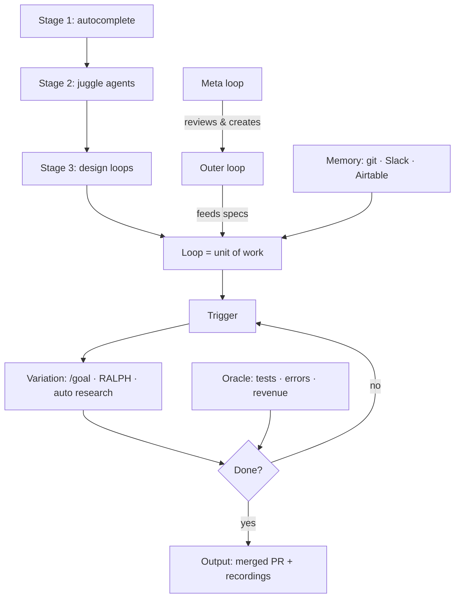

# How the Top 1% Actually Run Claude Code Now
Source: https://www.youtube.com/watch?v=2-0lxK2wgJ8 · Course: Agentic Loops · Added: 2026-06-11

## Summary
A high-level walkthrough of the shift from *prompting agents* to *designing loops that prompt agents for you* — framed as "stage 3" of AI coding. It explains the anatomy of a loop (trigger → variation → check → repeat), how to wrap your manual implement/review/verify cycle into one self-running loop, and how **inner loops** (build a spec) nest inside **outer loops** (feed new specs). Covers giving stateless loops memory (git, Airtable, Slack), keeping "slop"/entropy in check with adversarial review and external oracles, and where this is heading (meta-loops that build loops). Watch for the mental model, not step-by-step setup.

## Glossary

**Loop**:
A self-running system that prompts agents for you: a trigger fires a variation of work, a check decides if it's done, and it repeats otherwise. In stage 3, the loop — not the prompt — is the unit of work.
_Avoid_: automation, script, workflow

**Stage 3**:
The paradigm where you design loops instead of prompting directly. (Stage 1 = AI autocomplete; stage 2 = manually juggling many agent windows.)

**Inner loop**:
A loop that implements a spec — the build cycle of implement → code-review → fix → verify → merged PR.

**Outer loop**:
A longer-running loop that manages/feeds an inner loop — e.g. monitors competitors daily, writes a new spec, and (after human approval) triggers the inner loop to build it.

**Meta loop**:
A loop that reviews your existing loops — which ones move the bottom line — and proposes or creates new loops, with your approval.

**/goal**:
A Claude Code / Codex command that runs autonomously toward a goal (e.g. tested 300+ user flows over 19 hours, recording each one for later review).

**/loop**:
A Claude Code command that re-runs a prompt on a recurring interval (e.g. `/loop 2 minutes check for errors`).

**RALPH loop**:
Breaking a big task into many small tasks, each executed in a fresh context window.

**Auto research**:
A loop that tries variations, scores each against a benchmark, keeps what improves and reverts what doesn't (à la Karpathy's AutoResearch; also Microsoft's self-improving skills).

**Oracle**:
An external source of truth that scores a loop's output to keep it honest — passing tests, real production errors, Stripe revenue, reply rates.
_Avoid_: ground truth check

**Entropy**:
The disorder/"slop" that accumulates as agents do large volumes of work quickly; loops let it compound unless deliberately checked.

**Memory layer**:
Persistent state that makes stateless loops aware of prior runs so they compound — git/commits, Airtable, or Slack.

**Slack as a decision surface**:
Using a per-loop Slack channel as both memory (the bot's past messages) and human-in-the-loop steering (you react with an emoji and the next run acts on your choice).

## Key Notes

### The three stages of AI coding
- **Stage 1** (1–2 years ago): hand-coding with AI autocomplete — it finishes the line/function.
- **Stage 2** (where most people are now): juggling 6+ agent windows, manually prompting each — still inside every agent's loop.
- **Stage 3**: you write loops that prompt the agents; the **unit of work becomes the loop, not the prompt**. Boris Cherny (Claude Code) and an OpenAI creator both pointed here, without teaching the "how" — hence the gatekept feeling.

### Anatomy of a loop
- **Trigger** (a prompt, a time of day, or a data-source event) → **Variation** (a `/goal`, auto research, or RALPH loop) → **Check** ("done?") → repeat if not.
- Concrete example: a scheduled task that every 24h scans **Sentry**, finds issues affecting >20 users, and auto-opens a PR fixing each.
- Every run is **stateless** → loops need a memory layer.

### Turning your manual loops into one big loop
- The back-and-forth you already do is several **manual loops you drive**: implement → `/code-review` (spins up subagents) → fix (repeat 2–3×) → verify in browser (Claude in Chrome, screen recordings) → merge PR → `/loop` check for errors.
- Stage 3 wraps that whole thing as **one loop**: input = a **spec you still write yourself** (you decide how the feature looks); output = a **merged PR + screen recordings** proving it works.
- Design the loop *with* an agent — define inputs, actions, checks, where memory lives, the exit condition, and where it surfaces results (Slack/Telegram).

### Inner & outer loops
- **Inner** = implements specs. **Outer** = feeds the inner loop new specs.
- Example outer loop: check competitors' LinkedIn/X/changelogs daily → use browser/computer use to learn a new feature → write a spec → **human-in-the-loop approve** → trigger the inner build (else wait until tomorrow).
- ML example: inner `/goal` hunts performance improvements; outer monitors arXiv daily for new strategies, passes promising ones down, and notifies you on Slack when a strategy beats the baseline by some %.
- Non-technical example: cold-email inner loop improves copy on 10% of the list with daily HITL feedback; weekly outer loop monitors fake inboxes catching competitors' campaigns.

### Memory makes loops compound
- Give loops memory so they don't repeat themselves: **git/commits** (the Sentry loop reads yesterday's commits), **Airtable** (via Claude Code connectors — "check we haven't done this before"), or **Slack**.
- **Slack as memory + decision surface**: one channel per loop; a bot posts findings/recommendations; you react with an emoji (e.g. pick option #4) and the next run reads the reaction and acts — memory for the loop, steering for you.

### Keep entropy/slop in check
- Memory compounds value **and** slop. Entropy rises over time anyway; agents collapse lots of work into a short time, so daily entropy is far higher than before.
- Counters: **outer loops** that ground the inner loop in external sources; **adversarial code reviews** baked into the loop; and an **oracle outside the model** (tests, production errors, revenue, reply rates) so improvements are real, not just plausible.

### The next evolution
- Boris's abstraction ladder: punch cards (1940s) → assembly → high-level languages (C) → libraries/frameworks (Rails, Next.js) → prompts → **loops**. Leverage keeps moving up; you design the thing that runs rather than running it.
- Coming soon: **meta-loops** that audit which of your loops drive the bottom line and propose/create new ones (with approval). Models lack the "taste" to pick good loops yet, so expect 10–20 suggestions you filter.
- **Token economics**: loops burn tokens (he spent 4.1M in one run) — only worth it when the tokens are *economically valuable*, i.e. they earn back more than they cost.

## Understanding Diagram

