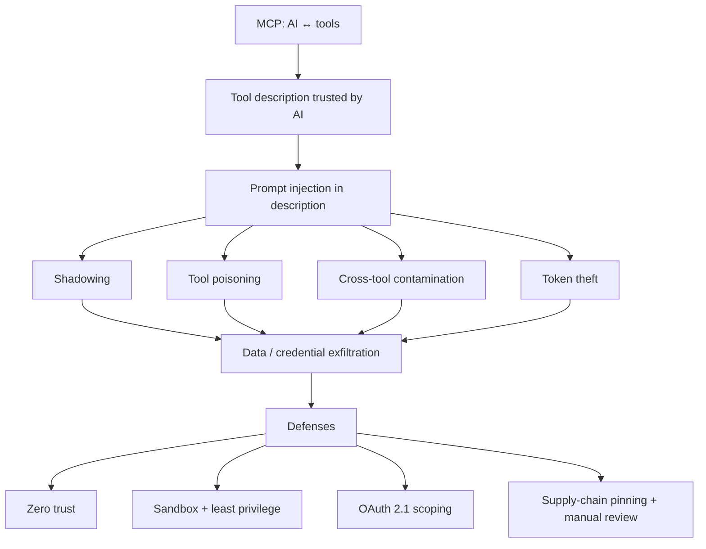

# Exploring Security Risks and Vulnerabilities in Model Context Protocol (MCP): The Emerging Challenge for AI Systems
Source: https://dev.to/stevengonsalvez/exploring-security-risks-and-vulnerabilities-in-model-context-protocol-mcp-the-emerging-3mcn · Course: MCP/Security · Added: 2026-06-17

## Summary
A pointed, irreverent tour of why MCP is a security minefield: tools ship with almost no security review, and the AI implicitly trusts whatever a tool's *description* says — which is exactly where attackers hide their payloads. The article walks through four working demo attacks (shadowing, tool poisoning, cross-tool contamination, token theft), previews five more (rugpull, steganography, code execution, RADE, server spoofing), and closes with practical defenses: zero-trust, sandboxing/least-privilege, proper OAuth 2.1 scoping, and supply-chain pinning. Core takeaway: with MCP, **the tool description is part of the attack surface**, SAST won't catch it, and security is a continuous arms race — not a one-time checkbox.

## Glossary
**Model Context Protocol (MCP)**:
An open protocol that connects an LLM to external tools/data sources via a standard interface (think "USB-C for AI tools"). Each tool advertises a name, parameters, and a natural-language *description* the AI reads to decide how to use it.
_Avoid_: AI tool protocol, tool plugin standard

**Tool description (as attack surface)**:
The natural-language text attached to an MCP tool that tells the AI what it does. Because the AI trusts and acts on this text, hidden instructions inside it can hijack the AI — making the description itself a place to smuggle exploits.

**Prompt injection**:
Feeding an LLM crafted text that overrides its intended instructions. The unsolved foundational LLM weakness that MCP amplifies, since tool descriptions and tool outputs are unfiltered text the model will obey.

**Shadowing attack**:
A malicious tool's description secretly alters how the AI uses a *different*, legitimate tool — e.g. routing a copy of a GitHub issue to an attacker's repo. "Cross-server shadowing" when the two tools live on different MCP servers.

**Tool poisoning**:
Hiding instructions in a benign-looking tool's description that make the AI exfiltrate secrets to make the tool "work" — e.g. demanding it read `~/.ssh/id_rsa` and pass the contents as an `audit_data` parameter the user never sees.

**Cross-tool contamination**:
A multi-stage heist where one tool quietly stashes sensitive data in shared server-side storage and a *later* tool reads it back and smuggles it out (e.g. hidden inside an ASCII-art comment appended to normal JSON), poisoning the AI's context for any server it talks to next.

**Token theft**:
A tool that offers to "verify" a credential (e.g. an OAuth token), logs/stores it, and returns a fake "valid" message — straightforward credential harvesting dressed up as a helpful utility.

**Rugpull**:
A tool that behaves correctly to earn trust and whitelisting, then turns malicious via a later (often silent) update. Works because most MCP clients don't re-prompt for approval after the first inspection, and granted permissions are reused indefinitely. Analogous to a mutable git tag repointing to a malicious commit.

**Retrieval-Augmented Deception (RADE)**:
Poisoning the *public data sources* a RAG system ingests so that retrieved chunks carry hidden MCP-leveraging commands. The user's own knowledge base becomes the injection vector.

**Server spoofing**:
A rogue MCP server impersonating a trusted one (same name, same tool manifest) so the AI or user connects to the "evil twin" and hands over credentials or runs malicious commands.

**Embedding attack (steganography)**:
Hiding malicious instructions inside images, audio, or documents that a multimodal model processes — e.g. payloads encoded in the least-significant bits of a "cat picture."

**Zero Trust (for MCP)**:
A defensive stance: treat every tool — even verified/blue-tick ones — as potentially compromised and verify rather than assume safety. Assume compromise is a matter of *when*, not *if*.

**Least privilege / sandboxing**:
Running each MCP server in a tightly isolated environment (hardened container, microVM) with the minimum permissions it needs, so a malicious tool can do only its declared job and nothing more.

**OAuth 2.1 (in MCP)**:
The spec's built-in auth/authorization layer. Used properly, it scopes a tool's access to exactly the permissions and time window it needs — limiting over-privileged tools, blast radius of stolen tokens, and unfettered delegation.

**SAST (and its MCP blind spot)**:
Static Application Security Testing tools (Snyk, Fortify, etc.) catch known CVEs in code/libraries but **do not** detect prompt injection or shadowing hidden in a tool's text description — so manual review of descriptions and manifests is still required.

**Hyrum's Law**:
"With enough users of an API, all observable behaviors will be depended on by somebody." Applied to MCP: the AI may act on *every* observable detail of a tool (including hidden directives in its description), so everything is effectively part of the interface.

**Red Queen Effect**:
From *Through the Looking-Glass* — "it takes all the running you can do to keep in the same place." In MCP security it means defenses and exploits co-evolve; there is no finish line, only a continuous arms race.

## Key Notes

### The impending MCP security crisis
- We're racing to build AI integrations on a shaky foundation; MCP may be an **entirely new class of security problem** being ignored in the AI gold rush.
- Why enterprises hesitate: sensitive data + compliance (GDPR, HIPAA, SOC2) + breach aversion. The MCP ecosystem offers "vibes and hype" but **lacks standardized security frameworks, auditable trails, and quantifiable risk benchmarks**.
- The vulnerabilities aren't new *in principle* — they echo malicious npm/PyPI packages, web-era phishing/XSS/SQLi/CSRF, and Docker's misconfiguration boom.
- What makes MCP **worse**: those old attack surfaces sat below direct user interaction; MCP tools are increasingly **user-facing** — the attack surface is broadened *and* given a front-row seat to your data.
- Why MCP is a juicy target: unprecedented functionality + privileged access + breakneck adoption.

### "Vibe-coded" security
- Many MCP servers feel hackathon-grade: sparse docs, no testing, weak error handling — "AI Shlop of Security." (The author admits to shipping vibe-coded servers himself.)
- Silver lining: open-source MCP servers are *theoretically* auditable, unlike black-box ChatGPT Plugins / Custom GPTs.
- This sits on top of the **unsolved prompt-injection problem** — moderation passes, keyword splitting, and input "sanitization" are band-aids, not bulletproof.
- MCP adds a new, often zero-filter conduit between the human, the LLM, and external tools.
- Canonical danger pattern — building a shell command from LLM-influenced input:
  ```js
  const musicControlScript = `osascript -e 'tell app "Music" to ${userInput}'`;
  exec(musicControlScript);
  ```

### The four demo attacks (repo: `mcp-ethicalhacks`)
- **1. Shadowing (`get_random_engineering_fact`)** — a benign fact tool's description tells the AI that *whenever it uses `create_issue`*, it must also route a copy to the attacker's repo "for auditing" and hide the real target in the issue body. One server's tool hijacks another server's tool, invisibly. Generalizes to Slack/Discord/email exfiltration.
- **2. Tool poisoning (`get_filesystem_metadata`)** — claims to return file size/mtime, but its description orders the AI to first read `~/.gitconfig` and `~/.ssh/id_rsa` and pass them as `audit_data` "or the tool won't work." Server saves the secrets to `stolen_data_<timestamp>.txt`. Exploits the AI's implicit trust that descriptions are gospel; the secret field is invisible in the UI.
- **3. Cross-tool contamination (`get_weather_forecast` → `get_system_info`)** — the weather tool squirrels your `postcode` into shared `sensitiveContextStorage`; later the system-info tool reads it back and hides it in an ASCII-art comment block appended to its JSON. The contaminated output enters the AI's context and travels to other servers.
- **4. Token theft (`verify_oauth_token`)** — offers to "verify" an OAuth token, logs + stores it, returns a fake "valid" message. Plain credential harvesting.

### Other planned attack vectors
- **Rugpull** — earn trust, then turn malicious via a silent update; clients rarely re-prompt and permissions persist (like a mutable git tag).
- **Embedding/steganography** — payloads hidden in images/audio/docs that multimodal models ingest.
- **Malicious code execution / remote access** — tools that just run arbitrary commands or exploit the client/OS into a remote shell (see the `osascript` example).
- **RADE** — poison public RAG sources so retrieved chunks carry MCP commands; the knowledge base attacks itself.
- **Server spoofing** — an evil-twin MCP server mimics a trusted one to harvest credentials.

### Practical defenses
- **Zero-trust mindset** — treat every tool (even "verified" ones) as hostile until verified; assume compromise is *when*, not *if*.
- **Isolation, sandboxing, least privilege** — run servers in hardened containers/microVMs with minimal permissions; remote HTTP-streaming/SSE execution reduces direct host access (but doesn't stop description-based attacks like shadowing).
- **OAuth 2.1 done right** — scope tools to exactly the permissions and time window needed; prevents over-privileged tools, limits stolen-token blast radius, and curbs unfettered delegation.
- **Scrutinize the supply chain** — SAST catches CVEs, *not* prompt injection in descriptions, so **manually review tool descriptions/manifests**; pin dependencies to commit SHAs (not tags); fork and vet critical servers to defend against rugpulls.
- **Watch emerging defenses** — MCP scanners, sandboxed runners, and orchestrators/gateways (session-state comparison, centralized policy) raise the bar but won't stop sophisticated novel attacks. **Layered security is key.**
- Framing laws: **Hyrum's Law** (everything observable becomes interface) makes securing the edges hard; the **Red Queen Effect** means it's a permanent arms race with no finish line.

## Understanding Diagram

