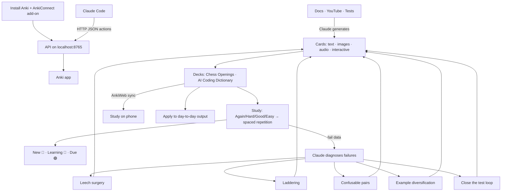

# Anki with Claude — Setup, What We Built, and Workflows
Source: https://foosoft.net/projects/anki-connect/ · Course: Anki · Added: 2026-06-25

## Summary
A practical note on driving **Anki** (a spaced-repetition flashcard app) from **Claude** via the **AnkiConnect** add-on. It covers how to install Anki and wire it to Claude, what we actually built together (an interactive chess-openings deck and an AI-coding-dictionary deck), how to study cards day-to-day (the Again/Hard/Good/Easy engine and the New/Learning/Due counts), and a set of higher-leverage workflows for generating cards from documents/videos and using AI to diagnose and fix the cards you keep failing. Read this to remember *how the pipeline is wired* and *what Claude can do once connected*.

## Glossary

**Anki**:
A free, open-source spaced-repetition flashcard app. Shows you a card's front (question), you recall the answer, reveal the back, and rate how it went — Anki schedules the next review accordingly. Runs on desktop, web (AnkiWeb), and phone.

**Spaced repetition**:
The learning engine behind Anki — cards you know well come back less often; cards you fail come back sooner. Maximizes retention per minute studied.

**AnkiConnect**:
An Anki add-on that exposes an HTTP API on `http://localhost:8765`. This is the *only* way Claude can see and control Anki — it must be running with the add-on loaded.

**Note vs. Card**:
A **note** is the raw content (fields like Front/Back). A note can generate **multiple cards** (e.g. a forward "recognition" card and a reverse "recall" card from the same note).

**Note type (model)**:
The template that defines a note's fields and how cards are rendered (HTML/CSS/JS). Built-ins: Basic, Basic (and reversed), Cloze, Image Occlusion. Custom note types can embed interactive widgets (we built one with a clickable chessboard).

**Deck**:
A named collection of cards (e.g. `Chess Openings`, `AI Coding Dictionary`).

**Recognition vs. Recall**:
Recognition card = "do I know this term when I see it?" (front = term). Recall card = "can I produce the term from its definition?" (front = definition). Recall sticks better.

**Leech**:
A card you keep failing (high lapse count). Anki flags leeches; they're candidates for rewriting/simplifying.

## Key Notes

### How to install Anki and connect it to Claude
1. **Install Anki (desktop).** Download from <https://apps.ankiweb.net/> and install. The desktop app is required — the add-on runs inside it.
2. **(Optional) Create a free AnkiWeb account** at <https://ankiweb.net/> so your decks sync to phone/web.
3. **Install the AnkiConnect add-on:**
   - In Anki: **Tools → Add-ons → Get Add-ons…**
   - Paste the code **`2055492159`** → OK → **restart Anki**.
4. **Verify it's live** (Anki must be open). AnkiConnect exposes an HTTP API on `localhost:8765`:
   ```bash
   curl localhost:8765 -X POST -d '{"action":"version","version":6}'
   # → {"result": 6, "error": null}
   ```
5. **Connect Claude.** Once the port answers, Claude (Claude Code) talks to Anki by POSTing AnkiConnect JSON actions to `http://localhost:8765` — e.g. `deckNames`, `createDeck`, `addNote`, `findCards`, `cardsInfo`. No extra MCP server needed; plain HTTP requests work.
   - Chain: **Anki (open) → AnkiConnect add-on → port 8765 → Claude's HTTP requests.**
   - If the port refuses the connection, Anki is closed or the add-on is disabled.

### What we built together
- **Connection confirmed** — AnkiConnect reachable on `localhost:8765`, API version 6, profile `User 1`. Built-in note types present (Basic, Cloze, Image Occlusion, etc.).
- **Interactive Chess Openings deck** — you asked for 10 opening moves (beginner → advanced) and how to respond, as interactive flashcards.
  - Custom note type **`Chess Opening (Interactive)`** with an **embedded clickable chessboard** (click a piece → click a square to play your guess; **Reset**/**Flip** buttons; board auto-orients to side-to-move). Self-contained JS — no extra add-ons.
  - Deck **`Chess Openings`** (10 cards): front = position after opponent's move + "how should X respond?"; back = best response, highlighted on the board.
  - Cards live in Anki's DB, not as repo files — so we also generated a standalone preview to open in VS Code: **`D:\AI-Learning\Chess\chess-openings-flashcards.html`** (open via Simple Browser, Live Preview extension, or a normal browser).
- **AI Coding Dictionary deck** — turning the repo's learning notes (~70 terms across 7 sections) into cards.
  - Card design reviewed: one concept per card, plain language, example, memory hook, source quote. Key decision: choose **recognition vs. recall** for the front (recall sticks better).
  - Built a Section 1 sample: deck **`AI Coding Dictionary`**, 15 notes → 23 cards (15 recognition + 8 reverse-recall).

### How to study cards day-to-day
- **Study flow:** deck list → click a deck → **Study Now** → read the **front** → think → **Show Answer** (or **Spacebar**) → rate it.
- **The rating buttons** (you press one *after* revealing the answer, judged honestly):
  | Button | Means | Effect |
  |--------|-------|--------|
  | **Again** (red) | forgot / wrong | resets card, ~1 min, counts as a lapse |
  | **Hard** (orange) | got it, but a struggle | shorter next interval |
  | **Good** (green) | recalled fine | normal interval growth |
  | **Easy** (blue) | trivial | larger jump in interval |
  These choices *are* the spaced-repetition engine — they set when you see the card next.
- **The colored counts** next to each deck (and on the study screen as `New + Learning + Due`):
  | Color | Name | Meaning |
  |-------|------|---------|
  | 🔵 Blue | **New** | never studied; fed in gradually (default 20/day) |
  | 🔴 Red | **Learning** | in the short-term loop (minutes apart) or just failed |
  | 🟢 Green | **Due** | review cards whose interval elapsed |
  - e.g. `0 + 12 + 0` = no new cards left, 12 still in learning steps, 0 reviews due. All zero = deck done for the day.
- **Gear ⚙️** per deck → Options (new-cards/day, learning steps, etc.), rename, custom study.

### What Claude can do once connected (capabilities)
- **Create flashcards in any format we need** — Claude connects through the add-on and builds cards in whatever note type/layout fits (Basic, Cloze, custom interactive).
- **Rich cards** — a card can hold a specific topic, description, **images/diagrams**, and **audio**.
- **Generate cards from sources** — from a document, a YouTube video, etc. Instruct Claude to attach relevant images/diagrams; **if it finds a gap in coverage, it creates a card for it.**
- **Multi-source** — provide several videos/docs and ask Claude to prepare cards that reference across them.
- **Progress tracking** — track how many topics you've read vs. how many remain.
- **Self-test** — see the question, answer it yourself, then flip the card to verify.
- **Phone access** — sync via AnkiWeb to study on mobile.

### Higher-leverage workflows (AI-assisted card improvement)
- **Diagnose failures** — based on your answers and failing cards, ask Claude to go through the deck, identify *where* you're failing, and recommend whether to re-read or simplify that content.
- **Priority** — prioritize / reorder cards by importance.
- **Leech surgery** — find high-lapse / low-retention cards, diagnose *why* they're hard, and rewrite them easier.
- **Laddering** — when you fail a hard card because an intermediate concept is missing, auto-insert the easier "rungs" beneath it.
- **Confusable pairs** — detect cards you mix up (failed together / similar answers) and write explicit **contrast** cards.
- **Example diversification** — a fact learned from one example is context-bound; Claude adds varied examples so recall generalizes.
- **Closing the test loop** — feed any real test/quiz results back into Claude Code and have it restructure the cards accordingly.
- **Applying the cards** — connect the deck to your actual output/work to check whether the knowledge is showing up in day-to-day practice.

## Understanding Diagram

