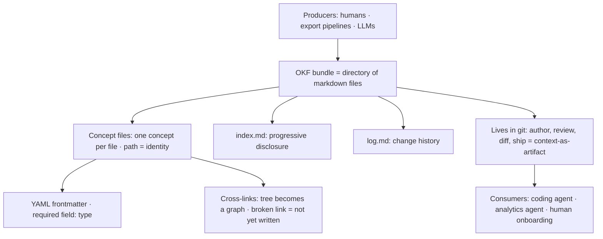

# The Context Layer Gets a Format - OKF-rajibdeb
Source: https://rajibdeb.substack.com/p/the-context-layer-gets-a-format-a · Course: Context Engineering · Added: 2026-07-27

## Summary
Rajib Deb's deep look (04 Jul 2026) at **Google's Open Knowledge Format (OKF)** — an open, vendor-neutral spec (June 2026) for representing the metadata, context, and curated knowledge that AI agents need. The framing: decades of data organization (data lakes, medallion architecture, vault modeling) were "context engineering before the term existed," but always aimed at *humans* reading dashboards. Agents need something different — an external version of the brain's **wiki** (categorized, compartmentalized, pointer-rich) — because unlike humans they can't filter signal from noise. Google's bet is that what's missing is a **format, not another service**: OKF v0.1 is deliberately boring — a directory of markdown files with YAML frontmatter, cross-links, `index.md`, and `log.md`, all in git. The big shift: the context layer stops being a runtime activity (RAG/embeddings) and becomes a **versioned artifact** you author, review, diff, and ship like code.

## Glossary

**Open Knowledge Format (OKF)**:
Google's open, vendor-neutral specification (June 2026) for representing metadata, context, and curated knowledge for AI systems. The first serious attempt to standardize a **universal context layer**. v0.1 = "a directory of markdown files with YAML frontmatter" + a few conventions; no compression, no runtime, no required SDK.

**Universal context layer**:
A single, portable representation of an organization's knowledge (what a table means, how a metric is defined, safe join paths, runbooks) that any producer can write and any consumer/agent can read — the layer agents have been missing.

**Bundle**:
An OKF unit — a **directory of markdown files**, each representing one **concept**; shippable as a tarball, hostable in any git repo.

**Concept (one concept, one file)**:
A table, dataset, metric, playbook, API — anything worth capturing. Each is a single markdown file whose **path is its identity**, carrying a YAML frontmatter block + a markdown body.

**YAML frontmatter / `type`**:
The small structured block on each concept file for queryable fields. Conformance requires **exactly one field: `type`** — everything else is up to the producer.

**Cross-links (tree → graph)**:
Ordinary markdown links between concepts expressing richer relationships (joins-with, depends-on, references) than the filesystem's parent/child tree. Consumers build a knowledge graph by following links. **Broken links are not an error** — a link to a not-yet-existing doc simply means not-yet-written knowledge.

**`index.md` (progressive disclosure)**:
Index files that let an agent read the root, see what's available, and navigate one level at a time — no need to load the whole bundle into a constrained context window.

**`log.md`**:
An optional chronological record of changes — institutional memory (what moved and when) that traditional catalogs rarely surface.

**LLM wiki (Karpathy)**:
The organically-emerging pattern OKF standardizes — give agents a shared markdown library that grows more useful over time; agents do the bookkeeping (read, cross-reference, update, "touch 15 files in one pass"), humans curate content like code. Seen before as Obsidian vaults, `AGENTS.md`/`CLAUDE.md`, `index.md`/`log.md` repos, and "metadata as code" — but every instance was bespoke and non-interoperable.

**Context-as-artifact**:
OKF's core reframe — the context layer moves from a *runtime* activity (RAG, embedding stores, prompt assembly) to a **versioned artifact**: authored, reviewed, diffed, and shipped like code, living in git.

## Key Notes

### The framing: humans vs agents
- Data lakes, **medallion architecture**, **vault modeling** = context engineering avant la lettre — but sculpted for *humans* reading marts/semantic models/dashboards. Agents don't need another dashboard; they need context.
- Humans do one thing extraordinarily well agents can't: **filter signal from noise**, via an internal "wiki" that stores *pointers* to knowledge, categorized and compartmentalized — recall *that* you know something before recalling the thing. Foundation models have no such structure over *your* world. **Models are no longer the bottleneck; trustworthy context about your systems is.**

### The problem: context is "everywhere, and nowhere"
- The answer to "how do I compute weekly active users?" is scattered across a metadata catalog, a stale wiki page, docstrings/notebooks, and a few senior engineers' heads — mutually incompatible surfaces (each vendor its own SDK + schema), none portable. Every agent builder re-solves context assembly from scratch.

### Google's insight: a format, not a platform
- Reject building another catalog/service/API. Represent knowledge so that anyone can **produce** (no SDK), **consume** (no integration), that **survives moving** between systems/orgs/tools, lives in **version control** beside the code it describes, and is **human-readable + agent-parseable in the same file** (no translation layer).
- OKF v0.1 is provocatively simple: **markdown + files + YAML frontmatter**. The whole spec (conformance rules, cross-linking semantics, reserved filenames) fits on one page.

### How OKF works — three structural ideas
- **Cross-links** turn the file tree into a graph (broken links = not-yet-written, not errors).
- **`index.md`** enables progressive disclosure (navigate a level at a time).
- **`log.md`** carries optional history. Conformance needs almost nothing — parseable frontmatter with the one required `type` field.

### Three design principles
1. **Minimally opinionated** — only `type` is required; the spec defines the *interoperability surface*, not the content model. Consumers must gracefully tolerate unknown types/fields and missing optional pieces.
2. **Producer/consumer independence** — who writes ≠ who reads. Human-authored, pipeline-generated, or LLM-synthesized bundles are all consumable by any end; the format is the contract, tooling is swappable.
3. **Format, not platform** — no cloud/DB/model/framework lock-in, never a proprietary account or SDK. "The value of a knowledge format comes from how many parties speak it, not from who owns it."

### Why it matters
- Knowledge curation becomes a **software-engineering activity** — PRs, diffs, blame, review, because bundles live in git.
- Context becomes **portable across the agent stack** — one bundle feeds a coding agent, an analytics agent, and human onboarding. Write once, consume everywhere.
- Organizations can **exchange knowledge, not just data** — ship meaning (schemas, semantics, join paths, caveats) alongside the bytes.
- The **flywheel favors agents maintaining their own context** — enrichment agents write bundles, consumption agents read them, humans review diffs; the participants who hate bookkeeping (us) stop doing it.

### Open questions & bottom line
- **Adoption** (network effect — will Unity Catalog / Collibra / Atlan write exporters? will agent frameworks treat OKF as first-class?), **governance of trust** (freshness/accuracy/authority — spec handles structure, not correctness), **scale** (progressive disclosure at tens of thousands of concepts; search/retrieval layers feel inevitable), and **untyped links** (relationships are prose around a link, not typed edges).
- Bottom line: *"The format itself is the contribution."* Boring on purpose (markdown, YAML, files, git) — so knowledge stops being an exhaust product of tools and becomes a first-class, portable asset.

## Understanding Diagram

