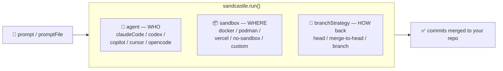
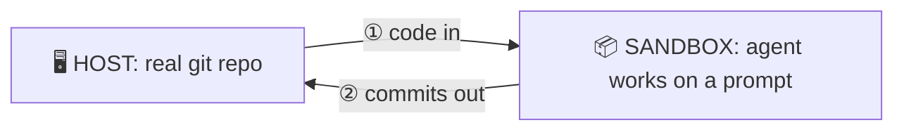

# Sandcastle — Overview & Quick Revision

A one-page skim of **[`@ai-hero/sandcastle`](https://github.com/mattpocock/sandcastle)** — enough to grok it (or re-grok it) in a few minutes. For install, full detail, diagrams, and recipes, go to **[Detailed Notes](02-detailed-notes.md)**.

---

## In one paragraph

Sandcastle is a **TypeScript library that runs an AI coding agent against a copy of your repo, inside an isolated sandbox, then merges the good commits back**. One call — `run()` — does the whole loop: copy code in → run the agent on a prompt → collect commits → merge home. It's **provider-agnostic** (Docker, Podman, Vercel, or your own) and **unopinionated** about workflow. You get **safety** (agents can't wreck your working tree), **parallelism** (many agents/branches at once), and **pipelines** (implement → verify → review → merge) — identically local or in CI.

```typescript
import { run, claudeCode } from "@ai-hero/sandcastle";
import { docker } from "@ai-hero/sandcastle/sandboxes/docker";

await run({
  agent: claudeCode("claude-opus-4-8"), // WHO
  sandbox: docker(),                      // WHERE (isolated)
  promptFile: ".sandcastle/prompt.md",   // WHAT
});
```

---

## Mental model (the part to actually remember)

**① Robot in a sealed playroom.** Your real repo is your **house** (the *Host*). You've hired a robot you don't fully trust yet (the *Agent*), so you build it a **sealed playroom** from a pre-furnished kit (the *Sandbox*) — whatever mess it makes stays inside. **Sandcastle is the site manager**: builds the room, slides the instructions under the door (*prompt*), lets the robot work, inspects, and **carries the finished builds back into the house** (*branch strategy*). Every provider option is just a deliberate small hole in the wall — a window onto one shelf (`mounts`), a phone line (`network`), a borrowed power tool (`devices`). → build in a sandbox, bring the good parts home.

**② Three pluggable slots + one data flow.** Everything is one of three slots or config around them:





Hold **agent (who) · sandbox (where) · branchStrategy (how) · prompt→commits (flow)** and everything else slots in.

---

## The repo / package at a glance

- **Package:** `@ai-hero/sandcastle` — install as a dev dependency; scaffold with `npx @ai-hero/sandcastle init` (interactive: pick a sandbox provider, issue tracker, and one of five templates — `blank`, `simple-loop`, `sequential-reviewer`, `parallel-planner`, `parallel-planner-with-review`).
- **`.sandcastle/` (scaffolded in your repo):** `Dockerfile` (sandbox image), the template's prompt file(s) + `main.mts` entry calling `run()`, `.env.example` (tokens), `.gitignore`.
- **Main exports:** `run`, `interactive`, `createSandbox`, `createWorktree`, `Output` (structured output), agent providers (`claudeCode`, `codex`, `pi`, `copilot`, `cursor`, `opencode`), and session helpers.
- **Sandbox providers (separate import paths):** `docker`, `podman`, `vercel`, `daytona`, `no-sandbox` (+ `createBindMountSandboxProvider` / `createIsolatedSandboxProvider` for custom).

---

## The three slots (cheat-sheet)

**Agents (`agent`)** — `claudeCode` ⭐ · `codex` · `pi` · `copilot` · `cursor` · `opencode` · custom. Swappable.

**Sandboxes (`sandbox`)**

| Provider | Type | Use for |
|---|---|---|
| **docker** ⭐ | Bind-mount | Local dev (default) |
| podman | Bind-mount | Rootless / secure hosts |
| vercel | Isolated (microVM) | CI / no local Docker |
| daytona | Isolated (cloud) | Cloud sandboxes (Daytona SDK) |
| no-sandbox | None | Trusted interactive only |

**Branch strategies (`branchStrategy`)**

| Strategy | Commits land… | Default for |
|---|---|---|
| `head` | your current working dir | bind-mount (docker/podman) |
| `merge-to-head` | temp branch → merged into HEAD | isolated (vercel) |
| `branch` | a named branch (reviewable/PR) | — |

---

## A tiny end-to-end example (implement → verify → review)

One warm sandbox, a test gate between two agents:

```typescript
import { createSandbox, claudeCode } from "@ai-hero/sandcastle";
import { docker } from "@ai-hero/sandcastle/sandboxes/docker";

await using sandbox = await createSandbox({
  branch: "agent/fix-42",
  sandbox: docker(),
  hooks: { sandbox: { onSandboxReady: [{ command: "npm install" }] } },
});

await sandbox.run({ agent: claudeCode("claude-opus-4-8"), promptFile: ".sandcastle/implement.md", maxIterations: 5 });

const tests = await sandbox.exec("npm test");       // exitCode returned, not thrown
if (tests.exitCode !== 0) throw new Error(tests.stderr);

await sandbox.run({ agent: claudeCode("claude-sonnet-4-6"), prompt: "Review the changes and fix any issues." });
```

---

## Quick-revision checklist (the things people forget)

- **Iteration = one agent invocation = ≤ 1 commit.** `run()` loops up to `maxIterations` (default **1**).
- **Stop early** with the **completion signal** (default `<promise>COMPLETE</promise>`) — tell the agent to emit it.
- **Two timeouts:** `idleTimeoutSeconds` (600) → silence **fails** the run; `completionTimeoutSeconds` (60) → grace after the signal, expiry **succeeds** with a warning.
- **Prompts:** `prompt` (inline, literal) **or** `promptFile` (supports `{{KEY}}` args + `` !`shell` `` expansion). Not both.
- **`head` has no worktree** → `copyToWorktree` and worktree hooks need `merge-to-head` or `branch`.
- **Reuse a sandbox** with `createSandbox()` (warm deps, `sandbox.exec()` for test gates); `await using` auto-closes.
- **Structured output** (`Output.object({tag,schema})`) needs `maxIterations === 1` and the tag in the prompt; optional `maxRetries` re-asks via session resume on validation failure.
- **Same code, any provider** — only the `sandbox:` argument changes across docker/podman/vercel/daytona.
- **Secrets:** `.sandcastle/.env` is git-ignored; local = subscription token, CI = API key.
- **Ralph loops are built in:** `maxIterations > 1` + a prompt that re-reads repo state (recent commits / open issues) each iteration = an autonomous plan/backlog runner. Sandcastle grew out of replacing Docker Sandbox for exactly this.
- **Why sandbox at all:** AFK autonomy means skipping permission prompts ("YOLO mode") — sane only when the agent's whole world is a disposable box. Test the fence: ask the agent for a file from your Downloads folder; it should refuse for lack of access.

---

## Where to go next → [Detailed Notes](02-detailed-notes.md)

- [Getting started (install & first run)](02-detailed-notes.md#getting-started-install--first-run)
- [The three slots in depth](02-detailed-notes.md#the-three-slots-in-depth) · [Execution model](02-detailed-notes.md#the-execution-model) · [Advanced building blocks](02-detailed-notes.md#advanced-building-blocks)
- [Recipes](02-detailed-notes.md#recipes): parallel agents · implement→review · custom agents · CI · Ralph loop
- [Full options reference](02-detailed-notes.md#appendix-b--full-options-reference) · [Primers](02-detailed-notes.md#appendix-a--primers) · [Glossary](02-detailed-notes.md#glossary)
