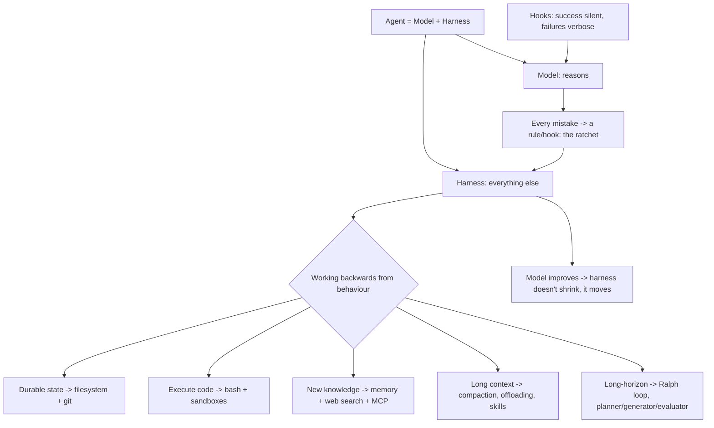

# Agent Harness Engineering - Addy Osmani
Source: https://addyosmani.com/blog/agent-harness-engineering/ · Course: Harness Engineering · Added: 2026-07-27

## Summary
Addy Osmani's synthesis (19 Apr 2026) of the emerging **harness engineering** discipline, pulling together Viv Trivedy ("Anatomy of an Agent Harness" / HaaS), HumanLayer, Anthropic, and Birgitta Böckeler. Core thesis: **Agent = Model + Harness** — the harness is everything around the model (prompts, tools, sandboxes, hooks, subagents, feedback/recovery loops), and **a decent model with a great harness beats a great model with a bad harness**. It reframes most agent failures as "skill issues" (configuration, not model weights), advocates a **ratchet** where every observed mistake becomes a permanent rule/hook, derives each harness component from a **behaviour the model can't deliver alone**, and argues harnesses **don't shrink as models improve — they move** to the new ceiling. Closes with the model↔harness co-training loop and Harness-as-a-Service.

## Glossary

**Agent = Model + Harness**:
Viv Trivedy's one-liner — "if you're not the model, you're the harness." A raw model isn't an agent; it becomes one once a harness gives it state, tool execution, feedback loops, and enforceable constraints. Claude Code, Cursor, Codex, Aider, Cline are all *harnesses* — often over the same model, but the behaviour you experience is dominated by the harness.

**Harness (the surface area)**:
Every piece of code/config/execution logic that isn't the model: system prompts + `CLAUDE.md`/`AGENTS.md`/skill/subagent prompts, tools/skills/MCP servers, bundled infra (filesystem, sandbox, browser), orchestration (subagent spawning, handoffs, model routing), hooks/middleware (compaction, continuation, lint), and observability (logs, traces, cost/latency). It's *your* surface area, not the provider's.

**"Skill issue" reframe**:
HumanLayer's framing — "it's not a model problem, it's a configuration problem." Failures are legible: unknown convention → add to `AGENTS.md`; destructive command → add a blocking hook; 40-step task → split into planner + executor; broken "done" → wire a typecheck back-pressure signal. Data point: on Terminal Bench 2.0, the same model scored far higher in a custom harness — Viv's team went Top 30 → Top 5 by changing **only the harness**.

**The ratchet (every mistake becomes a rule)**:
Treat agent mistakes as permanent signal, not one-off bad runs. Add a constraint only when you've seen a real failure; remove it only when a capable model made it redundant. **Every line in a good `AGENTS.md` should trace back to a specific thing that went wrong** — which is why a harness can't be downloaded; it's shaped by *your* failure history.

**Working backwards from behaviour**:
Viv's design pattern — start from *behaviour you want* → derive the harness piece that delivers it. If you can't name the behaviour a component exists to deliver, it shouldn't be there. (Durable state → filesystem+git; execute code → bash; safe execution → sandboxes; new knowledge → memory/web-search/MCP; long context → compaction/offloading/skills; long-horizon → Ralph loops/planning/verification.)

**Context rot & its three fixes**:
Models degrade as the window fills. **Compaction** (summarize/offload older context near the limit), **tool-call offloading** (keep head/tail of huge outputs, dump the rest to disk for on-demand read), and **skills with progressive disclosure** (reveal instructions/tools only when the task calls for them). Anthropic adds **full context resets** — tear down and rebuild from a compact hand-off brief (compaction alone wasn't enough for long tasks).

**Ralph Loop**:
A hook intercepts the model's attempt to exit and re-injects the original prompt into a **fresh context window**, forcing continuation against a completion goal. Each iteration starts clean but reads prior state from the filesystem — turning a single-session agent into a multi-session one.

**Planner / generator / evaluator split (+ sprint contract)**:
Anthropic's finding — separating generation from evaluation into distinct agents beats self-evaluation (agents skew positive grading their own work; "GANs for prose"). The **sprint contract**: generator and evaluator negotiate what "done" means *before* code is written (writing down the done-condition catches scope drift).

**Hooks (enforcement layer)**:
Scripts at lifecycle points (pre-tool-call, post-edit, pre-commit, session-start) enforcing what the agent forgets: run typecheck/lint/tests after edits, block destructive bash (`rm -rf`, `git push --force`, `DROP TABLE`), require approval before PR/`main`, auto-format on write. Principle: **success is silent, failures are verbose** — passing checks say nothing; failures inject error text into the loop for self-correction.

**`AGENTS.md`**:
The flat markdown rulebook at repo root — highest-leverage config because it lands in the system prompt every turn. Two rules: **keep it short** (HumanLayer < 60 lines — "pilot's checklist, not style guide") and **earn each line** (trace to a real failure or hard constraint; ratchet, don't brainstorm). Same discipline for tools — 10 focused tools beat 50 overlapping ones; MCP tool descriptions are trusted prompt text (prompt-injection risk).

**Harness-as-a-Service (HaaS)**:
Viv's framing — moving from building on **LLM APIs** (which return a completion) to **harness APIs** (which return a runtime): Claude Agent SDK, Codex SDK, OpenAI Agents SDK. You get the loop, tools, context management, hooks, and sandbox out of the box and customize along four pillars (system prompt, tools, context, subagents).

## Key Notes

### The core argument
- Two years of "which model is smartest" misses the other half of the system. **The gap between what today's models can do and what you see them do is largely a harness gap** — the opposite of "just wait for GPT-6."
- Models get **post-trained coupled to a harness**; moving them into a better harness (tighter prompt, better tools, sharper back-pressure) unlocks capability the original left "on the floor."
- Simon Willison's reduction: an agent "runs tools in a loop to achieve a goal" — the skill is designing both the tools and the loop.

### The harness primitives (derived from behaviour)
- **Filesystem + Git** = durable state — the foundational (underrated) primitive; workspace to read/offload work and coordinate; Git gives versioning, rollback, branching. Most other primitives point back at the filesystem.
- **Bash + code execution** = the general-purpose tool — instead of pre-building a tool per action, give the agent bash to build tools on the fly ("hand them a kitchen, not one gadget").
- **Sandboxes + default tooling** = safe execution — isolated env with allow-listed commands, network isolation, on-demand spin-up/teardown; good defaults (runtimes, Git/test CLIs, headless browser) let the agent observe its own work and close the self-verification loop.
- **Memory + search** = continual learning — `AGENTS.md`-style memory files injected on start and reloaded as edited (crude but effective); web search + MCP (e.g. Context7) bridge the training cutoff.
- **Long-horizon execution** — Ralph loops, planning (decompose into a plan file), self-verification hooks, and planner/generator/evaluator splits.

### Production picture
- Fareed Khan's breakdown of **Claude Code's architecture** maps almost every concept to a named component: context injection = knowledge layer; loop state = memory store + worktree isolator; destructive-action hooks = permission gate; subagent firewalls = multi-agent layer; tool dispatch = where MCP + bash plug in. The master agent loop sits at the centre.

### Harnesses don't shrink, they move
- Better models don't make harnesses obsolete — **the ceiling moves with the model**. Opus 4.6 killed the "context-anxiety" failure mode (Sonnet 4.5 wrapped up prematurely), making a class of anxiety-scaffolding dead code — but new reachable tasks bring new failure modes needing new scaffolding (multi-day memory policy, multi-agent coordination, UI design-quality evaluators).
- Anthropic: **"every component in a harness encodes an assumption about what the model can't do on its own"** — when the model improves at that, the component should come out.
- **Model↔harness training loop**: a useful primitive is discovered → standardized into the product → used to train the next model → the model gets better at it. Co-training creates overfitting (why `apply_patch` vs `str_replace` can matter). Implication: **a harness is a living system, not a one-time config**, and the best harness is the one designed for *your* task.

### Where it's going
- Top coding agents "look more like each other than their underlying models do" — harness patterns are **converging** on the load-bearing scaffolding.
- Open problems (Viv): orchestrating many parallel agents on a shared codebase; agents that analyze their own traces to fix harness-level failures; harnesses that **assemble the right tools/context just-in-time** — "where harnesses stop being static config and start becoming something closer to a compiler."

## Understanding Diagram

