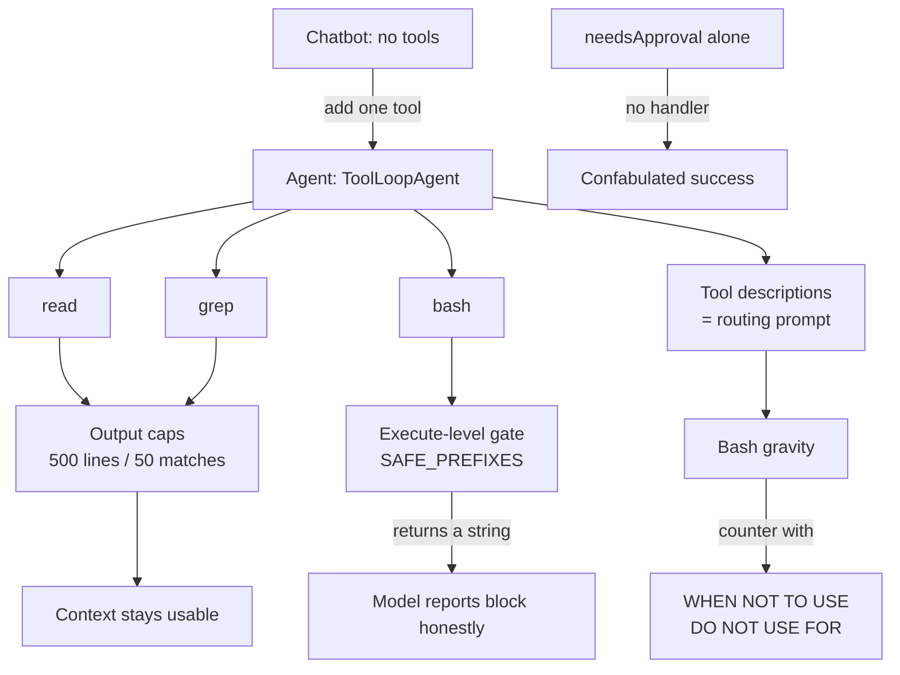

# 01 - The Agent Loop
Source: https://vercel.com/academy/build-ai-agent-harness · Course: Harness Engineering/Build Your Own AI Coding Agent Harness - Vercel · Added: 2026-07-27

## Summary
Module 1 of Vercel Academy's `TeensyCode` course — the step that turns a chatbot into an agent. A model with no tools is "the world's most confident intern": ask it about `tsconfig.json` and it describes what's *probably* in there, because pattern-matching is all it can do. Adding a single `read` tool flips that; adding `grep` and `bash` completes the minimum viable toolbox. The module's real lesson isn't the three tools — it's that **the tool `description` is a prompt, not a docstring** (the model reads it to route), and that **every tool needs an output cap** or one careless call eats the context window. It closes by gating `bash` at the `execute` layer, and explains why the AI SDK's `needsApproval` flag is a trap without a surrounding approval flow.

## Glossary
**Harness**:
The system built *around* the model — tools, prompts, safety gates, context management, sandbox — that turns a raw tool loop into something usable for real work. The course's subject; the agent itself is the small part.
_Avoid_: agent, wrapper, scaffold

**Tool loop**:
The cycle where the model picks a tool, the harness executes it, the result goes back into the conversation, and the model decides again. `ToolLoopAgent` in AI SDK v6 implements it; `stopWhen: stepCountIs(n)` bounds it.
_Avoid_: agentic loop, ReAct loop

**Tool description**:
The prose attached to a `tool()` definition. It is the model's API for *choosing* the tool — not documentation for humans. Written with WHEN TO USE / WHEN NOT TO USE / DO NOT USE FOR sections.

**Bash gravity**:
The observed tendency of every model tested (Haiku, Sonnet, Opus) to default to the `bash` tool for everything when other tool descriptions are weak. Countered with explicit negative steering.

**Execute-level gate**:
Safety enforced *inside* the tool's `execute` function, so a blocked call still returns a real string to the model. Contrasted with `needsApproval`, which skips execution and can leave the model with nothing.

**Confabulated success**:
The failure mode where a tool call silently disappears, the model receives no result, and invents one — reporting "Done! I deleted the files" for a command that never ran.
_Avoid_: hallucinated result

**Output cap**:
A hard limit on what a tool returns (500 lines for `read`, 50 matches for `grep`). The first and cheapest form of context management.

## Key Notes

### 1.1 From Chat to Agent
https://vercel.com/academy/build-ai-agent-harness/from-chat-to-agent
- Start with the smallest possible agent: `ToolLoopAgent` with `model`, `instructions`, `tools: {}`, `stopWhen: stepCountIs(10)`. Run it and you get one step, no tool calls — a polite, entirely fictional answer. That's the chatbot.
- Adding one `read` tool (Zod `inputSchema` with `path`, optional `offset`/`limit`) is the whole transformation: two steps instead of one, and the answer is real.
- **AI SDK v6 naming traps** — use `instructions` (not `system`), `stopWhen` (not `stopCondition`), and `agent.generate({ prompt })` (not `agent.generate(prompt)`). Wrong names compile silently but misbehave.
- `read` returns *numbered* lines, resolves paths against the working directory (so the agent can't escape the project), and truncates at `MAX_LINES = 500` with an explicit `... (truncated)` message.
- Why the cap: an unbounded read of a 10,000-line file lands in context *and stays there for the rest of the session*. One careless read can eat 10% of the window.
- Model used throughout: `anthropic/claude-haiku-4-5`.

### 1.2 Your First Tools
https://vercel.com/academy/build-ai-agent-harness/your-first-tools
- With only `read`, "find all TODO comments" makes the agent guess filenames and open them one at a time — "not searching, flailing politely."
- Add `grep` (regex `pattern`, optional `path` and `glob`, implemented via `execSync` with `grep -rn`, excluding `node_modules` and `.git`, capped at 50 matches).
- **Deliberately watch the wrong tool win first**: give `grep` the description `"Search files."` and the model ignores it, reaching for `read` or `bash`. A two-word description gives it nothing to route on.
- The fix is the description, not the implementation. Four sections: WHEN TO USE, WHEN NOT TO USE, DO NOT USE FOR, EXAMPLES.
- Steering has to work in *both* directions — `read`'s description must push back against `grep` as hard as `grep`'s pushes back against `read`.
- Treat `grep`'s non-zero exit (no matches) as success, not error. Quote inputs into the shell command so special characters don't break it.
- Verification tip: seed two obvious `// TODO:` comments in a file you control. The point is to verify *routing*, not to discover bugs.

### 1.3 Completing the Toolbox
https://vercel.com/academy/build-ai-agent-harness/completing-the-toolbox
- `bash` is the most useful tool you can give an agent and the most dangerous — add it, then leash it.
- **Why not `needsApproval`**: when it returns `true`, the SDK emits a `tool-approval-request` and *skips execution*. With no approval handler wired up, the tool call vanishes, the model gets no result, and it fabricates one. Worse than running the command, because the user never learns anything went wrong. `needsApproval` is a signal to the harness, not a gate.
- Instead, gate inside `execute` with a `SAFE_PREFIXES` allowlist (`ls`, `cat`, `echo`, `pwd`, `which`, `find`, `head`, `tail`, `wc`, `git log`, `git status`, `git diff`). Match by *prefix* so `ls -la` matches `ls`.
- The key pattern: a blocked command **returns a string**. That string enters the conversation as a normal tool result, so the model can report the block truthfully instead of confabulating.
- Set a `timeout` on `execSync` (30s) so a hung process doesn't freeze the agent.
- **Known hole, kept on purpose**: prefix matching catches `rm -rf` but not a creative rewrite like `find . -name node_modules -exec rm -rf {} +`. Production harnesses use regex patterns for dangerous commands. The prefix check is here because it's *clear*, not because it's complete.

### The three-tool baseline
| Tool | Purpose | Safety |
|---|---|---|
| `read` | View file contents | 500-line cap |
| `grep` | Search across files | 50-match cap |
| `bash` | Run shell commands | `SAFE_PREFIXES` allowlist |

Descriptions steer selection · caps protect context · the gate protects your machine.

## Understanding Diagram

