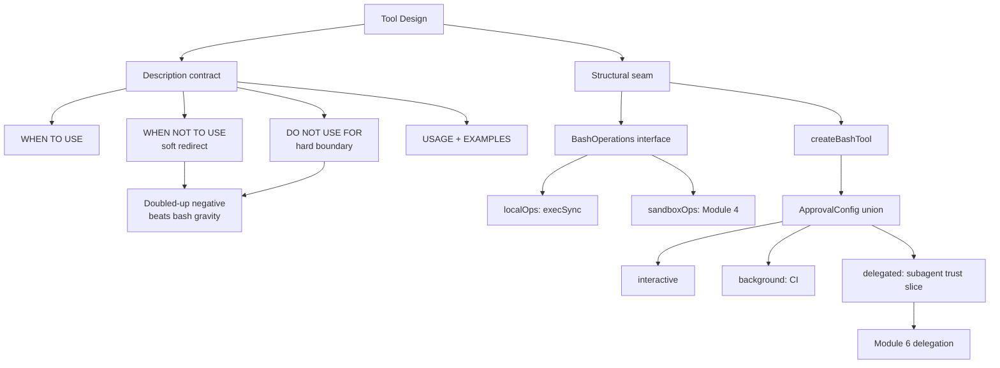

# 02 - Tool Design
Source: https://vercel.com/academy/build-ai-agent-harness · Course: Harness Engineering/Build Your Own AI Coding Agent Harness - Vercel · Added: 2026-07-27

## Summary
Module 2 hardens the three tools from Module 1 along two axes. First, **descriptions**: three tools routed fine on two sections, but at four or five tools the model gets fuzzy again, so every description grows to a 5-section contract (WHEN TO USE, WHEN NOT TO USE, DO NOT USE FOR, USAGE, EXAMPLES) — with the negative stated *twice* on purpose, because every model leaks back toward `bash`. Second, **structure**: `bash` is refactored into a `createBashTool(operations, needsApproval)` factory, putting a seam between the model-facing contract and the execution backend so Module 4 can swap in a sandbox without touching the tool. Approval then evolves from a boolean → a function → a discriminated union with `interactive`, `background`, and `delegated` modes.

## Glossary
**5-section description contract**:
The full tool-description shape: a one-line summary of what the tool does and returns, then WHEN TO USE, WHEN NOT TO USE, DO NOT USE FOR, USAGE, EXAMPLES.

**Doubled-up negative**:
Stating the boundary twice — WHEN NOT TO USE as a soft redirect ("prefer X"), DO NOT USE FOR as a hard boundary ("never use this for Y"). Redundant by design; saying it once often fails, repeating it almost always works.

**Seam**:
The interface between the part of a tool the model sees (description, schema, safety check) and the part that actually does the work (execution backend). `BashOperations` is the seam for `bash`.

**Factory pattern (tools)**:
`createBashTool(operations, needsApproval)` — a function returning a configured `tool()`, closing over an injected backend and policy. Applied only where the backend genuinely varies.

**`BashOperations`**:
The injected backend interface: `exec(command: string): Promise<{ stdout: string; exitCode: number }>`. `localOps` wraps `execSync`; a sandbox implementation swaps in later with a one-line change.

**`ApprovalConfig`**:
A discriminated union — `{ mode: "interactive" }` | `{ mode: "background" }` | `{ mode: "delegated"; trust: string[] }` — consumed by `createApproval(config)` to produce a `needsApproval` function.

**Delegated trust**:
Handing a subagent a *slice* of the parent's permissions rather than the full allowlist. A read-only explorer gets `pwd`, `find`, `git status`; a test executor gets `npm test`, `npm run build`.

## Key Notes

### 2.1 Descriptions That Work
https://vercel.com/academy/build-ai-agent-harness/descriptions-that-work
- Two sections were enough for three tools. Add `edit`, `write`, `todo`, and subagents and routing degrades — the model picks `bash` where `read` belongs, or opens twenty files instead of using `grep`. The fix is the same medicine, just more of it.
- **Per-model behaviour observed by the authors**: Haiku reads WHEN NOT TO USE but ignores it under ambiguity; Sonnet respects it but benefits from DO NOT USE FOR as reinforcement; Opus handles both well and the repetition does no harm. So the redundancy costs nothing and rescues the weaker models.
- What each section earns:

  | Section | Purpose |
  |---|---|
  | First line | What the tool does, what it returns |
  | WHEN TO USE | 2–4 specific scenarios, using keywords the *prompt* will contain |
  | WHEN NOT TO USE | Soft redirect to the right tool, by name |
  | DO NOT USE FOR | Hard boundary, restated |
  | USAGE | Constraints the schema can't express (caps, defaults, encoding) |
  | EXAMPLES | 2–3 concrete invocations to pattern-match against |

- Descriptions get long — that's fine. **Tool descriptions live in the system prompt, which the SDK caches between turns, so you pay for the tokens once.**
- USAGE earns its place only when a parameter has constraints the model can't infer from the Zod schema.
- Test with one prompt *per tool shape*: search-shaped → `grep`, file-shaped → `read`, shell-shaped → `bash`. An ambiguous prompt like "show me the package.json contents" may route to `read` or `bash` with `cat` — that's an ambiguous prompt, not a routing bug.

### 2.2 Shell Execution with Safety
https://vercel.com/academy/build-ai-agent-harness/shell-execution-with-safety
- Problem: the description, safety check, and `execSync` call are all stacked in one closure. Fine for one bash tool — not fine once you want to run commands somewhere other than this machine.
- Introduce the interface `BashOperations { exec(command): Promise<{ stdout, exitCode }> }`. **Everything the model sees lives above the seam; everything that runs commands lives below it.**
- `createBashTool(operations, safePrefixes)` keeps description, schema, and the safety check; `execute` calls `operations.exec(command)` instead of `execSync`. The factory no longer knows anything about Node's `child_process` or `cwd`.
- `localOps` handles success and failure uniformly — always return `{ stdout, exitCode }`, never throw.
- The Module 4 swap is one line: `const sandboxOps = { exec: (c) => sandbox.exec(c) }` → `createBashTool(sandboxOps, ...)`. Same tool, different backend.
- **Deliberately not refactoring `read` yet**: the factory earns its keep only where the backend genuinely varies. "Refactor when there's pressure, not before."
- Good sanity check: write a `mockOps` returning `{ stdout: "(pretend output)", exitCode: 0 }` and watch the agent produce plausible-but-fake output for everything — that's the seam proving it works.

### 2.3 Approval Gates
https://vercel.com/academy/build-ai-agent-harness/approval-gates
- The Module 1 allowlist has one mode: block anything not on the list. Real harnesses need three — CI has no human to ask, subagents need a slice of the parent's trust, and a local user wants to approve `npm install express` once rather than three times.
- **Evolution of the config's shape** is the lesson:
  1. **Boolean** — `needsApproval: true`. Blocks everything. Useless, but it establishes the question: "should we pause for a human before this runs?"
  2. **Function** — `({ command }) => !SAFE_PREFIXES.some(...)`. Better, but one rule is baked in; CI gets the same gate as a local terminal.
  3. **Discriminated union** — the config carries the mode, the factory builds the function from it.
- `createApproval(config)` returns `(input) => boolean`, where `true` means *approval needed*: `background` → always `false` (auto-approve); `delegated` → approve only prefixes in `config.trust`; `interactive` → approve only `SAFE_PREFIXES`.
- **Why a union and not three functions**: the config is *data, not code* — loadable from `AGENTS.md`, validatable with `z.discriminatedUnion("mode", [...])`, serializable across a subagent boundary, and changeable by users without touching harness code. TypeScript also narrows `config.trust` only inside the `delegated` branch.
- `delegated` is the mode that unlocks Module 6: the parent decides, command by command, what trust a subagent inherits.
- **Keep approval outcome and command outcome separate** when debugging — `npm test` can pass the gate and still exit non-zero because the tests fail.
- Suggested extension: a session-level `Set<string>` of patterns the user has approved, so repeat commands skip the prompt (and a question of granularity — should approving `npm install` trust all installs, or only `npm install express`?).

## Understanding Diagram

