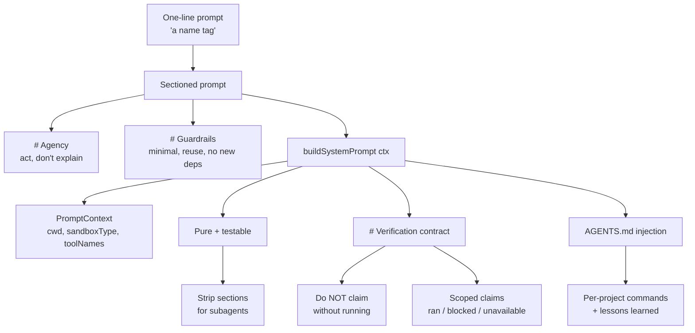

# 03 - The System Prompt
Source: https://vercel.com/academy/build-ai-agent-harness · Course: Harness Engineering/Build Your Own AI Coding Agent Harness - Vercel · Added: 2026-07-27

## Summary
Module 3 turns `You are a coding agent.` — "not a prompt, a name tag" — into the harness's most important piece of configuration. If tools define what the agent *can* do, the system prompt defines what it *should* do: an `# Agency` section that forces action instead of explanation, and `# Guardrails` that constrain scope. The prompt is then extracted from a hardcoded string into a pure `buildSystemPrompt(ctx)` function so it can be tested, composed, and stripped down for subagents. Two more sections follow: a `# Verification` contract that stops the agent claiming "all tests pass" without running them, and `AGENTS.md` injection so each project tells the agent its own commands, architecture, and hard-won lessons.

## Glossary
**Agency section**:
The prompt block granting permission *and instruction* to act — "USE your tools… Do NOT explain what you WOULD do. Actually do it." Counteracts the model's default drift toward explaining.

**Guardrails section**:
The prompt block constraining *how* to act: minimal changes, search before creating, reuse existing patterns, no new dependencies without asking.

**`buildSystemPrompt(ctx)`**:
A pure function in `src/system.ts` mapping a typed `PromptContext` to the prompt string. Same context in, same prompt out, no side effects — which makes it unit-testable.

**`PromptContext`**:
The typed runtime state the prompt depends on: `workingDirectory`, `sandboxType`, `toolNames`, optional `gitBranch` and `projectContext`.

**Verification contract**:
A `# Verification` prompt section naming the checks to run (typecheck, lint, test, build), what to do when a check doesn't exist, and how to scope the claim afterwards. "Make verification a contract, not a vibe."

**Scoped claim**:
A report that states what was actually run, what was blocked, and what was unavailable — "Ran `npm test`: 47 passed, 3 failed (pre-existing)" rather than "all tests pass."

**Confabulation tell**:
Hedged future-tense phrasing — "should be fine," "looks good to me," "I expect this to work" — signalling the agent didn't run the check. Real verification speaks in past tense with specific results.

**`AGENTS.md`**:
A markdown file in the repo describing project-specific facts (commands, architecture, style, lessons learned) that the harness discovers at startup and injects as a Project Instructions section.

## Key Notes

### 3.1 Structuring Agent Instructions
https://vercel.com/academy/build-ai-agent-harness/structuring-agent-instructions
- The tools are already doing most of the steering by Module 2. The prompt's job is different: it's where the **policy** lives — what the agent should do, in what order, with what restraint.
- With a one-line prompt, "find all TODO comments and fix them" is a coin flip: sometimes the agent acts, sometimes it produces a plan and waits. That ambiguity is what the prompt exists to remove.
- Be explicit with negatives. "Do NOT explain what you WOULD do. Actually do it." — saying it out loud is *annoyingly necessary*.
- Tool preferences are repeated in the prompt even though they're already in the descriptions. Deliberate redundancy: "we're saying it in two places because models miss it in one."
- The real gain is **portability of policy** — a sectioned prompt can be copied to a different agent, A/B tested, or have one section lifted out for a subagent. A one-liner can't.
- Section anatomy: Role line → Agency → Guardrails, with Tool Usage and Communication earning their place later (once the prompt passes ~20 lines).
- Expect the visible change to be subtle if descriptions were already strong. The durable win is that the operating style is now explicit and changeable.

### 3.2 Dynamic Prompt Construction
https://vercel.com/academy/build-ai-agent-harness/dynamic-prompt-construction
- A hardcoded prompt can't carry a different working directory, a different sandbox backend, or a subagent that only gets `read` and `grep`. A function can.
- `buildSystemPrompt` is built with an array of sections, a few `push` calls, and a `join("\n")`. **No template engine, no DSL** — "the prompt is a string; building it should look like building a string."
- Optional sections are plain `if (ctx.gitBranch) sections.push(...)`. Resist fancier patterns.
- `toolNames` lets the prompt list the tools actually wired up — which is what makes subagent subsets work later.
- Why a function, not a string: **testable** (assert output for a given context), **composable** (add sections without touching others), **replaceable** (users can supply their own builder), **deterministic**. "The cost is one file. The benefit shows up the third time you add a section."
- The smallest useful prompt test: build with `gitBranch: "main"`, assert the output contains `Current branch: main`; build without it, assert the line is absent. Catches bugs that are nearly impossible to spot by reading model output.

### 3.3 Verification Gates
https://vercel.com/academy/build-ai-agent-harness/verification-gates
- "I fixed the bug" is a sentence the agent says with equal confidence whether or not it did. Not malice — models are pattern-matchers and the patterns they've seen end with "all tests pass" a lot.
- The load-bearing sentence in the contract is **"Do NOT claim success without running the check."** Models are good at avoiding things you *name*, bad at avoiding things you only imply.
- Require **scoped reporting**: what ran, what was blocked, what was unavailable.

  | Model's default voice | What the contract produces |
  |---|---|
  | "All tests pass" | "Ran `npm test`: 47 passed, 3 failed (pre-existing, unrelated to my change)" |
  | "I fixed the bug" | "Fixed the null check in `auth.ts:42`. `npx tsc --noEmit` passes. Tests were blocked by approval mode." |
  | "The build works" | "Ran `npm run build`: succeeded in 4.2s, no warnings." |

- **Verification is about scope, not coverage.** You're not asking the agent to check everything — you're asking it to say accurately what it *did* check. "A small honest scope is more useful than a confident-sounding full sweep." Same discipline as the Module 2 description contracts: say the limits out loud and the agent stays inside them.
- The section doesn't make checks pass; it makes the *report* honest. That's the difference between trusting the output and re-running everything yourself.
- Don't bake project-specific commands into the prompt — that's what lesson 3.4 is for. (Suggested middle step: read `package.json`'s `scripts` block and list only the checks that actually exist.)

### 3.4 Project Context
https://vercel.com/academy/build-ai-agent-harness/project-context
- The harness is generic; every project isn't. One uses `bun test`, the next `vitest`, the third `npm run check`. The agent shouldn't guess and you shouldn't teach it project by project.
- The whole feature is ~5 lines: `existsSync(join(cwd, "AGENTS.md"))` → `readFileSync` → pass as `projectContext`. **Convention over configuration** — no plugin system, no registration, no event bus. A file in a known location.
- What belongs in `AGENTS.md`: Commands, Architecture, Style, and **Lessons learned** (e.g. "auth middleware must run before rate limiting", "don't modify migration files directly, generate new ones") — the project's recurring mistakes.
- Same trick under different names: Cursor's `.cursorrules`, Codex's `AGENTS.md`, Claude Code's `CLAUDE.md`. **The file name varies; the pattern doesn't** — discover a markdown file, inject as instructions.
- Deliberately one file, no directory walking yet. A real harness walks up to the repo root collecting every `AGENTS.md` and merges them — and the merge strategies genuinely differ: **pi merges everything found, Cursor uses the deepest only, Codex concatenates root plus cwd.** Conflicts (root says `npm`, package says `pnpm`) are where they diverge.
- The check happens once at startup, not in a hot loop, so `existsSync` is fine.

## Understanding Diagram

