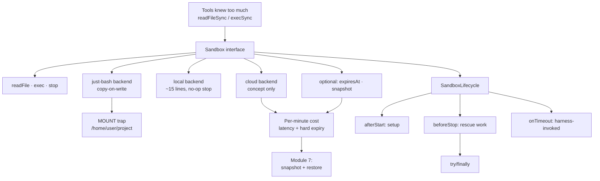

# 04 - The Sandbox Abstraction
Source: https://vercel.com/academy/build-ai-agent-harness · Course: Harness Engineering/Build Your Own AI Coding Agent Harness - Vercel · Added: 2026-07-27

## Summary
Module 4 fixes the fact that the tools "know too much" — `read` knows about `readFileSync`, `bash` knows about `execSync`, and both know they're on Node. It defines a deliberately tiny `Sandbox` interface (`readFile`, `exec`, `stop`, plus identity fields and two *optional* capabilities), refactors all three tools to call it, then slots three backends in behind: **local** (wraps Node APIs, ~15 lines), **just-bash** (in-memory copy-on-write virtual FS — reads real disk, writes vanish), and **cloud** (a real VM: costs money per minute, adds latency, expires in ~30 minutes). The cloud lesson is concept-only by design. The module closes with `SandboxLifecycle` hooks (`afterStart`, `beforeStop`, `onTimeout`) that are ceremony locally but essential in the cloud, where skipping `beforeStop` means losing uncommitted work when the VM dies.

## Glossary
**`Sandbox` interface**:
The contract every execution backend implements: `type`, `workingDirectory`, `readFile(path)`, `exec(command)`, `stop()`, plus optional `expiresAt` and `snapshot()`. Every method is `async`, even where the implementation is synchronous.

**Copy-on-write filesystem**:
`just-bash`'s model — reads come from real disk, writes go to memory, the real filesystem is never modified, and the overlay is garbage-collected on stop.

**Overlay / mount point**:
`just-bash` mounts `overlayRoot: "/path/to/project"` at the *virtual* path `/home/user/project` — not at `/`, not at the original path. Every path in and out must be translated through it.

**Optional capability**:
An interface member marked `?` because it genuinely doesn't apply to every backend (`expiresAt`, `snapshot`). Lets each backend opt in to what it can actually deliver instead of stubbing.

**`SandboxLifecycle`**:
Three optional hooks around the sandbox's life — `afterStart` (setup: git config, `npm install`, `.env`), `beforeStop` (rescue: commit uncommitted work, snapshot), `onTimeout` (invoked *by the harness* when `expiresAt` is hit).

**Sticky interface decision**:
The observation that changing a signature (e.g. making `exec` stream instead of returning one final result) ripples back into every tool that calls it. "Anything you add now will be the thing every implementation has to support forever."

## Key Notes

### 4.1 Designing the Interface
https://vercel.com/academy/build-ai-agent-harness/designing-the-interface
- Write the contract *before* any backend: what does a sandbox need to do, in the abstract, for any tool to call it?
```ts
export interface Sandbox {
  type: string;
  workingDirectory: string;
  readFile(path: string): Promise<string>;
  exec(command: string): Promise<{ stdout: string; exitCode: number }>;
  stop(): Promise<void>;
  expiresAt?: number;
  snapshot?(): Promise<{ snapshotId: string }>;
}
```
- **Everything is `async`** — the local backend wraps sync calls, the cloud backend really is async, and inconsistent signatures across implementations are a mess.
- `type` and `workingDirectory` are identity fields (logging, debugging, and the `sandboxType` the Module 3 prompt interpolates). Don't make `type` a union yet.
- **Make the interface as small as you can get away with.** Anything added now is permanent for every implementation.
- The tool refactor is one line each: `readFileSync(...)` → `await sandbox.readFile(filePath)`; `execSync` / `localOps` → `sandbox.exec(command)`. Schemas, descriptions, line caps, and match caps are untouched — the model sees the same contract.
- **The win is portability, not behavior.** If the agent behaves differently after this refactor, the refactor leaked. The payoff arrives in 4.3 when a second backend needs zero tool changes.
- Open design question worth sitting with: adding `writeFile` forces *every* implementation to support it, including read-only review sandboxes. New optional method? Separate write-capable interface? Throw from implementations that can't? Each has a different cost.

### 4.2 Local Implementation
https://vercel.com/academy/build-ai-agent-harness/local-implementation
- The boring backend, and boring is the point — it proves the interface works without adding complexity, and becomes the baseline every other backend is compared to.
- The whole file is ~15 lines. "If yours is longer, you're probably handling cases the cloud backend will care about and the local one doesn't."
- **`exec` must never throw**, even on non-zero exit. Catch and return `{ stdout: e.stdout || e.stderr || e.message, exitCode: e.status ?? 1 }`. Tools expect a result object.
- `stop()` is an async no-op — the local filesystem and `child_process` outlive the agent.
- Streaming challenge: `execSync` buffers everything until the command finishes, which is painful for a long build. Switching to `spawn` requires a different `exec` shape (an async iterator), and that change ripples into every calling tool. Interface decisions are sticky.

### 4.3 In-Memory Implementation (`just-bash`)
https://vercel.com/academy/build-ai-agent-harness/in-memory-implementation
- The use case: let the agent explore code without trusting it not to break anything. Fast, cheap, safe.
- **The mount-point trap** — `overlayRoot: "/Users/you/project"` mounts at `/home/user/project` inside the virtual FS. Every `readFile` and `runCommand` must be prefixed with that `MOUNT` constant. "This will trip you up. It trips everyone up."
- API shape: `JustBashSandbox.create({ overlayRoot })` is async (so the factory returns `Promise<Sandbox>`); `runCommand` returns a *handle*, not a result — call `wait()` for the exit code and `output()` for combined stdout/stderr.
- Backend selection is one env var: `SANDBOX=just-bash`. The conditional absorbs the sync/async factory difference; tools, agent, and prompt builder are unchanged.
- Proof it works: `SANDBOX=just-bash ... "Create a file called scratch.txt"` — the agent writes it, and `scratch.txt` is not on the real disk.
- **Portability isn't free.** Some tools quietly fail because they assumed something about the host — `grep` is the common offender, since shell behaviour under `just-bash` is simulated and not byte-identical. Expect to fix one or two tools, and decide each time whether to fix the tool or let the interface absorb the difference with a shim.

### 4.4 Cloud Implementation (concept-only)
https://vercel.com/academy/build-ai-agent-harness/cloud-implementation
- A real VM elsewhere: real filesystem, real `git`, real `npm`, real network — and per-minute cost, per-call latency, and a hard expiry whether you're done or not.
- Concept-only on purpose: provisioning, network details, and snapshot semantics vary by vendor and shift often. **What survives is the shape** — same interface, different tradeoffs, tools don't care.

  |  | Local | just-bash | Cloud |
  |---|---|---|---|
  | Cost | Free | Free | Per-minute |
  | Latency | Microseconds | Microseconds | Tens–hundreds of ms per call |
  | Isolation | None | Partial (reads real, writes virtual) | Full, separate VM |
  | Persistence | Permanent | GC'd on stop | Snapshot / restore |
  | `git`, `npm` | Your local install | Simulated | Real, separately installed |
  | Timeout | None | None | Hard limit (often 30–60 min) |

- When to pick each: `local` → development, debugging, trusted environments · `just-bash` → exploration, testing, untrusted code review · `cloud` → production, CI, multi-user, full isolation.
- **What the optional fields buy you**: `expiresAt` lets the harness know the clock is running, so a long task can decide whether to start another operation or wrap up — without it the agent runs until a network error and has to reverse-engineer what happened. `snapshot` lets you save state at minute 28 and resume in a fresh sandbox (Module 7).
- Design prompt worth answering: a cost guardrail lives in the *harness*, not the agent. Where in the loop does the check go, and on breach do you stop, snapshot, or ask the user? Each answer implies a different operational model.

### 4.5 Lifecycle Hooks
https://vercel.com/academy/build-ai-agent-harness/lifecycle-hooks
- A fresh cloud VM has no git config, no `node_modules`, no `.env`. Something must configure it before the agent starts and rescue work before it dies.
```ts
export interface SandboxLifecycle {
  afterStart?(sandbox: Sandbox): Promise<void>;
  beforeStop?(sandbox: Sandbox): Promise<void>;
  onTimeout?(sandbox: Sandbox): Promise<void>;
}
```
- `afterStart` → `git config`, `npm install`, `cp .env.example .env`. `beforeStop` → `git status --porcelain`, auto-commit WIP if dirty, then `snapshot()` if available. `onTimeout` → invoked *by the cloud backend* when `expiresAt` is reached; usually logs and reuses `beforeStop`.
- **The `try/finally` matters**: `beforeStop` must fire even when the agent throws mid-run. That's exactly where the uncommitted-work check belongs.
- Optional chaining (`await lifecycle.afterStart?.(sandbox)`) does the conditional call — no `if` blocks. Default to an empty `lifecycle = {}`; "even an empty lifecycle is still a lifecycle," so don't make it optional at the outer level.
- Locally the hooks are mostly ceremony; in the cloud, skipping `beforeStop` loses uncommitted work. **"The local case is the simpler shape of the cloud case, not a different shape."**
- Natural pairing to try: `afterStart` restores from a saved snapshot if one exists, `beforeStop` auto-snapshots — crash-resume with no extra code at the call site. Open questions: where does the snapshot live, how do you tell a new run from a resumed one, and what if the snapshot is from a different code version?

## Understanding Diagram

