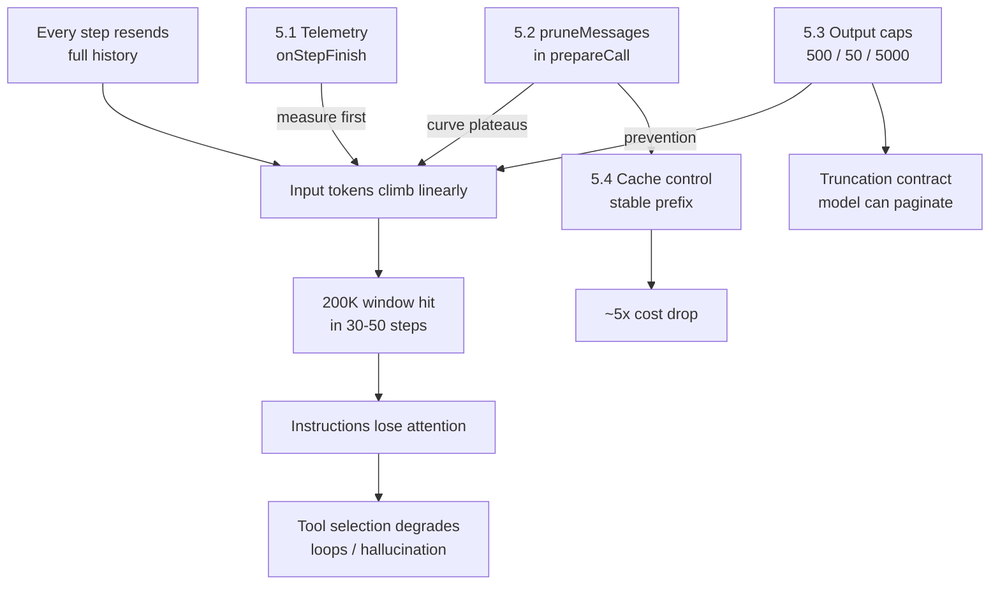

# 05 - Context Management
Source: https://vercel.com/academy/build-ai-agent-harness · Course: Harness Engineering/Build Your Own AI Coding Agent Harness - Vercel · Added: 2026-07-27

## Summary
Modules 1–4 got away with short tasks; Module 5 turns around and looks at what a 20–50-step task does to the context window. It starts with **telemetry, not a fix** — `onStepFinish` logging shows input tokens climbing linearly while output stays flat, because every step re-sends the whole message history and nothing ever leaves on its own. Then three layers of defence: **pruning** (four lines of `pruneMessages` inside `prepareCall`, and the curve plateaus), **tool output design** (caps at the source — 500 lines, 50 matches, 5,000 chars — because pruning can't undo a 5,000-token result that's already landed), and **cache control** (marking the stable prefix cacheable, worth roughly a 5× cost swing on long sessions). The through-line: pruning is the cleanup crew, tool design is the prevention.

## Glossary
**`onStepFinish`**:
The `ToolLoopAgent` callback fired after every step, carrying `usage` and `stepNumber`. The instrumentation hook for token telemetry; log it to `console.error` so it doesn't mix with the agent's stdout.

**Linear context growth**:
The default behaviour — each step sends the user prompt, system prompt, and every prior tool call *and result*. A file read at step 1 is still in context at step 20.

**`prepareCall`**:
The hook that receives the full request options right before each model call, letting you rewrite `messages` on the way in. Where both pruning and cache marking are applied.

**`pruneMessages`**:
The `ai` package helper that drops tool call/result pairs older than a cutoff (`toolCalls: "before-last-3-messages"`), while always keeping the original user prompt.

**Bounded output / truncation contract**:
Every tool caps its output *and tells the model it truncated and by how much*, so the agent can paginate or narrow. "A tool that silently truncates is worse than no truncation at all."

**Tail-keep**:
Slicing the *last* N characters of command output rather than the first, because failed tests, failed builds, and stack traces print their useful part at the end.

**Cache control**:
Marking the stable prefix of the message list (`providerOptions.cacheControl: { type: "ephemeral" }`) so the provider doesn't reprocess tokens it has already seen. Breakpoints work by *prefix*.

## Key Notes

### 5.1 The Problem
https://vercel.com/academy/build-ai-agent-harness/the-problem
- **"The fix is small. The seeing is the hard part."** This lesson deliberately fixes nothing — you can't tell whether a fix worked unless you measured first, so the token logging stays in for the rest of the module.
- Wire `onStepFinish: ({ usage, stepNumber }) => console.error(...)` and run a prompt that forces 4+ tool calls. Typical shape: input `1,200 → 2,800 → 4,100 → 8,900 → 9,200`; output stays roughly flat at 200–600.
- Why: every step re-sends the entire history. The `package.json` from step 1 is still there at step 4 even though the agent is done with it.

  | Component | Tokens | Behavior |
  |---|---|---|
  | System prompt | ~500 | Fixed, sent every call |
  | Each tool result | 200–2,000 | Stays in history forever |
  | After 20 tool calls | 4,000–40,000 | Linearly accumulating |

- **What happens at the ceiling** (200K window, reachable in 30–50 steps by a read-heavy agent): instructions at the top get pushed out of attention → the model starts ignoring its own system prompt → tool selection degrades → the agent loops or hallucinates.
- Three tempting non-fixes: *hoping it doesn't happen* (it always does on real tasks), *reducing step count* (ten is too few; fifty is normal), *a bigger model* (delays the problem, costs more per token, doesn't solve it).

### 5.2 Pruning Old Results
https://vercel.com/academy/build-ai-agent-harness/pruning-old-results
- The whole fix is four lines and one import — "the lines themselves are easy; where they go and why is the lesson."
```ts
prepareCall: async (options) => ({
  ...options,
  messages: options.messages
    ? pruneMessages({ messages: options.messages, toolCalls: "before-last-3-messages" })
    : undefined,
}),
```
- **Two gotchas worth saying out loud**: (1) *spread `...options` first* — it carries `model`, `tools`, and `system`; forget it and the agent breaks confusingly. (2) *guard `messages`* — on the very first call the SDK passes `prompt` and leaves `messages` undefined, and `pruneMessages({ messages: undefined })` throws.
- What survives pruning: the original user prompt (always) plus the recent tool interactions. The middle of the conversation, where results pile up, is dropped on each call.
- `before-last-3-messages` keeps the last three *messages*, not the last three tool pairs — enough for the model to know where it is. `before-last-1` is more aggressive, `before-last-5` gentler. Three is a reasonable default.
- After pruning the curve plateaus by step 2–3 (`2,800 → 3,100 → 3,400 → 3,200`). **The proof is the shape, not the digits** — linear before, plateau after.
- Tuning method: pick a task where the agent must remember something it read several steps earlier, then run at 1/3/5 and find where it loses the thread.

### 5.3 Tool Output Design
https://vercel.com/academy/build-ai-agent-harness/tool-output-design
- Pruning is necessary but insufficient: a single 5,000-token grep result has already done its damage and will sit in context for at least three more turns. **The better fix is upstream.**

  | Tool | Cap | Why this number |
  |---|---|---|
  | `read` | 500 lines | Enough to grasp structure, small enough not to bury the model |
  | `grep` | 50 matches | 50 results answered the question; 500 is a data dump |
  | `bash` | 5,000 chars | Most output fits; `npm install` and friends are noise |

- **Keep the tail for `bash`, not the head** — failed tests, failed builds, and stack traces put the actionable part last.
- The truncation contract, in three parts: cap the output; tell the model it was truncated *and by how much*; provide pagination where possible (`offset`/`limit` on `read`, narrower `glob` on `grep`). The message is the model's only signal that more data exists.
- "Bounded" ≠ "tiny." And the caps aren't sacred — they're tuned by running real tasks and noticing what hurts.
- **Caps are a tax the agent pays in pagination**: a 2,000-line file now takes four `read` calls. That's the right trade — four bounded reads cost less, in tokens and money, than one massive read polluting the rest of the session.
- Next step worth taking: make caps a per-agent `caps` config (a quick-check subagent may want 100 lines, a deep analysis 2,000) — while noticing that configurable caps are more knobs to set wrong.

### 5.4 Cache Control
https://vercel.com/academy/build-ai-agent-harness/cache-control
- Pruning solves half the problem; the other half is that every call still re-sends the parts that *didn't change* — system prompt, tool definitions, the early user prompt.
- `addCacheControl(messages)` marks message 0 and everything older than the last two as `{ type: "ephemeral" }`. The recent messages stay uncached because they're about to be replaced.
- **Cache breakpoints work by prefix** — marking message 5 caches everything up to and including message 5, and the provider checks that prefix on the next call.
- **Order matters**: prune first (it changes how many messages there are), then cache whatever survives.
- Rough economics for a long Anthropic-backed session: ~$30 → ~$6, an order-of-magnitude swing. Short sessions see less, because the cache has no time to amortise.
- Provider-specific: `cacheControl` on message parts is the Anthropic shape; other providers use different keys, and some don't expose prompt-level caching at all. **The pattern — separate stable from fresh — survives those differences; the `providerOptions` shape doesn't.** Unsupported headers are simply ignored.
- Why the discipline is worth keeping even without caching: it forces you to identify which parts of the prompt are stable, which tells you whether the system prompt is doing too much work per call. Stable context is also easier to test, version, and reason about.
- Capstone exercise: wire telemetry + pruning + caps + caching into a token-budget dashboard that prints session cost *and* what it would have cost without pruning and caching. "The number is what makes the discipline worth doing."

## Understanding Diagram

