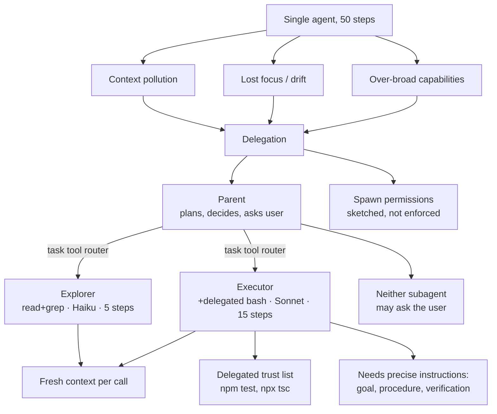

# 06 - Subagent Delegation
Source: https://vercel.com/academy/build-ai-agent-harness · Course: Harness Engineering/Build Your Own AI Coding Agent Harness - Vercel · Added: 2026-07-27

## Summary
Module 5 made long sessions survivable; Module 6 addresses the failures pruning *can't* catch — where the work itself is wrong-shaped for one agent. Three named failure modes (context pollution, lost focus, over-broad capabilities) motivate splitting the agent into roles: a **parent** that plans, decides, and talks to the human; an **explorer** (read + grep only, Haiku, 5 steps) that investigates and reports; and an **executor** (plus a delegated-trust `bash`, Sonnet, 15 steps) that follows precise instructions. Both subagents are spawned fresh per call so each gets a clean context window, and neither may ask the user anything. The `task` tool becomes a thin router over role builders, with model chosen *per role, not per session*, and a documented (not yet enforced) spawn-permissions table for when subagents start spawning subagents.

## Glossary
**Delegation**:
Splitting work so the parent decides and subagents execute in isolation. "The parent gets the answer back, not the journey."

**Context pollution**:
Twenty files read during exploration burying the files that actually matter to the change. Pruning removes them eventually — but not before they've shoved the task off the top of attention.

**Lost focus / drift**:
By step thirty the agent has fixed a CSS typo, refactored an import, and written a comment about an interesting function, and forgotten it was asked to refactor the auth module.

**Over-broad capabilities**:
An exploring agent that holds `write` and `bash` "helpfully" fixing a typo it noticed — a single agent with the full toolset can't draw the exploration/modification line for itself.

**Explorer subagent**:
Read-only researcher: `read` + `grep`, `claude-haiku-4-5`, `stepCountIs(5)`. Cannot write, run commands, or ask the user. "That sounds like a constraint. It's the feature."

**Executor subagent**:
Implementer: `read` + `grep` + delegated-mode `bash`, `claude-sonnet-4-6`, `stepCountIs(15)`. Follows instructions literally; explicitly told not to ask questions.

**Clean handoff shape**:
The test for whether to delegate — reading thirty files and returning a paragraph is a clean handoff; choosing between three architectural approaches isn't, "because the decision is the work."

**Spawn permissions**:
A `Record<parentRole, allowedSubagentTypes[]>` map gating which roles may spawn which. Documented as a sketch; needed once subagents themselves call `task`.

## Key Notes

### 6.1 Why Delegate (concept)
https://vercel.com/academy/build-ai-agent-harness/why-delegate
- On a fifty-step task the agent fails "not because the context is too long, but because the work itself is wrong-shaped for one agent to do" — exploration, planning, execution, and verification bleed into each other.
- **The three failure modes**: context pollution (relevant files buried under once-useful ones), lost focus (drift away from the original task by step 30), over-broad capabilities (exploration allowed to modify things).
- Role split:
  - **Parent** — plans, delegates, synthesizes, makes architectural decisions. *The only agent that asks questions or holds the long-term plan.*
  - **Explorer** — read/grep only, cheap fast model, reports findings, does not act.
  - **Executor** — full tools including write/bash, stronger model, follows precise instructions, no `askUser`.

  | Delegate | Keep in the parent |
  |---|---|
  | Research across many files | Single-file changes |
  | Parallel independent tasks | Sequential dependent changes |
  | Mechanical bulk work | Architectural decisions |
  | Exploration before acting | Ambiguous requirements (use `askUser`) |

- **Delegation is not free** — a subagent call is a fresh model run with its own startup tokens, system prompt, and latency. "If the parent could do the task in three steps, delegation isn't paying for itself." Delegate the work where the parent benefits from *not seeing the full trace*.

### 6.2 Explorer Subagent
https://vercel.com/academy/build-ai-agent-harness/explorer-subagent
- The explorer is the simplest and most useful subagent to start with: it investigates, summarises, and disappears. It can't drift, can't make accidental changes, "and can't burn down your project with a creative `find -exec`."
- Design choices, each load-bearing:
  - **Fresh agent per call** — never reuse one; each delegation gets its own context window, which is the entire point.
  - **No `bash`, no `askUser`** — the parent stays in charge of decisions.
  - **Haiku, not Sonnet** — exploration is reading and summarising, not deep reasoning.
  - **Five steps** — enough for a handful of files; if it needs more, the parent should break the task down.
  - **Errors return as strings** (`Subagent error: ${e.message}`) — an uncaught exception breaks the tool loop; a string lets the parent decide what to do.
- Reuse the parent's `read`/`grep` — they're already closed over the same sandbox.
- Return format `[Explorer: N steps]\n${text}` gives the parent a cheap signal of how much work happened.
- **Log step count and text length while developing.** When a subagent returns nothing, you otherwise have no idea whether it ran once or five times, found anything, or failed quietly.
- Honest note on the demo: without an explicit "delegate to a subagent" instruction, the parent may just call `grep` directly — and that's fine. The tool earns its keep when the search spans many files and the parent doesn't want the text in its context.
- Extension: accept an *array* of descriptions and `Promise.all` them — a single explorer is a coroutine, two in parallel is real parallelism.

### 6.3 Executor Subagent
https://vercel.com/academy/build-ai-agent-harness/executor-subagent
- The split follows the same line as delegation itself: exploration is cheap, read-only, high-volume; execution is costlier, can modify files, and needs a stronger model because being wrong costs more.

  |  | Explorer | Executor |
  |---|---|---|
  | Tools | `read`, `grep` | `read`, `grep`, `bash` (delegated) |
  | Model | `claude-haiku-4-5` | `claude-sonnet-4-6` |
  | Step budget | 5 | 15 |
  | Can modify | No | Yes (within trust list) |
  | Can ask user | No | No |

- **The executor needs its own `bash`** in `mode: "delegated"` — reusing the parent's *interactive* bash would pause for a user prompt the executor cannot answer. Trust list stays small on purpose: `npm test`, `npm run build`, `npx tsc`. Test runners and builds are usually safe; package installs and migrations are not. **This is the use case that justified Module 2's discriminated union.**
- **Instruction quality matters far more for the executor.** The explorer is looking around, so a vague description still yields something useful; the executor follows literally, so a vague description gets a vague and possibly destructive result.
  - Bad: `Fix the auth bug.`
  - Good: `In src/auth.ts, the login function at line 42 doesn't check for null email. Add a null check before the database query. Run npx tsc --noEmit after the change.`
- The parent supplies **goal, procedure, constraints, and verification steps**; the executor follows them. The "Do NOT ask questions" line does real work — it forces the executor to act on what it has or fail, rather than stalling for clarification.
- Sonnet is the right default; "Opus is overkill for most implementation tasks and slow enough to feel it."
- Open question worth thinking through: should the executor inherit the parent's trust list, and should each nesting level *shrink* the trust set? Production harnesses differ, and the answer tracks how much you trust the agent's planning.

### 6.4 Task Tool (as a router)
https://vercel.com/academy/build-ai-agent-harness/task-tool
- Refactor so routing is the first thing you see: `execute` becomes ~5 lines dispatching on `subagentType`, with `buildExplorer`, `buildExecutor`, and a shared `runSubagent(role, agent, description)` that owns the `[Role: N steps]` formatting and the try/catch.
- **Don't over-abstract** — two helpers and a router is enough. "A registry-and-factory system is the right move when you have five roles, not two."
- Adding a third role should be a new helper plus a new branch, nothing more.
- WHEN TO USE / WHEN NOT TO USE applies to the routing layer too, not just individual tools — the description must tell the parent when *not* to delegate (ambiguous requirements → `askUser`; architectural decisions → parent; single-step tasks → do it directly).
- **Spawn permissions**, sketched but not enforced:
```ts
const SPAWN_PERMISSIONS: Record<string, string[]> = {
  orchestrator: ["explorer", "executor", "reviewer"],
  executor: ["explorer"],
  explorer: [],
};
```
  The check belongs at the top of `execute`, returning an error string instead of building the subagent. Not needed yet because the parent has no role — but it's the next thing you'll want once subagents call `task` themselves. "The absence is fine and the shape is documented."
- **Model per role, not per session**: Explorer → Haiku (fast, cheap, read-only) · Executor → Sonnet (reliable implementation) · Reviewer → Opus (heavy reasoning) · Orchestrator → Sonnet (multi-tool routing). "The cost difference compounds across a long task, and the failure modes are different too."
- **Two roles is the right starting point.** Architect/planner/reviewer/integrator hierarchies are available but speculative — "each role is a new place for instructions to drift and a new model bill to track."
- Suggested extension: a `reviewer` role (read-only, Opus, plus a `verdict` tool returning pass/fail with feedback) that runs automatically after the executor, re-running the executor with feedback, capped at two retries — and the real question, "when does the reviewer rubber-stamp instead of catching real problems?"

## Understanding Diagram

