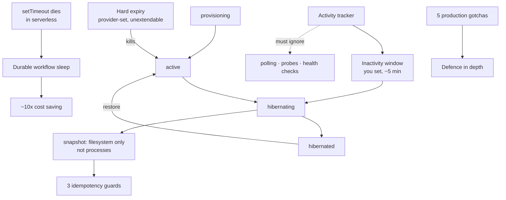

# 07 - Sandbox Lifecycle
Source: https://vercel.com/academy/build-ai-agent-harness · Course: Harness Engineering/Build Your Own AI Coding Agent Harness - Vercel · Added: 2026-07-27

## Summary
The one module that is **concept and analysis, not build-along** — sandbox lifecycle involves durable workflows and state machines you can't safely demo locally. It models the cloud sandbox as a four-state machine (provisioning → active → hibernating → hibernated, with restore back to active) driven by two clocks: a **hard expiry** you can't extend and an **inactivity window** you set. It then covers what `snapshot`/`restore` actually preserve (filesystem, not running processes) and the three idempotency hazards around them, why `setTimeout` is useless for lifecycle in serverless (the function dies and takes the timer with it) and what durable workflows do instead, and closes with five production gotchas that each caused a real outage, cost spike, or lost work. The recurring theme is money: active is the expensive state, and every bug in this module shows up on the bill.

## Glossary
**Hard expiry**:
The provider-set maximum lifetime (1–4 hours). When it hits zero the VM is killed regardless of what's happening. You can't extend it or argue with it — only finish or snapshot first.

**Inactivity window**:
The timeout *you* set; after N minutes of no activity the sandbox hibernates itself. 5 minutes is a reasonable default, 2 is aggressive, 20 means paying for idle. "Hard expiry is the worst-case bill. Inactivity is the typical bill."

**Activity tracker**:
One timestamp updated on every *real* event. The whole trick is deciding what's real — user messages, tool calls, and filesystem changes count; status polls, reconnect probes, and health checks must not.

**Idempotency**:
Calling something twice producing the same result as once. "Sandboxes are full of operations that you really, really do not want to call twice without thinking about it."

**Durable `sleep()`**:
A sleep that checkpoints the workflow to durable storage and resumes in whatever function instance is available — across deploys and host restarts. The seam that makes serverless lifecycle possible.

**Step function (`"use step"`)**:
A workflow-invoked function wrapping an external side effect. Retried on transient failure, cached on success; the workflow loop calls it like a normal function.

**State divergence**:
Sandbox state living in three places — provider API, your database, the client cache — which will disagree. The provider API is the only source of truth.

## Key Notes

### 7.1 State Machine
https://vercel.com/academy/build-ai-agent-harness/state-machine
- "A cloud sandbox is not 'running' or 'stopped.'" Four states, two timers, one activity tracker — that's the entire thing, and the mistakes happen when a piece is missing.

  | State | What's happening | Cost |
  |---|---|---|
  | Provisioning | VM spinning up, dependencies installing | Billing has started |
  | Active | Agent working, commands running | Full per-minute |
  | Hibernating | Snapshot in progress | Full per-minute |
  | Hibernated | VM stopped, snapshot stored | Storage only |

- Both *transition* states are short but billed at full rate — so you don't want them happening more than necessary.
- **What counts as activity** (the table that decides your bill): user chat message ✔ · tool call ✔ · sandbox event (file write, process spawn) ✔ · status polling ✘ · reconnect probe ✘ · health check ✘.
- Both failure modes are common: if polling counts, the sandbox never hibernates and you pay for hours of idle; if tool calls *don't* count, it hibernates mid-task and you lose in-progress work.
- Worked timeline: provision at 0:00 → active 0:02 → `npm install` 0:05 → responds 0:08 → inactivity fires 0:13 → hibernated 0:14 → user returns 0:20, restores → active 0:21 → hard expiry kills it at 1:30.
- Two open questions against that timeline — when to warn the user that hard expiry approaches, and when to auto-snapshot. "There's no single right answer. There's a wrong one (do nothing) and a less-wrong one (**auto-snapshot at 80% of hard expiry**)."

### 7.2 Snapshot and Restore
https://vercel.com/academy/build-ai-agent-harness/snapshot-and-restore
- **What a snapshot preserves**: filesystem state — `/workspace` contents, installed packages, agent-created files. **What it doesn't**: running processes, in-flight network connections, in-memory state. A build halfway through compiling does *not* resume; the tests have to run again.
- **Three idempotency hazards**, each with a small guard:
  1. **Snapshot already in progress** — two snapshots fight over the same VM, or you get a partial one that looks valid. *Fix*: cache the in-flight promise, return it on the second call, clear it in `finally`.
  2. **Sandbox already running on restore** — you end up with two VMs, one wasting money and one still serving traffic. *Fix*: `attachOrRestore` — look for an active sandbox **before** you create.
  3. **Double stop** — inactivity timer and user both call `stop`, or hibernate and hard expiry both fire; the second call hits a dead VM and either fails loudly or corrupts state silently. *Fix*: a `stopped` boolean is enough.
- **What restore doesn't solve**: a snapshot is a moment in time. Restoring yesterday's snapshot gives you yesterday's code, dependencies, and env — a fossil if the project moved on. Production lifecycles either invalidate snapshots when the project changes or re-run `afterStart` (Module 4) after restore. **Neither is automatic.**
- You can fake a local snapshot with `git stash` or a tarball — semantically wrong (a real snapshot freezes everything, not just tracked files) but it teaches the seam.

### 7.3 Durable Workflows
https://vercel.com/academy/build-ai-agent-harness/durable-workflows
- The task is trivial — poll every 30s, hibernate if idle. "In a long-running server, that's a `setInterval` and you go home."
- **Why `setTimeout` fails in serverless**: the calling function returns, the runtime cleans up its process, the timeout is garbage collected, the check never runs — *while the sandbox keeps running and billing*. Even if it survived one tick, the next deploy would replace it and lose the timer state.
- The workflow pattern: `await sleep(POLL_INTERVAL)` doesn't pause the function — it **checkpoints the workflow to durable storage and returns**, resuming 30 seconds later wherever a function instance is available. "The loop body is normal code. The `sleep` is the magic."
- External side effects live in `"use step"` functions, which are retried on transient failure and cached on success.
- Cost math for a middle case:

  | Setup | Behavior | Cost per session |
  |---|---|---|
  | No lifecycle | Runs to hard expiry (4h) | 4h × $0.02/min = **$4.80** |
  | Inactivity hibernation | Hibernates after 5 min idle | 25 min × $0.02/min = **$0.50** |

- **The pattern survives the runtime** — Vercel Workflow, Temporal, AWS Step Functions all provide it. Look for the equivalent of `sleep()` and step functions. "Roll your own only if you really mean it."
- Where it slots in: `afterStart` launches the durable workflow, `beforeStop` tells it to wrap up, and the workflow calls back through the same `Sandbox` interface. **That's why the interface is shaped the way it is** — the in-process world (local) and the multi-deploy world (cloud) fit behind one surface.

### 7.4 Hard-Won Lessons
https://vercel.com/academy/build-ai-agent-harness/hard-won-lessons
- Five gotchas from teams running production harnesses. "They look obvious once you've seen them. They aren't obvious before that, which is why they keep happening."
  1. **Stale handles after reconnect** — the handle survives the disconnect, the session inside it doesn't; commands go in and garbage comes out or the call hangs. *Fix*: probe with `echo probe` before using a reconnected handle, and recreate from the last snapshot if it fails. Probes are read-only and quick.
  2. **Stale expiry data** — `expiresAt` was already old when you cached it; passing a derived `remainingTimeout` to a provider API can create a sandbox that's *already expired*. *Fix*: fetch fresh expiry before lifecycle decisions. **Cache expiry for display, not for control flow.**
  3. **Polling resets inactivity** — the sandbox never hibernates and runs to hard expiry. "A clean pure-function bug masquerading as an integration issue." *Fix*: the tracker counts only user-initiated work.
  4. **Auto-resume loops** — reconnect → auto-resume → lifecycle check sees no activity → snapshot → hibernate → auto-resume… "an infinite loop out of two pieces of code that look correct in isolation." *Fix*: auto-resume only on *initial* entry; later reconnects join the active sandbox. **Don't chain transitions automatically.**
  5. **State divergence** — provider API vs. your DB vs. client cache. *Fix*: the provider API is the source of truth; everything else is a cache. "When in doubt, fetch."
- **The combinations are worse than the individuals**: a stale handle *plus* polling-as-activity means paying for a sandbox you can't talk to; a divergent cache *plus* an auto-resume loop means three duplicate sandboxes for one user. Defence-in-depth — fix all five.
- Write the fix gates into the lifecycle hooks *before* the cloud backend exists. They no-op locally and are far cheaper to add now than to retrofit.
- Suggested practice: a `--chaos` flag that injects one failure per session (kill the sandbox mid-command, return a stale handle, force state divergence, skip a status update). "The first thing that breaks is the gotcha you forgot to defend against."

## Understanding Diagram

