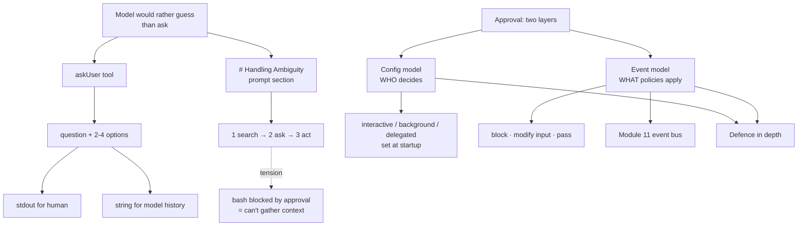

# 08 - Human-in-the-Loop
Source: https://vercel.com/academy/build-ai-agent-harness · Course: Harness Engineering/Build Your Own AI Coding Agent Harness - Vercel · Added: 2026-07-27

## Summary
Two lessons on getting the human back into the loop deliberately. The first builds `askUser` — and makes the point that **the tool is the easy half**: models trained on developer chat have absorbed a lot of "let me just figure this out for you" energy, so they'd rather guess than ask. The system prompt has to script a `# Handling Ambiguity` protocol (search → ask → act) before the agent will actually reach for the tool. The second lesson steps back to show that the Module 2 `ApprovalConfig` answers only *who decides*, not *what policies apply* — file-level rules like "never write to `.env`" and input rewrites like wrapping commands in an OS sandbox belong to a second, event-based layer that intercepts every tool call. The two layers combine as defence in depth; the event bus itself arrives in Module 11.

## Glossary
**`askUser`**:
A tool taking a `question` plus 2–4 `options`. Prints to stdout (so the human sees it) and returns the same content as a string (so the model sees a pending question in its history).

**Ambiguity protocol**:
The numbered `# Handling Ambiguity` prompt section — **search first, ask second, act third** — that gives the model a sequence it can follow rather than a preference it can ignore.

**Config approval model**:
Module 2's `ApprovalConfig` discriminated union. Set at startup, fixed for a session. Answers *who decides*.

**Event approval model**:
A `tool_call` interceptor firing on every call that can `{ block, reason }`, rewrite the input, or pass through. Answers *what policies apply*.

**Input modification**:
The event layer's distinctive power — rewriting a tool's arguments before execution, e.g. wrapping a bash command in `sandbox-exec -p '(deny default)'`. The config layer can't do this at all.

**Risk score**:
A suggested alternative to binary approve/deny — score commands 0–100 (disk write +30, network +20, deletion +50, config change +40, read-only 0) against a tunable threshold, logging every auto-approval for audit.

## Key Notes

### 8.1 Structured Questions
https://vercel.com/academy/build-ai-agent-harness/structured-questions
- **"The agent will not ask you questions. Not on its own."** Build `askUser` and the model will read the description and carry on not using it — "asking feels weak to them."
- The fix is two-part: a small tool, and a system prompt that does the real work of telling the agent that asking is the right move. *"The system prompt scripting is doing more work than the tool description here."*
- The tool's `execute` doesn't actually block — it prints the question and returns a string ending `(Awaiting user response.)`. That's enough for the model to know the question is in flight and not act as if it were answered.
- The prompt protocol:
```
# Handling Ambiguity
1. Search the code or docs to gather context first
2. Use askUser to let the user choose. Do NOT guess.
3. Examples: "add auth" -> ask OAuth or JWT; "set up a db" -> ask Postgres or SQLite
Specific tasks (file paths, line numbers, precise instructions) do not need askUser. Act directly.
```
- **The numbered sequence matters.** Without it the agent asks too early (before it has enough context for the question to be useful) or too late (after it started building the wrong thing). Two examples are enough to anchor the pattern — don't overload it.
- **Models would rather explore than ask**: even with the protocol, expect three or four file reads before `askUser` appears. That's correct — step 1 *is* "search first" — and worth knowing if you're watching impatiently.
- **A real tension, not a bug**: if `bash` is blocked by approval, the agent can't gather the context it needs and may never reach step 2. "The approval system and `askUser` are in tension, and that tension is real architectural friction."
- Verification is two prompts: "Add authentication to this project" should trigger `askUser`; "Add a null check at line 42 of src/auth.ts before the database query" should not.
- What's still missing: a real harness would *pause*, collect the choice, and inject it as the next user message. Where the harness intercepts the result and where the answer enters the conversation is the design question — and the event approach in 8.2 is where it wires in.

### 8.2 Approval Config
https://vercel.com/academy/build-ai-agent-harness/approval-config
- The discriminated union answers **who decides**. It doesn't answer **what specific policies apply** — "block any write to `.env` regardless of mode," "wrap bash in a stricter OS-level sandbox regardless of mode." Those rules live one layer down.
- The event model fires on every tool call and can block, modify, or pass through:
```ts
harness.on("tool_call", async (event) => {
  if (event.toolName === "write" && event.input.path.endsWith(".env"))
    return { block: true, reason: "Cannot modify .env files" };
  if (event.toolName === "bash")
    event.input.command = `sandbox-exec -p '(deny default)' ${event.input.command}`;
  return { block: false };
});
```

  | Use case | Config | Events |
  |---|---|---|
  | CI run, auto-approve everything | `mode: "background"` | Overkill |
  | Subagent inheriting parent trust | `mode: "delegated"` | Wrong level |
  | Block writes to specific files | Too coarse | File-level policy |
  | Wrap commands in an OS sandbox | Can't modify input | Input modification |
  | Project-specific safety rules | Global only | Per-project extension |

- **How they combine**: the config says "interactive mode, the human approves"; the event handler says "regardless of what the human approves, never touch `.env`." The event fires *after* the config but *before* the tool runs. Defence in depth.
- Why one knob can't carry both: **the mode is set by whoever runs the harness** (CI, a developer, a delegated subagent) while **the policies are set by the project** (`.env` is sensitive, the build directory is read-only, production credentials need OS-level sandboxing). "One config knob can't carry both kinds of decisions without getting tangled."
- The event layer is deliberately deferred to Module 11 — approval events are just one kind of lifecycle event, and once the bus exists the interceptor is a few lines. The four steps to add it: build a typed emitter → emit `tool_call` before each tool runs → let subscribers block or modify → wire one subscriber blocking a hardcoded file as a smoke test.
- Suggested extension: replace binary approve/deny with a **risk score** and a `--risk-threshold` flag — then face the real problem, "how to score `rm -rf /tmp/test` differently from `rm -rf /` without scoring purely on keywords."

## Understanding Diagram

