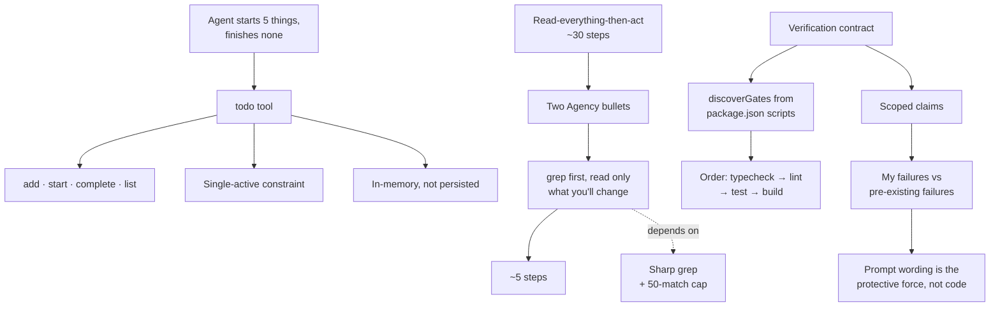

# 09 - Planning and Verification
Source: https://vercel.com/academy/build-ai-agent-harness · Course: Harness Engineering/Build Your Own AI Coding Agent Harness - Vercel · Added: 2026-07-27

## Summary
Three lessons that make the agent work like a disciplined engineer rather than a panicked one. A **todo tool** gives it a list with one rule it can't argue with — only one item `in_progress` at a time — because otherwise the agent "starts five things at once, finishes none of them, and then explains what it was about to do." A two-bullet prompt change replaces the default *read-everything-then-act* strategy with **search first, read second, act third**, collapsing a thirty-step exploration into five. Finally the Module 3 verification section grows up: gates are **discovered from the project's own `package.json`** rather than hardcoded, run in a known order, and reported with scoped claims that separate the agent's failures from pre-existing ones. The last point is the module's sharpest: gate-discovery code can be perfect and the agent will still claim "all tests pass" — the protective force is the prompt wording, not the plumbing.

## Glossary
**Single-active constraint**:
The todo tool's load-bearing rule — `start` is rejected while another item is `in_progress`. Without it the agent starts every item up front and races through them in parallel, losing focus on each.

**Grep-first exploration**:
The policy of searching to narrow the file set before reading anything, and never reading files "just in case." Lives in the Agency section (agent policy), not in the `grep` description (tool policy).

**Read-everything-then-act**:
The naive default: `package.json`, `tsconfig.json`, the entry point, every file in `src/` — twenty steps before the real work starts. "It feels thorough. It pollutes context, burns budget, and runs out of attention."

**Verification gate**:
A project check the agent can actually run — typecheck, lint, test, build — discovered from `package.json` scripts rather than assumed.

**Scoped claim**:
A report naming the exact command and result, and distinguishing failures the agent caused from failures already present: "47 passed, 3 failed — pre-existing in `user.test.ts`, unrelated to my changes."

## Key Notes

### 9.1 Todo Tool
https://vercel.com/academy/build-ai-agent-harness/todo-tool
- The agent under a complicated task does what humans do under pressure. "The fix is the same one that works for humans. Make a list. Pick one thing. Finish it. Cross it off."
- Four actions — `add`, `start`, `complete`, `list` — over an in-memory array of `{ id, description, state }` where state is `pending | in_progress | completed`.
- `start` rejects with a *specific* message when something else is active: `Already working on: [id] description. Complete it first.`
- `crypto.randomUUID().slice(0, 8)` is enough of an id; no serial counter needed.

  | Plan first | Skip the planner |
  |---|---|
  | 3+ steps to complete | One file change, known location |
  | Multiple files affected | A question that doesn't need files |
  | Dependencies between changes | Exploration with no outcome yet |
  | User asked for a multi-part feature | Bug fix with a precise error message |

- **Calibration signal**: if the agent makes a todo list for a one-line typo fix, the description is steering too aggressively — tighten WHEN NOT TO USE.
- **The list lives in memory on purpose.** A list that survives across sessions "tends to grow into a junk drawer of stale items," and a stale `in_progress` item carried into a new session is one the agent has no memory of starting. If you do want persistence, snapshot at session end.
- Extension worth trying: `dependsOn: string[]` per item, with `start` rejecting while any dependency is unfinished — so "rename the function" can depend on "find every caller." The question to sit with: where does this start to feel like overkill?

### 9.2 Fast Context Understanding
https://vercel.com/academy/build-ai-agent-harness/fast-context-understanding
- The entire change is **two bullets in the Agency section**: "Search before reading. Use grep first, then read only what you'll change." and "Don't read files 'just in case.' Read what you need when you need it."
- Deliberately *not* added to `grep`'s description — "it belongs at the agent's policy level, not the tool's."
- Naive flow on "Add rate limiting to the auth routes": read `package.json`, `tsconfig.json`, `src/index.ts`, `routes/index.ts`, `routes/auth.ts`, `routes/users.ts`, `middleware/index.ts`, *…20 more files*, then start.
- Grep-first flow on the same prompt: grep `router\.post.*auth|router\.get.*auth` → `routes/auth.ts` → read it → grep `rateLimit|rate-limit|middleware` → `middleware/rate-limit.ts` → read it → implement. **Five steps instead of thirty**, with "exactly the context it needs to act and almost nothing else."
- Reads can fan out in parallel once grep has narrowed the list (the SDK runs independent tool calls concurrently) — but **don't force it**; the search-first habit alone is the win.
- **The policy is only as good as `grep` is sharp.** A vague pattern returning hundreds of matches means the agent reads half the codebase anyway. The 50-match cap from Module 5 is doing real work here, as is the model's habit of narrowing its patterns once it sees the cap bite.
- Adaptive by design: a prompt naming a specific file should skip `grep` and go straight to `read`.
- Open question: architectural questions ("how is auth handled across the app") don't map to one regex. Is the answer a `survey` tool, or the Module 6 explorer with a tighter prompt? "Where's the line between a tool and a subagent?"

### 9.3 Verification Contract
https://vercel.com/academy/build-ai-agent-harness/verification-contract
- The full version of Module 3's section. The framing: an agent saying "tests pass" when three were already failing is only *slightly* better than one claiming success without running anything — **both are lying**. The truthful version is "three pre-existing failures, my change didn't introduce any new ones."
- `discoverGates(sandbox)` reads `package.json`, checks `scripts.typecheck` / `scripts["type-check"]` (different projects use different names), falls back to `npx tsc --noEmit` when TypeScript is a dependency but no script exists, then adds `lint`, `test`, `build` if present. Unreadable `package.json` → empty array, "still better than running gates that don't exist."
- The discovered list is threaded into `PromptContext` as `verificationCommands`, so the prompt lists **the project's actual gates**, not a generic placeholder.
- **Order matters**: typecheck first because it fails fastest, build last because it's slowest.

  | Model's default voice | What the contract produces |
  |---|---|
  | "All tests pass." | "Ran `npm test`: 47 passed, 3 failed — pre-existing in `user.test.ts`, unrelated to my changes." |
  | "The build works." | "Ran `npm run build`: succeeded in 4.2s, no warnings." |
  | "Looks good." | "Ran tsc: passed. Lint not configured. Test suite passed (12 tests)." |

- **"The hardest gate is the agent's honesty."** Perfect gate discovery won't stop it saying "all tests pass" unrun — the protective force is the prompt section. Spend time on the wording; **"Distinguish failures you caused from failures that were already there" is the load-bearing sentence.**
- Also explicit: "Do NOT inflate partial verification into a blanket success claim."
- Refinement worth benchmarking: sort gates by measured duration to fail fast (typecheck ~3s, tests ~30s, build ~90s) — then handle the fact that some gates *depend* on others (a build is meaningless if `tsc` failed) without losing the fail-fast property.

## Understanding Diagram

