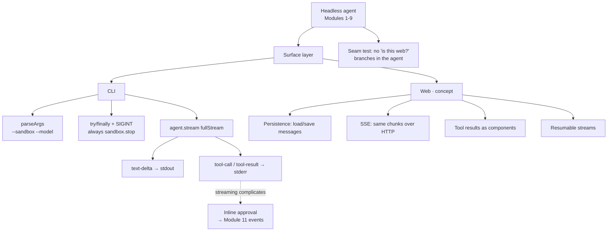

# 10 - Surfaces
Source: https://vercel.com/academy/build-ai-agent-harness · Course: Harness Engineering/Build Your Own AI Coding Agent Harness - Vercel · Added: 2026-07-27

## Summary
Module 10 is the payoff for nine modules of keeping the agent headless: **the agent code doesn't change between surfaces — only the wrapper does.** It formalises the CLI (`parseArgs` for `--sandbox` and `--model`, a `try/finally` plus a SIGINT handler so `sandbox.stop()` always runs — because Ctrl-C on a cloud sandbox means "leaving a VM running on someone else's credit card"), swaps `agent.generate()` for `agent.stream()` so tool calls appear the moment the model decides on them, and splits stdout/stderr so `2>/dev/null` leaves just the agent's answer. The final lesson is an architectural sketch of a web surface: same chunk shapes, different rendering — the surface adds persistence, SSE streaming, React components for tool results, and resumable streams. The test of a clean seam: *"if you find yourself adding 'is this web?' branches to the agent, that's the seam slipping."*

## Glossary
**Surface**:
The wrapper around the headless agent — CLI, web, Slack bot, IDE extension. Owns input, rendering, persistence, and auth; owns nothing about how the agent works.

**`parseArgs`**:
Node's built-in argument parser (`node:util`), used with `allowPositionals: true` to mix `--sandbox` / `--model` flags with positional cwd and prompt.

**`fullStream`**:
The async iterable returned by `agent.stream()`, yielding typed chunks — `text-delta`, `tool-call`, `tool-result` — that the surface switches on.

**stdout/stderr split**:
Response text to stdout, tool activity to stderr. Meta belongs *alongside* the response, not inside it — so redirecting stderr yields a clean answer.

**Resumable stream**:
A web-only capability: the user closes the tab mid-response and returns later, resuming the live stream if the agent is still running or the persisted state if it isn't. "The session is the unit of work. The stream is one render of that session."

## Key Notes

### 10.1 CLI Entry Point
https://vercel.com/academy/build-ai-agent-harness/cli-entry-point
- `bun run index.ts . "prompt"` was a CLI — "it just isn't a polite one." Positionals were doing too much work, the sandbox came from `process.env.SANDBOX`, the model was hardcoded, and Ctrl-C didn't shut anything down.
- Four changes: `parseArgs` for `--sandbox` (default `local`) and `--model` (default `anthropic/claude-haiku-4-5`); a `sandboxFromFlag(name, dir)` switch; a `SIGINT` handler; and `try/finally` around the agent run.
- **`finally` and the signal handler are deliberately redundant** — `finally` covers normal exit and thrown exceptions, the handler covers explicit interrupt. Two different paths to the same cleanup.
- The same cleanup code has very different stakes per backend: local cleans up nothing important, `just-bash` releases memory, cloud avoids leaving a VM billing. "Same code, different cost, all of them cleanly handled."
- **"The CLI is a thin wrapper."** Almost nothing in `index.ts` is about CLI concerns — the agent, tools, prompt, and sandbox are all reusable. The CLI parts are five or six lines. Build a web server, Slack bot, or VS Code extension and *only those lines change*.
- Extension worth building: `--session=<id>` that loads prior messages from disk and passes them to `agent.generate({ prompt, messages })`, saving them back on exit — plus the real questions of where the file lives, what happens when it's corrupt, and whether to version-stamp it so old sessions survive harness changes.

### 10.2 Streaming and Tool Rendering
https://vercel.com/academy/build-ai-agent-harness/streaming-and-tool-rendering
- `generate()` blocks until everything is done; past one or two steps you're "staring at a terminal that looks frozen, with no idea whether it's working or stuck."
- The whole change is `for await (const chunk of result.fullStream)` with a switch on `chunk.type`: `text-delta` → `process.stdout.write`, `tool-call` → stderr with name and args, `tool-result` → stderr with a ~100-char preview.
- **Tool results are meta — "they go alongside the response, not inside it."** That's what makes `2>/dev/null` give you a clean answer with no tool noise.
- What it buys the user: the tool call appears the moment the model decides on it, the result the moment the tool returns, and the answer streams as it's written. "The user can read along instead of waiting."
- Per-tool rendering table (a hint, not a contract): `read` → path + line count · `grep` → match count + first three · `bash` → command + exit code · `write` → path + bytes · `edit` → path + "1 replacement" · `task` → subagent type + step count · `askUser` → full question and options. Per-tool formatting "earns its place when one tool's output is consistently noisy."
- **Streaming complicates inline approval**: the block-string approach works fine with `generate`, but pausing the stream to ask and then resuming is *an interaction loop, not a chunk handler*. That pattern belongs to Module 11's events.

### 10.3 Web Surface (concept)
https://vercel.com/academy/build-ai-agent-harness/web-surface
- Concept-only on purpose — a working web frontend is a module (or several) of its own, "and the teaching point is about separation, not about React."

  |  | CLI | Web |
  |---|---|---|
  | Output | Terminal text | Chat bubbles |
  | Tool calls | stderr lines | Tool result components |
  | Approval | stdin prompt | Button group |
  | Lifetime | Process exit | Session persistence |
  | Streaming | `process.stdout.write` | Server-sent events |
  | Input | One shot from argv | Continuous from the textarea |

- **Persistence lives in the surface, not the agent**: the surface loads messages, passes them to `agent.stream({ prompt, messages })`, and saves them back. "The agent doesn't know about the database."
- Streaming over HTTP is a `ReadableStream` enqueuing `data: ${JSON.stringify(chunk)}\n\n` with `Content-Type: text/event-stream` — **the same chunk shape the CLI consumes**, just over the network.
- Tool results become components: `read` → syntax-highlighted code block · `grep` → search results with file links · `bash` → terminal output with an exit-code badge · `write`/`edit` → diff views · `askUser` → an actual button group. "The agent emits the same chunks. The surface chooses how to display them."
- **Resumable streams** are the capability the CLI simply can't have, because there's no surface to come back to.
- The seam test: *"If you find yourself adding 'is this web?' branches to the agent, that's the seam slipping. Pull the special case back out into the surface."* You'll know the separation is clean if Modules 1–9's code runs unchanged.

## Understanding Diagram

