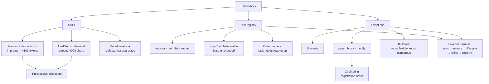

# 11 - Extensibility
Source: https://vercel.com/academy/build-ai-agent-harness · Course: Harness Engineering/Build Your Own AI Coding Agent Harness - Vercel · Added: 2026-07-27

## Summary
The closing module turns the harness into something other people can extend without forking it. **Skills** apply Module 5's prevention discipline to the knowledge layer: names and one-line descriptions sit in the system prompt forever (~100 tokens for five skills), full markdown loads on demand through a `loadSkill` tool (~5,000 tokens *only when needed*) — progressive disclosure instead of a fifteen-thousand-token system prompt. A **tool registry** replaces the hardcoded tool object, with a `wrapTool(base, hooks)` helper so a project can rewrite a built-in's inputs without touching the harness core. Finally an **event bus** sketch handles what the registry can't: the cross-cutting concerns *around* tool calls — logging, blocking writes to `.env`, injecting instructions before compaction, auto-committing on shutdown — with handlers that pass through, block, or modify, chained in registration order. The bus is last on purpose: it's the most flexible extension surface and the most dangerous.

## Glossary
**Progressive disclosure**:
Keeping cheap pointers permanently in context and loading expensive content only on demand. Five skills as one-liners ≈ 100 tokens; five skills inlined ≈ 5,000 tokens *on every call, forever*.

**Skill**:
A `skills/<name>/SKILL.md` file with YAML frontmatter (`description:`) and markdown body. Discovered at startup; content returned by `loadSkill`, capped at 4,000 chars.

**Skill precedence**:
Deduplication by name across multiple directories, first-directory-wins — so project-local skills override global ones in `~/.harness/skills`.

**Tool registry**:
`Map<string, Tool>` behind a typed interface (`register`, `get`, `list`, `entries`). Owns no policy — "whoever calls `register` decides what gets in." The agent's `tools` field becomes `Object.fromEntries(registry.entries())`.

**`wrapTool`**:
Composition helper returning a new tool that runs optional `beforeExecute` (rewrite input) and `afterExecute` (post-process output) around a base tool. The base stays unchanged, so other consumers aren't broken.

**Lifecycle event**:
One of five emission points — `session_start`, `tool_call`, `tool_result`, `session_before_compact`, `session_shutdown` — that extensions subscribe to.

**Pass / block / modify**:
The three handler outcomes. No return value passes through; `{ block: true, reason }` stops the call and feeds the reason back to the model as the tool result; `{ modify }` alters the data that subsequent handlers and the harness see.

## Key Notes

### 11.1 Skills System
https://vercel.com/academy/build-ai-agent-harness/skills-system
- The naive approach — pasting conventions into the system prompt — survives one or two packages. "By five, the system prompt is fifteen thousand tokens long, you're paying for them on every call, and the agent is rummaging through them looking for the one bullet that applies to today's task."
- `discoverSkills(dirs)` scans `<dir>/<name>/SKILL.md`, parses frontmatter, and **deduplicates by name with the first directory winning** — project-local skills override globals. `dirs` is an array "because real harnesses look in more than one place."
- Frontmatter parsing needs no library — a slice between `---` markers finding the `description:` line is enough.
- The prompt section is one line per skill (name + description); the `loadSkill` tool returns full content, **capped at 4,000 chars** so a skill that grew to fifteen thousand words can't blow the window on a single call. Same caps discipline as Module 5, applied to knowledge.
- **The economics**: five skills × 1,000 words inline ≈ 5,000 tokens added to *every* call forever; five one-line descriptions ≈ 100 tokens total. "The model still knows the skills exist… The full content only enters context when there's a reason."
- **"The model has to ask."** Skills are a *retrieval path, not a guarantee* — nothing auto-loads. Watch your sessions: **if the model never loads a skill that would obviously help, your skill descriptions need sharper hooks.**
- Verification is two prompts: a task naming the skill should trigger `loadSkill`; an unrelated question ("syntax for a TypeScript const assertion") should load nothing.
- Extension: an optional `section` parameter so the model can load just one heading — raising the question of "where you draw the line between 'skill as document' and 'skill as a small searchable corpus'."

### 11.2 Custom Tools
https://vercel.com/academy/build-ai-agent-harness/custom-tools
- Hand-built tool objects work for the course's seven tools. They don't work "when someone wants to add their own `deploy` tool, or wrap `bash` with project-specific safe commands, **without forking the harness**."
- The registry is deliberately dumb — a Map plus four methods, owning no policy. `entries()` returning `[name, tool][]` is what makes `Object.fromEntries` work cleanly.
- **Registration order matters**: `task` needs `read` and `grep` to already be in the registry, since it spawns subagents that use them. "Get the order wrong and you'll register `task` with undefined references."
- `wrapTool` is where the seam pays off — re-registering `bash` as a wrapped version that appends `--reporter=spec` to `bun test` means "the agent never sees the unwrapped one. The harness core never changed."
- Both `toolNames` in the prompt and `tools` on the agent now derive from the registry, so adding or removing a tool is one line.
- **The extension surface table** — every row is code already written:

  | Surface | What you can customize | How |
  |---|---|---|
  | Tools | Add, remove, wrap | Registry + `wrapTool` |
  | Skills | Add specialized knowledge | `skills/` + `loadSkill` |
  | Sandbox | Custom backends | `createSandbox` factory |
  | Approval | Custom policies | Config + events |
  | System prompt | Custom sections | `PromptContext` + `buildSystemPrompt` |
  | Model | Per-role models | Subagent definitions |

- Follow-up worth doing: `registry.unregister(name)` and full *replacement* rather than wrapping — which forces the questions of where replacement belongs in the bootstrap order and what breaks if it happens after the agent is built.

### 11.3 Extension Points
https://vercel.com/academy/build-ai-agent-harness/extension-points
- The registry answers "what tools exist"; it doesn't answer "**what happens around tool calls**" — logging, blocking protected files, OS-level sandboxing, auto-commit on shutdown. "These are cross-cutting concerns that don't belong inside any single tool."
- Five events keep the contract legible: `session_start`, `tool_call`, `tool_result`, `session_before_compact`, `session_shutdown`. "Adding more later is fine; starting with five is what keeps the contract legible."
- Four worked extensions: **logging** (no return → pass through) · **protected files** (`return { block: true, reason }`, and the reason goes back to the model *as the tool result*, so it reports the policy in plain text) · **compaction safety** (`return { modify: { customInstructions: "Preserve all safety constraints…" } }` — "compaction is a moment where instructions can leak") · **auto-commit on shutdown** (Module 4's `beforeStop`, generalized so any session ending for any reason gets to checkpoint).
- **The chaining rule**: handlers run in registration order; any `block: true` stops the call; a `modify` is visible to subsequent handlers. **Order produces the trace** — "logging before safety checks captures the call attempt even when it gets blocked. Telemetry after the result captures what actually ran. Get it wrong and you log half the story."
- How the layers overlap, deliberately: the Module 2 **approval config** sets the operational mode and runs at the tool level; the **event bus** runs *around* the tool layer and can block even when approval would have passed; Module 4's **lifecycle hooks** are the convenient names for the common cases of `session_start`/`session_shutdown`; **skills don't go through events at all**, because the *model* decides whether to load one, not the harness.
- The finished architecture, layered: **tools at the bottom → events around tools → lifecycle hooks at the session boundary → skills as discovered knowledge → registries as the entry point for everything.**
- **Why the event bus is the last lesson**: it's the most flexible extension surface *and the most dangerous* — "a bad handler can deadlock the agent, leak secrets through logging, or block legitimate tool calls." Learning it last means you understand what you're plugging into. "If you wired this earlier, the temptation would be to handle every problem with an event hook."
- The implementation is genuinely small: a `Map<string, Handler[]>` and an `emit` running handlers in order with early exit on block, plugged in right before tool execution and right after the result. Module 4's lifecycle hooks become the first two subscribers.
- Capstone suggestion: a **telemetry extension** appending timestamps, durations, and token counts to JSONL as they happen (so a crash doesn't lose the trace), producing a one-screen session report — then running the same task under two different system prompts and diffing. "This is how you A/B test agent behavior without guessing."

## Understanding Diagram

