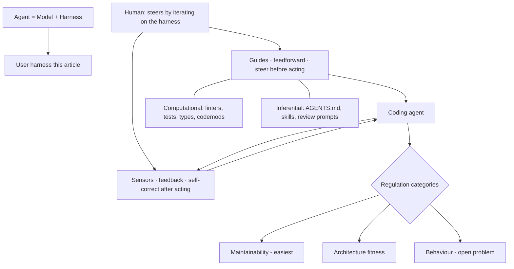

# Harness Engineering for Coding Agent Users - Martin Fowler
Source: https://martinfowler.com/articles/harness-engineering.html · Course: Harness Engineering · Added: 2026-07-27

## Summary
A mental model (Birgitta Böckeler, Thoughtworks; on martinfowler.com, 02 Apr 2026) for building trust in coding agents that work with less supervision. Starting from **Agent = Model + Harness**, it narrows "harness" to the *user*-built outer harness around a coding agent and organizes it along two axes: **Guides (feedforward)** that steer the agent before it acts, and **Sensors (feedback)** that let it self-correct after; each being either **Computational** (deterministic, fast, cheap) or **Inferential** (semantic, LLM-based, slower/non-deterministic). The human's job is to **steer** — iterate on the harness whenever an issue recurs — and to keep quality "left" in the delivery lifecycle. It closes with regulation categories (maintainability / architecture-fitness / behaviour), harnessability, harness templates, and Ashby's Law.

## Glossary

**Harness (Agent = Model + Harness)**:
Everything in an AI agent *except the model itself*. A wide definition, so the article bounds it to **coding agents** and distinguishes the **builder harness** (built into the agent — system prompt, retrieval, orchestration) from the **user harness** (what you build for your own use case and system).

**Guides (feedforward controls)**:
Controls that **anticipate** the agent's behaviour and steer it **before** it acts — raising the probability of a good result on the first attempt (e.g. `AGENTS.md`, skills, coding conventions, bootstrap scripts, codemods, LSPs).

**Sensors (feedback controls)**:
Controls that **observe after** the agent acts and help it **self-correct** (e.g. linters, tests, type-checkers, review agents). Especially powerful when their signals are optimised for LLM consumption — e.g. custom linter messages that embed self-correction instructions ("a positive kind of prompt injection").

**Computational vs Inferential**:
The two execution types of guides/sensors. **Computational** — deterministic, fast, CPU-run (tests, linters, type-checkers, structural analysis); reliable, cheap enough to run on every change. **Inferential** — semantic, GPU/NPU-run (AI code review, "LLM as judge"); richer but slower, costlier, non-deterministic.

**Steering loop**:
The human's core job — **iterate on the harness**. When an issue recurs, improve the feedforward/feedback controls so it's less likely (or impossible) next time. AI can help build the controls (draft rules, structural tests, custom linters).

**Keep quality left**:
Borrowing from CI/CD — distribute controls across the lifecycle by cost/speed/criticality: fast, cheap checks pre-commit; expensive ones (mutation testing, broad review) post-integration in the pipeline; plus **continuous drift/health sensors** running outside the change lifecycle.

**Regulation categories**:
Dimensions of the desired state a harness regulates — **Maintainability** (internal code quality; easiest today, rich existing tooling), **Architecture fitness** (fitness functions for arch characteristics), **Behaviour** (does it functionally work — "the elephant in the room," still unsolved; over-relies on AI-generated tests; see the *approved fixtures* pattern).

**Harnessability & ambient affordances**:
How amenable a codebase is to harnessing — strong typing gives type-checking for free, clear module boundaries afford arch rules, frameworks abstract away risk. **Ambient affordances** (Ned Letcher): structural properties that make an environment "legible, navigable, and tractable to agents." Greenfield can bake it in; legacy faces "the harness is most needed where it is hardest to build."

**Harness templates + Ashby's Law**:
Reusable bundles of guides/sensors leashing an agent to a service **topology** (like service templates). **Ashby's Law of Requisite Variety**: a regulator needs at least as much variety as the system it governs — committing to a topology is a *variety-reduction* move that makes a comprehensive harness achievable.

## Key Notes

### The framing
- Software engineers have a **natural trust barrier** with AI code — LLMs are non-deterministic, lack context, and "think in tokens." A good outer harness (1) raises the chance the agent gets it right first time and (2) provides a **self-correcting feedback loop** before issues reach human eyes → less review toil, higher quality, fewer wasted tokens.
- **Bounded contexts** (concentric circles): the model at the core, the coding agent's *builder* harness around it, the *user* harness outermost. "Harness" means different things per context.

### The two-axis model
- **Feedforward (Guides)** × **Feedback (Sensors)**, each **Computational** or **Inferential**. You need both directions: feedback-only → an agent that repeats mistakes; feedforward-only → an agent that encodes rules but never learns if they worked.
- Examples: coding conventions (feedforward/inferential → AGENTS.md, skills); codemods (feedforward/computational → OpenRewrite recipes); structural tests (feedback/computational → ArchUnit in a hook); review instructions (feedback/inferential → skills).
- **Harness engineering is a specific form of context engineering** — context engineering makes the guides and sensors available to the agent.

### Regulation & the harness as a governor
- The harness acts like a **cybernetic governor**, combining feedforward + feedback to regulate the codebase toward a desired state.
- **Maintainability**: computational sensors reliably catch structural issues (duplication, complexity, coverage gaps, arch drift, style); LLMs partially catch semantic issues (semantic duplication, redundant tests, over-engineering) but expensively/probabilistically; neither reliably catches misdiagnosis, unnecessary features, or misunderstood instructions — and **correctness is outside any sensor's remit if the human didn't clearly specify what they wanted**.
- **Behaviour harness** is the hard, open problem — current practice leans on AI-generated test suites (coverage + mutation testing + manual), which isn't trustworthy enough yet.

### The human & open questions
- Humans bring an **implicit harness**: social accountability, taste, "we don't do it that way here," organisational memory, small human-paced steps. Agents have none of it. Harnesses **externalise** that experience but only go so far — a good harness directs human input to where it matters most, not eliminates it.
- Industry signals: OpenAI ("designing environments, feedback loops, and control systems" is the hard part now), Stripe's "minions" (shift-feedback-left, pre-push hooks, blueprints), resurgent mutation/structural testing, LSP/code-intelligence integration.
- Open questions: keeping a growing harness **coherent** (guides/sensors in sync, not contradictory); trusting agents to trade off when signals conflict; whether silent sensors mean high quality or poor detection; measuring **harness coverage/quality** (like code coverage/mutation testing does for tests). Building the outer harness is an **ongoing engineering practice**, not a one-time config.

## Understanding Diagram

