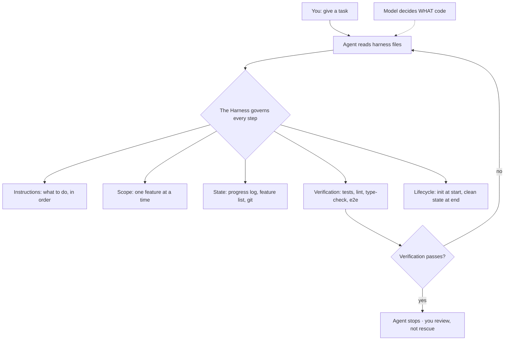

# Learn Harness Engineering - walkinglabs
Source: https://github.com/walkinglabs/learn-harness-engineering · Course: Harness Engineering · Added: 2026-07-27

## Summary
A project-based course (walkinglabs) on **harness engineering** — building the environment, state management, verification, and control mechanisms that make AI coding agents reliable. Its thesis: the strongest model still fails on real engineering tasks without a proper harness around it; reliability is a *harness* problem, not a *model* problem. It defines a harness as **five subsystems** (Instructions, State, Verification, Scope, Session Lifecycle), teaches them through **13 lectures + 7 hands-on projects** evolving one Electron knowledge-base app, and gives a 4-file quick-start you can drop into any repo today. The model decides *what* code to write; the harness governs *when, where, and how*.

## Glossary

**Harness engineering**:
Building a complete working **environment around the model** so it produces reliable results — not better prompts, but designing the system the model operates inside. "The model decides what code to write; the harness governs when, where, and how it writes it."

**The five subsystems**:
The anatomy of a harness — **Instructions** (what to do, in what order), **State** (what's done/in-progress/next, persisted to disk), **Verification** (only a passing test suite counts as evidence), **Scope** (one feature at a time, explicit definition of done), **Session Lifecycle** (init at start, clean state + handoff at end).

**Instructions (progressive disclosure)**:
The agent's operating manual (`AGENTS.md` / `CLAUDE.md`, feature list, `docs/`) — *not* one giant file, but a navigable structure the agent reads on demand. "Give a map, not an encyclopedia."

**State**:
On-disk memory (`claude-progress.md`, `feature_list.json`, git log, session handoff) so the next session picks up exactly where the last left off — the fix for lost multi-session continuity.

**Verification**:
Runnable proof (tests, lint, type-check, smoke runs, e2e pipeline) — the agent can't declare victory without evidence. Only a **full-pipeline run** counts as real verification; confidence ≠ correctness.

**Scope**:
Machine-readable boundaries (`feature_list.json`) constraining the agent to **one feature at a time** — no overreach, no half-finishing three things, no rewriting the list to hide unfinished work.

**Agent session lifecycle**:
The structured flow every session follows — **START** (read instructions, run `init.sh`, read progress/feature list/git log) → **SELECT** (pick exactly one unfinished feature) → **EXECUTE** (implement, verify, fix-and-rerun, record evidence) → **WRAP UP** (update progress + feature list, note what's unverified, commit only when safe to resume, leave a clean restart path).

**`init.sh`**:
The initialization phase — install + verify + health-check the environment *before* the agent starts work, so a broken setup is caught up front.

**harness-creator / audit-harness.sh**:
Repo tooling — a reusable **skill** that scaffolds a production-grade harness, and a zero-dependency **shell audit** that checks a repo against all five subsystems (exits 0 when all CRITICAL items pass; no Node.js needed).

## Key Notes

### The core claim: reliability is a harness problem
- Strong model ≠ reliable execution. Agents start well (read files, write code) then skip steps, break tests, or say "done" when nothing works.
- **Anthropic experiment**: same model (Opus 4.5), same prompt ("build a 2D retro game editor"). *No harness* → ~$9 / 20 min, didn't work. *Full harness* (planner + generator + evaluator) → ~$200 / 6 hrs, a playable game. The model didn't change — the harness did.
- OpenAI reported the same with Codex: a well-harnessed repo turns the same model from "unreliable" to "reliable" — a qualitative shift, not marginal.

### The harness pattern
- You give a task → the agent reads harness files → executes, with the harness governing **every** step (instructions → scope → state → verification → lifecycle). The agent **stops only when verification passes**.
- Without/with contrast: without a harness you spend more time cleaning up than doing it yourself; with one, the agent does the work and **you review, not rescue**.

### Quick start — 4 files, today
- Drop starter templates into your repo root: `AGENTS.md` (or `CLAUDE.md`), `init.sh`, `feature_list.json`, `claude-progress.md`. These live in the repo so every session starts from the same state — significantly more stable than prompts alone.

### Course shape
- **Capstone**: all 7 projects evolve one product — an **Electron personal knowledge-base app** (import docs, index them, AI Q&A with grounded citations). Each project's solution becomes the next project's starter.
- **13 lectures across 7 phases**: (1) see the problem, (2) structure the repo as single source of truth, (3) connect sessions, (4) feedback & scope, (5) verification, (6) put it all together (capstone), (7) automate the loop (goal/timer/maker-checker loops — "stop prompting, design loops").
- **7 projects**: P01 prompt-only vs rules-first · P02 agent-readable workspace · P03 multi-session continuity · P04 runtime feedback & scope · P05 self-verification · P06 complete harness (capstone) · P07 first automated loop.
- Resources in 15 languages; core references include OpenAI/Anthropic harness write-ups, LangChain, Cursor, and Thoughtworks/Martin Fowler.

### Repo & tooling
- VitePress docs site (`docs/` lectures + projects + resources), shared Electron+TS+React foundation, `skills/harness-creator`, `tools/audit-harness.sh`. Run locally with `npm install` + `npm run docs:dev`.

## Understanding Diagram

