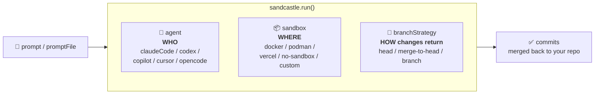
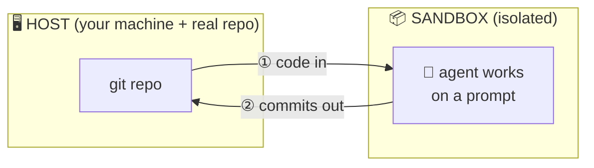

# Sandcastle — Team Guide

> A shared, from-scratch guide to **[`@ai-hero/sandcastle`](https://github.com/mattpocock/sandcastle)** — a TypeScript library for orchestrating AI coding agents inside isolated sandboxes. Written so any engineer on the team can go from zero to running complex, safe, parallel agent workflows in our enterprise.

---

## TL;DR (read this first)

**Sandcastle runs an AI coding agent against a copy of your repo, in an isolated box, then merges the good commits back.** One function call — `run()` — does the whole dance: copy code in → run the agent on a prompt → collect commits → merge home.

```typescript
import { run, claudeCode } from "@ai-hero/sandcastle";
import { docker } from "@ai-hero/sandcastle/sandboxes/docker";

await run({
  agent: claudeCode("claude-opus-4-8"), // WHO does the work
  sandbox: docker(),                      // WHERE it runs (isolated)
  promptFile: ".sandcastle/prompt.md",   // WHAT to do
});
```

Why we care: it lets us run agents **safely** (they can't wreck your working tree or leak into prod), **in parallel** (many agents, many branches, at once), and **as pipelines** (implement → verify → review → merge) — the same way whether local or in CI.

---

## The mental model (hold these in your head)

### Model 1 — The walled construction site 🏗️

| Real thing | Sandcastle term | Role |
|---|---|---|
| Your house (live) | **Host** | Your machine + the real git repo. Never let an agent swing a hammer here directly. |
| A fenced building site with a copy of the plans | **Sandbox** | A throwaway isolated environment (container / microVM) where the agent is free to make a mess. |
| The contractor | **Agent** | The AI coding tool (Claude Code, Codex, …) doing the work. |
| The site manager | **Sandcastle** | Fences the site, hands over the blueprint (prompt), lets the contractor build, inspects the result, and merges the finished work back into your house. |

The name says it: you **build in a sandbox, then bring the good parts home**.

### Model 2 — Three pluggable slots + one data flow

Everything in the API is either one of **three slots** or config around them:



And the data always flows the same way:



Once the team internalizes **agent (who) · sandbox (where) · branchStrategy (how) · prompt→commits (the flow)**, every option in the reference slots neatly into one of those buckets.

---

## What's in this guide

| Doc | Read it when… |
|---|---|
| **[01 — Overview & Quick Revision](01-overview.md)** | You want to grok (or re-grok) Sandcastle fast: a one-page skim with the mental model, a whole-repo map, the 3-slot cheat-sheet, a tiny example, and a "things to remember" checklist. |
| **[02 — Detailed Notes](02-detailed-notes.md)** | You want everything: install & first run, every concept, all three slots in depth, diagrams, the execution model, advanced patterns, enterprise concerns, the complete options tables, end-to-end recipes, primers, and a glossary. |

> **New to containers, git worktrees, or AI coding agents?** The detailed notes have short **[primers](02-detailed-notes.md#appendix-a--primers)** — skim those first.

---

## At a glance

**Agents (the `agent` slot)** — `claudeCode` (default), `codex`, `copilot`, `cursor`, `opencode`. Swappable; you can write your own.

**Sandbox providers (the `sandbox` slot)**

| Provider | Import | Type | Best for |
|---|---|---|---|
| **Docker** ⭐ | `@ai-hero/sandcastle/sandboxes/docker` | Bind-mount | Local dev — our recommended default |
| Podman | `.../sandboxes/podman` | Bind-mount | Rootless / security-conscious hosts |
| Vercel | `.../sandboxes/vercel` | Isolated | Cloud microVMs — CI without local Docker |
| No-sandbox | `.../sandboxes/no-sandbox` | None | Interactive/trusted runs directly on host |

**Branch strategies (the `branchStrategy` slot)** — `head` (write straight to working dir), `merge-to-head` (temp branch → merge back), `branch` (land on a named branch). See the [comparison](02-detailed-notes.md#3-the-branchstrategy-slot--how-changes-come-home).

---

## Our enterprise use cases (covered as recipes in the reference)

1. **Parallel AFK agents** — fan out N agents on N branches, unattended, then collect results. → [recipe](02-detailed-notes.md#recipe-1--parallel-afk-agents)
2. **Implement → review pipeline** — one agent builds, gate on tests, another reviews/fixes on the same warm sandbox. → [recipe](02-detailed-notes.md#recipe-2--implement--review-pipeline)
3. **Orchestrate our own agents** — plug custom agents / custom sandbox providers into the same spine. → [recipe](02-detailed-notes.md#recipe-3--orchestrate-our-own-agents)
4. **CI / automation** — headless runs from pipelines with structured output and secrets. → [recipe](02-detailed-notes.md#recipe-4--ci--automation)

---

_Source: [github.com/mattpocock/sandcastle](https://github.com/mattpocock/sandcastle) · package `@ai-hero/sandcastle` (AI Hero). This guide was written against the repo README, docs site, and source; verify version-specific details against the package you install._
