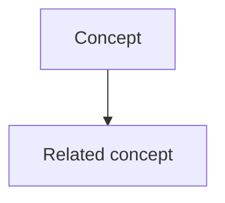

# How These Notes Are Made — Process

The core idea of this repo: **given a video URL, extract its text and turn it into a self-contained study note** — a summary, a glossary, key notes, and a Mermaid understanding diagram — filed per course and indexed automatically. This document explains that extract → write pipeline.

---

## The goal
For any lecture/video, produce **one markdown note** that lets a future reader understand the content *without watching the video*:

1. **Source URL** — clickable, at the top.
2. **Summary** — 4–5 lines: what it's about and the main takeaway (the "should I revisit this?" blurb).
3. **Glossary** — the key terms, defined tightly (what each term *is*).
4. **Key Notes** — the substance, distilled into bullets, grouped by topic/chapter.
5. **Understanding Diagram** — a Mermaid `graph TD` showing how the main concepts relate.

The raw transcript is also kept (hidden, for regeneration) so the note can be rebuilt later without re-fetching.

---

## Step 1 — Extract the text from the video
How you get the transcript depends on where the video lives.

### A. YouTube / yt-dlp-supported sites (automatic)
- `yt-dlp` grabs the **captions** directly (fast path).
- If the video has no captions, **`faster-whisper`** transcribes the audio locally on CPU (slower, ~10–15 min per hour of video).
- This is fully automated by the `/learn` skill — it also pulls the **title** and **chapter markers** when present.

### B. Paywalled / non-YouTube pages (e.g. an aihero.dev lesson — paste)
- A logged-in course player like **aihero.dev is not yt-dlp-supported**, so auto-fetch returns *"Unsupported URL"*.
- Instead, **the source text is pasted in by hand** from the lesson page. Grab both, when available:
  1. **The lesson article / write-up** — clean structure, exact commands, links, code blocks.
  2. **The video transcript** — the spoken walkthrough (often with `mm:ss` timestamps), which adds nuance and the "why."
- Having both gives the best note: the article supplies precise structure, the transcript supplies intent. The note is **reconciled from both**.

> The output is identical either way — only the *source* of the text differs (auto-fetched vs pasted).

## Step 2 — Write the note from the text
Compose the note from the extracted text — **distill, don't transcribe**. Aim for *adequate detail*: enough to understand the lesson, not a word-for-word rewrite.

### Summary (4–5 lines)
Plain language, no unexplained jargon. State what the video covers and the main takeaway so it works as a 10-second "is this worth opening?" reference.

### Glossary (bold-term format)
Define the terms the video introduces — tight and opinionated, one or two sentences on what each term **is** (not what it does).

```
**<Term>**:
<definition>
_Avoid_: <alias>, <alias>      ← optional: other words for the same thing
```

Skip generic terms the reader already knows. Prefer the glossary's own terms inside other definitions.

### Key Notes
Bulleted, organized by topic. For a **long video (~30 min+) with chapter markers**, use one `### <Chapter>` subsection per chapter to preserve lecture structure for recall. Otherwise group by natural topic. **Bold** key terms; use `code font` for commands, filenames, and tool/skill names.

### Understanding Diagram (Mermaid)
A `graph TD` (top-down) with **5–12 nodes**, short labels (1–4 words), showing how the main concepts relate — not every detail. Test: would it make sense at a glance in 3 months?



## Step 3 — File, index, and commit
1. **Save** the note as `<Course>/<Sanitized Title>.md`, and copy the raw transcript to `<Course>/.transcripts/<Title>.txt`.
2. **Rebuild indexes** with `python scripts/update_index.py` — regenerates the master `INDEX.md` and each `<Course>/INDEX.md`.
3. **Commit + push** the new note and the updated indexes.

`<Course>` is one top-level folder per learning and may be nested (e.g. `Mattpock/AI coding for real engineers`).

---

## The `/learn` skill ties it together
Running `/learn <url> --course "<Course>"` in Claude Code does the whole flow end-to-end: fetch transcript → compose the note (summary + glossary + key notes + Mermaid) → file under `<Course>/` → rebuild indexes → commit + push.

For **paid/non-YouTube lessons**, the only difference is Step 1: paste the lesson's text instead of auto-fetching; everything downstream is the same.

## Tooling summary
| Purpose | Tool |
|---|---|
| Fetch captions / detect chapters | `yt-dlp` |
| Transcribe audio when no captions | `faster-whisper` (local, CPU) |
| Audio/subtitle handling for yt-dlp | `ffmpeg` |
| Compose the note | Claude (in Claude Code) — no cloud LLM call |
| Rebuild indexes | `python scripts/update_index.py` |
| Orchestration | the `/learn` skill (`.claude/skills/learn/`) |
