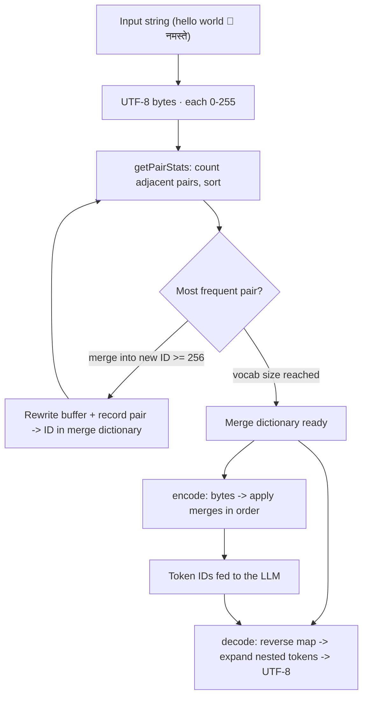

# Building Tokenizer From Scratch In TypeScript
Source: https://www.youtube.com/watch?v=mRcf5qQSYws · Course: LLM Internals · Added: 2026-07-27

## Summary
A hands-on, math-light walkthrough (Mehul Mohan / codedamn) that builds a working **Byte Pair Encoding (BPE) tokenizer from scratch in TypeScript** — aimed at web developers, no ML background needed. It establishes why LLMs never see text (only token IDs), why character/byte-level tokenization is computationally infeasible (attention cost, finite context windows), and then implements the whole pipeline: UTF-8 bytes → count adjacent pair frequencies → repeatedly merge the most frequent pair into a new token ID → build a merge dictionary → `encode`/`decode` arbitrary text. Along the way it uses the Tiktokenizer tool to compare real tokenizers (GPT-2 vs GPT-4's `cl100k_base` vs GPT-5's `o200k_base`) and shows why "data matters" — frequent sequences like `function` become single tokens through training.

## Glossary

**Tokenizer**:
The component that converts a string into a list of **numbers (token IDs)** on the way in and back to text on the way out. It's a **separate piece** from the LLM — you can build/use one on its own — but ships coupled with each model. The LLM "never really sees the string," only the numbers.

**Token / token ID**:
An integer standing for a character *or a group of characters*. Grouping (e.g. `meh`, `mo`, `an`) is what makes LLMs efficient; each ID later maps into the model's vector space.

**Byte Pair Encoding (BPE)**:
The core algorithm — repeatedly find the **most frequently adjacent pair** of tokens and replace every occurrence with a single new token, until no pair repeats (or a vocabulary limit is hit). Decoding = perform the replacements in reverse. It's fundamentally a **compression** scheme.

**UTF-8 bytes (0–255)**:
The starting representation — `Buffer.from(str, "utf8")` yields byte values, each ≤ 255 (8 bits). ASCII-compatible (`73` = `"I"`). Emojis / Hindi / Japanese use **multiple bytes** (up to 4) per character. This is why new token IDs must start at **256** — 0–255 are reserved for raw bytes.

**Vocabulary size**:
The target number of total tokens (e.g. 300). Since the first 256 are raw bytes, **iterations = vocabSize − 256**, and each merge creates exactly one new token. Real models cap vocabulary rather than merging exhaustively.

**`getPairStats`**:
The function that slides a 2-wide window over the token array, counts each adjacent pair's frequency into a `"a-b" → count` map, then sorts descending so the **most common pair** can be picked first.

**Merge / "token swapping"**:
The function that scans the buffer and replaces every occurrence of a target pair with a new token ID (marking the second slot `null`, filtered out after). Operates purely in numbers from here on.

**Merge dictionary (ordered)**:
The saved mapping of `pair → new token ID`, in creation order (most popular first). Required for later `encode`/`decode` — without storing it, you can't tokenize new text.

**Encoding / Decoding**:
`encode` — string → UTF-8 bytes, then apply the dictionary's merges **in order** (most popular first). `decode` — build a **reverse dictionary** (tokenID → its two parts) and expand tokens back to bytes; the loop counter is **decremented on each expansion** because merged tokens are *layered* (a token can decompose into tokens that decompose further), then convert bytes → UTF-8.

**Tiktokenizer / tokenizer comparison**:
The `tiktokenizer` web tool visualizes real tokenizers. Same text tokenizes differently: **GPT-2 → 138 tokens vs GPT-4 (`cl100k_base`) → 87**; GPT-5 uses `o200k_base`. Fewer tokens for the same text = a better (more efficient) tokenizer.

## Key Notes

### Why tokenizers exist
- A chat request (`"hello"`) hits the server, whose **tokenizer** converts the string to numbers before the LLM ever sees it; the model works only on numbers → binary → matrix multiplication.
- **Why not character/byte level?** LLMs have a **finite vocabulary** and a **finite context window** (100k/200k tokens). Char-level streams explode token counts, making attention computationally infeasible and wasting the context budget. Grouping characters into tokens is far more efficient.
- Demonstration: GPT-2 chunks text into *more, smaller* tokens (e.g. treats each space separately); GPT-4's tokenizer collapses runs (whole indentation block = one token) → fewer tokens, better efficiency.

### The UTF-8 foundation
- Everything starts as UTF-8 bytes, each ≤ 255. ASCII values line up (`String.fromCharCode(73)` = `"I"`). Multi-byte characters (emoji, non-Latin scripts) combine up to 4 bytes.
- Because raw bytes occupy 0–255, **learned tokens are numbered from 256 upward** (256, 257, …).

### The BPE build (step by step)
1. **`getPairStats(tokens)`** → frequency map of adjacent pairs, sorted (e.g. pair `224,164` occurs 10×).
2. **`merge(tokens, pair, newId)`** → replace every occurrence of the top pair with a new ID ≥ 256.
3. **`tokenize` (train)** → set a vocab size (e.g. 300), loop `vocabSize − 256` times; each pass recomputes stats, takes the top pair, mints the next ID (`i + 256`), and rewrites the buffer. Example result: **529 bytes → 386 tokens after 30 iterations**.
4. **Merge dictionary** → push each `pair → newId` so encoding/decoding is reproducible. Later entries can reference earlier learned tokens (e.g. `265` = an earlier merged token, combined again) — that's how compression deepens.

### Encode / decode
- **Encode**: bytes → apply merges in dictionary order (priority = most frequent first), same "scan and swap" as training.
- **Decode**: build reverse map (`newId → [a, b]`); walk tokens, expand any ID ≥ 256 back into its two parts, **re-processing the same position** (`i--`) because tokens nest; finish by decoding the now-all-≤255 bytes as UTF-8. Round-trips `"hello world"` correctly.

### Why "data matters"
- The tokenizer is *trained on data*; the more (and the kind of) data, the better the compression. Common sequences become single tokens — e.g. `function` = token `1723`, `  ` / `this` etc. emerge as single tokens purely from how often they appeared during training. Token IDs roughly encode *when in training* a sequence became frequent (`17353 − 255` merges in, etc.).
- Part of a miniseries; deeper "why" (attention, vector space) deferred to later videos.

## Understanding Diagram

