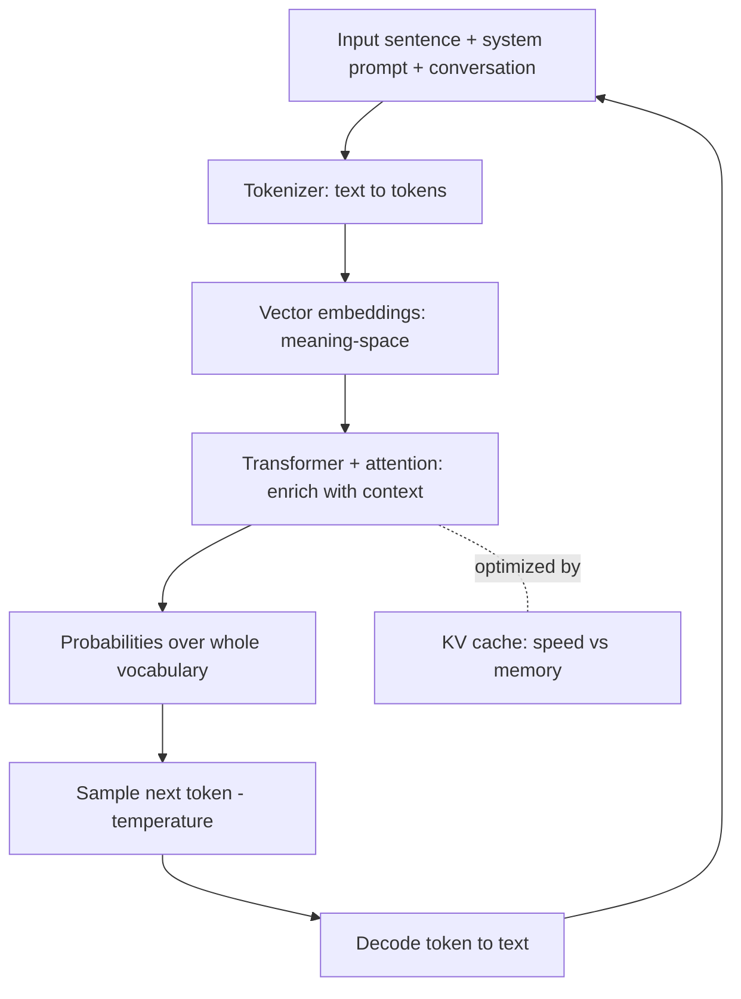

# LLM Internals Explained [Watch This If You're A Developer]
Source: https://www.youtube.com/watch?v=CwTeSDZSUxM · Course: LLM Internals · Added: 2026-06-12

## Summary
A developer-focused walkthrough of how a large language model actually works under the hood — and why it doesn't "think" like a human. It traces the full pipeline a sentence goes through: tokenizer → vector embeddings → transformer (attention) → a probability distribution over the whole vocabulary → sampling the next token → decode and repeat. Along the way it explains why models are probabilistic (not deterministic), what `temperature` really controls, what the model is *actually* fed (system prompt + conversation, not just your message), and how `KV cache` speeds up generation. Watch this for an intuitive, math-light mental model of the LLM internals every developer building on these APIs should have.

## Glossary

**LLM (Large Language Model)**:
At its core, just a **next-token predictor** — it takes a sequence of tokens and outputs the most likely next token. ChatGPT, Claude, Gemini are all this, wrapped in software that makes them feel conversational.
_Avoid_: thinking machine, AI brain

**Token**:
The atomic unit an LLM reads and writes — usually a word *fragment* (e.g. `vide` + a space), not always a whole word. Each token maps to a number.

**Tokenizer**:
The component that converts a sentence into an array of numbers (tokens) on the way in, and numbers back into text on the way out (encoder + decoder). Every LLM has its **own** tokenizer — there is no universal one.

**Vocabulary**:
The fixed set of all tokens a model knows, each tied to a number. Analogous to ASCII mapping characters to numbers, but the entries are tokens (word-pieces), and the range is far larger.

**Vector embedding**:
Mapping each token to a point/vector in a high-dimensional space where **semantically similar tokens sit close together** (e.g. `dog`, `cat`, `animal` cluster; `JavaScript` is far away). Vector math is meaningful — `dog + cat` lands near `animal`.
_Avoid_: word vector magic

**Transformer**:
The heart of the model and its most compute-intensive part — it **enriches the embeddings with context/meaning** so the model grasps how words relate. Introduced in Google's 2017 paper *"Attention Is All You Need."* Remove it and nothing meaningful happens.

**Attention**:
The transformer mechanism that lets the model weight which earlier tokens matter most — e.g. giving the word *"don't"* enough emphasis to flip a sentence's meaning.

**Base model**:
The raw model straight out of pre-training/post-training. It is **not conversational** — extra work is needed to turn it into the chat-style assistant you interact with.

**System prompt**:
Hidden instructions (e.g. "This is a conversation between…") prepended to the conversation. The model is actually fed *system prompt + alternating user/AI messages*, then asked to continue — the UI only shows you your own message.

**Temperature**:
An API parameter controlling sampling randomness. **Low** → favors the highest-probability tokens (more deterministic, repetitive); **high** → allows more variation. You avoid both extremes: always-most-likely is too rigid, low-probability picks are gibberish.

**KV cache**:
An optimization that caches the transformer/embedding work already done for previous tokens, so each new token doesn't recompute everything. Trades **GPU memory for speed** — central to fast, streaming responses.

## Key Notes

### The core claim: LLMs don't "think"
- Output *feels* like reasoning (fluent sentences), but under the hood it's purely **probabilistic next-token prediction** — "the weather today is ___" → predict the next token.
- Everything fancy (Claude Code, Codex, chat UIs) is software/abstraction built on top of this simple predictor.

### Step 1 — Tokenizer (text → numbers)
- Computers only understand numbers, so the first thing that happens on an API call is **tokenization**: the sentence is broken into tokens, each mapped to a number from the model's vocabulary.
- Tokens are word-*pieces*, not necessarily whole words; vocabulary is much broader than ASCII.

### Step 2 — Vector embeddings (numbers → meaning-space)
- Tokens are mapped into a **vector space** where similar concepts are near each other; vector arithmetic carries semantic meaning.
- Not enough on its own: *"I hate dogs, which animal should I buy?"* vs *"I **don't** hate dogs…"* are near-identical token-wise but opposite in meaning — a plain embedding would mispredict.

### Step 3 — Transformer + attention (enrich with context)
- The transformer **enriches the vectors with meaning**, using **attention** to give pivotal words (like *"don't"*) the weight needed to change the whole sentence.
- It's the most important and most compute-heavy stage — the "heavy lifting" of the model.

### What the model is actually fed
- Not just your message: the real input is **system prompt + ordered user/AI turns**, and the model continues from the last AI turn.
- A **base model** isn't conversational by default; chat behavior is added afterward. The clean UI hides all of this.

### Step 4 — Output is a probability distribution
- The transformer produces a **probability for *every* token in the vocabulary** (nothing omitted) for the next position.
- You **sample** from the high-probability region — too-low probability = gibberish; always-highest = too deterministic/repetitive. This is exactly what **temperature** tunes.

### Step 5 — Decode and repeat (autoregression)
- Pick the next token → **decode** it back to text → append → feed the whole sequence back in → predict again. This loop produces output in chunks, which is why early ChatGPT **streamed** partial/broken tokens.

### Optimization & training
- Re-running the transformer over the full sequence each step is wasteful, so **KV cache** stores prior work (speed ↔ GPU-memory trade-off). Making this faster/cheaper is active research (e.g. DeepSeek's R1 paper packed many such optimizations).
- Training an LLM is mainly training the **transformer + embedding space together**; the **tokenizer** is trained too (how to split/join tokens). Each model ships its own tokenizer.

## Understanding Diagram

