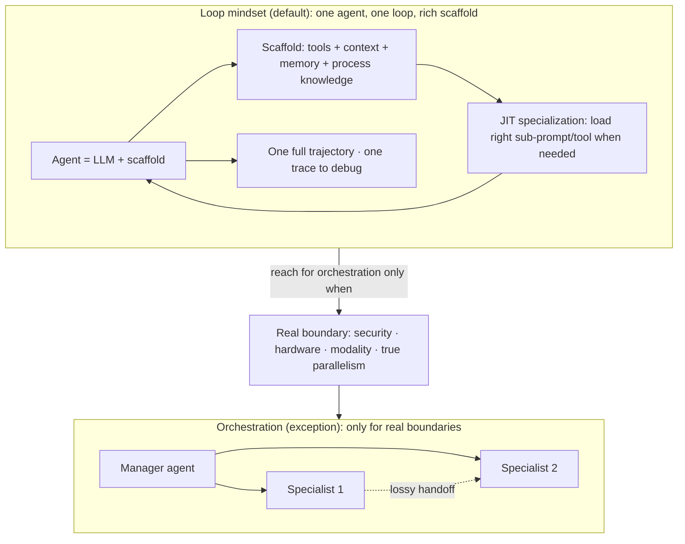

# Agent Loop vs Agent Orchestration-rajibdeb
Source: https://github.com/rajib76/agent_loop · Course: Loop Engineering · Added: 2026-07-27

## Summary
Rajib Deb's argument (a "draft / thinking out loud" essay, `agent_loop_vs_orchestration.md`) that **a single well-scaffolded agent in a tight loop usually beats a graph of specialist agents passing messages** — orchestration should be the exception, not the default. The core claim: multi-agent orchestration is a **category error** that treats "agent" as a synonym for "human worker" and imports the whole apparatus of human team design (roles, handoffs, managers, escalation) onto a substrate that doesn't share human cognitive limits. Since `agent = LLM + scaffold`, **specialization is a property of context, not of the worker** — you don't coordinate ten specialists, you build one loop that loads the right scaffold at the right time (JIT specialization). Orchestrate only when there's a *real* boundary (security, hardware, modality, genuine parallelism), not just "a different kind of expertise."

## Glossary

**Agent = LLM + scaffold**:
The essay's definition. `scaffold = tools + context + memory + process knowledge + loop`. The LLM is fungible, general-purpose cognition; the **scaffold** is what makes it good at a job. Change the scaffold → a different "specialist" without changing the engine.

**Specialization-as-context**:
The key reframe — in agent-land, specialization is a property of *context*, not of *the worker*. A human can't be a tax lawyer at 9am and a kernel engineer at 10am; an agent can, at roughly the cost of loading a different prompt, toolset, and memory store.

**Category error**:
The flawed premise behind orchestration — "if you needed N humans to do this job, you need N agents." Humans need org charts because of intrinsic *human* limits (no one holds expert competence in everything, fixed working memory, fatigue, lossy communication as the cheapest context-sharing). None of these are intrinsic to an LLM agent.

**JIT specialization**:
The loop's advantage — pull in the right tool, doc, or sub-prompt **at the moment it's needed** (just-in-time), versus orchestration's pre-allocated specialization (fixed roles decided up front).

**Lossy handoffs**:
Every inter-agent message is a context bottleneck — the receiving agent sees a *summary*, not the raw evidence. A loop preserves the full trajectory.

**Coordination overhead**:
Tokens multi-agent systems burn negotiating who does what, re-explaining state, and reconciling disagreements — instead of spending them on the actual problem.

**Process-as-scaffold**:
The "real lever" — the process knowledge usually externalized into a manager agent ("who handles this?") is just another kind of context. Put it *inside* the loop as a **playbook** to read, a **state machine** to advance, a **checklist** to verify against, or **sub-prompts/tools** to invoke — keeping the whole trajectory in one place, making the system one thing rather than N.

**Real boundary**:
The test for when orchestration is warranted — orchestrate when the boundary is *real* (security, hardware, modality, parallel work), not when it's merely "a different kind of expertise."

## Key Notes

### The thesis
- We build multi-agent orchestration because we can't unlearn how *humans* organize work. But an agent isn't a narrowly specialized cognitive unit — the scaffold is what we should invest in, not the org chart around it. **Default: one agent, one loop, rich scaffold.**

### Why orchestration is seductive (but not evidence it's right)
- It maps onto how we already build software (services, queues, DAGs, workflow engines) and organizations (roles, handoffs, reviews); it's **legible** (drawable on a whiteboard, understandable by a manager); and it gives an **illusion of reliability through decomposition**. These show it's the architecture we know how to draw — not that it fits agents.

### Why the loop usually wins
- **No lossy handoffs** — the loop keeps the full trajectory, not summaries.
- **No coordination overhead** — tokens go to the problem, not to negotiation.
- **Adaptive (JIT) specialization** — load the right sub-prompt/tool/doc when needed.
- **One thing to debug** — one trace on failure, vs N traces plus the message bus between them.
- **Cheaper to evolve** — improving the scaffold improves *all* "specialties" at once; improving an orchestrator improves nothing about the agents inside it.

### When orchestration IS warranted
- **True parallelism** over independent subtasks (e.g. fan out 200 document reviews) — really map-reduce.
- **Hard isolation** — security boundaries, separate credentials/data domains.
- **Heterogeneous substrates** — one node an LLM, another a deterministic solver, another a human-in-the-loop.
- **Latency/cost tiering** — small fast model triages, large slow model handles the residual.
- Pattern: orchestrate when the boundary is *real*, not when it's just different expertise.

### The reframe (orchestration mindset → loop mindset)

| Orchestration mindset | Loop mindset |
|---|---|
| Who are the agents? | What does the loop need to know? |
| How do they hand off? | What tools should be reachable from the loop? |
| Who is the manager? | What does the playbook look like? |
| How do we resolve disagreements? | How does the loop self-check? |
| How many agents? | How rich is the scaffold? |

### Framing & open questions
- Offered as a **lens, not a prescription** ("may not hold in every case"): many multi-agent systems may be reproducing *human org structures* — paying tokens/latency/reliability for coordination overhead that isn't buying much.
- Open questions: How far does one loop scale before **scaffolding complexity** itself becomes the bottleneck? Is there a clean formalism for "process-as-scaffold" beyond "put it in the prompt"? What do **evals** look like when one loop plays many roles (per-role vs end-to-end)? When orchestration *is* warranted, what's the **minimum-viable orchestration** vs the maximalist framework default?

## Understanding Diagram

