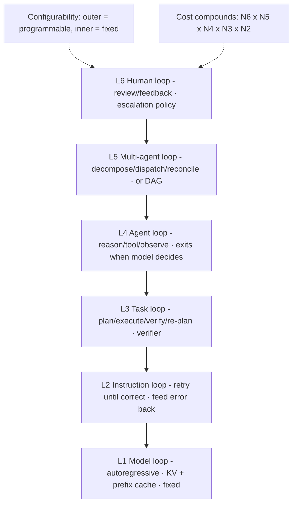

# Loop Engineering-rajibdeb
Source: https://rajibdeb.substack.com/p/loop-engineering · Course: Loop Engineering · Added: 2026-07-27

## Summary
Rajib Deb's design-principles piece (04 Jul 2026) reframes "the agent loop" as **not one loop but a stack of nested loops** — six levels, each iterating for a different reason, closing on a different signal, and offering a different engineering lever. **Loop engineering** is the discipline of deciding, at each level: *what iterates, what feeds back, when to exit, and what to cache.* A key axis is **configurability**: the innermost loop (autoregressive token generation) is fixed by the model architecture, and each level outward becomes more programmable until the outermost loops (multi-agent, human) are pure design choices. It closes with five design principles (explicit exit predicates, fail upward, feedback-is-the-product, cache everywhere, multiplicative cost) and open research questions.

## Glossary

**Loop engineering**:
The discipline of deciding, **at each level of the loop stack**, what iterates, what feeds back, when to exit, and what to cache. The loop is a *stack of nested loops*, not one large loop.

**Configurability axis**:
The organizing principle — the innermost loop is **fixed by the model architecture**; each level outward is **more programmable**, until the outermost loops are pure design choices.

**Exit predicate**:
The explicit condition that closes a loop (exception-free, schema-valid, assertion-pass, tests green, model-decides-done, human-approves). "A task loop is only as good as its exit check." Every loop needs an explicit predicate **or** budget.

**KV cache / prompt-prefix cache**:
The cost lever at the model loop — KV caching turns each step's O(n²) re-attention into incremental work; prompt-prefix caching extends the same idea **across calls**. (Caching recurs at every level: memoized sub-results at levels 3–5.)

**Fail upward**:
When a loop exhausts its budget, escalate to the level above with a **distilled failure summary** — not a raw transcript.

**Feedback is the product**:
The *information* fed back into a loop (error messages, verifier output, review comments) matters more than the retry count — feedback quality drives convergence speed.

## Key Notes

### The Loop Stack (6 levels)
- **L1 — Model loop (not configurable):** the autoregressive loop (predict token → append → predict). You don't control its logic; you engineer its **cost profile** via KV caching + prompt-prefix caching. Only behavioral knobs: sampling params (temperature, top-p).
- **L2 — Instruction loop:** each instruction runs in its own **retry loop until it executes correctly** (e.g. generate SQL → run → syntax error → feed error back into the prompt → re-execute). Closes on *success, not first attempt*. Engineering questions: exit predicate ("executed the right way"), how the error is rendered back (raw stack trace vs distilled), retry budget + backoff, and whether each retry sees full history or just the last error (**context accumulation vs reset**).
- **L3 — Task loop:** a sequence of instructions with a goal. Even if every instruction succeeds locally, the task can miss the goal — so it loops on **verification** (plan → execute → check against goal → re-plan). Lever = the **verifier** (tests, output schemas, rubric checks, LLM-as-judge).
- **L4 — Agent loop:** the classic **reason → call tool → observe → reason** loop. Unlike L2/L3, it exits when **the model itself decides** the job is done. Lever = **context engineering** (compaction, memory, scratchpads) — what stays in the window keeps long loops coherent.
- **L5 — Multi-agent loop:** an orchestrator loops over delegation (decompose → dispatch to sub-agents → collect → reconcile conflicts → re-dispatch gaps); each sub-agent runs its own full L1–L4 stack. Lever = **decomposition quality + reconciliation** (bad merges make the orchestrator loop forever). *Alternate pattern:* don't loop here at all — orchestrate the L1–L4 stack as a **cyclic or acyclic DAG** for more resilience and restartability.
- **L6 — Human loop:** the outermost loop — system proposes, human reviews, feedback re-enters. Lever = **escalation policy** (which inner-level failures surface to a human vs get absorbed by retries). Can itself be a loop or part of the orchestration.

### Design principles
1. **Every loop needs an explicit exit predicate or budget** — unbounded inner loops starve outer ones.
2. **Fail upward** — on budget exhaustion, escalate up with a distilled summary, not a raw transcript.
3. **Feedback is the product** — what you feed back matters more than retry count.
4. **Cache at every level** — KV at L1, prompt-prefix at L2, memoized sub-results at L3–L5.
5. **Cost compounds multiplicatively** — N₆ × N₅ × N₄ × N₃ × N₂ generation calls; **budget the outer loops tightest**.

### Open questions (author's flagged research areas)
- Can **exit predicates be learned** rather than hand-written? (author: a good area for traditional ML).
- Where should **observability** live — per-loop traces or one unified trace across levels? (a question for observability products).
- Is there a level **between instruction and task** — a "step" loop for tool-argument repair? (maybe needed for multi-step instructions).

## Understanding Diagram

