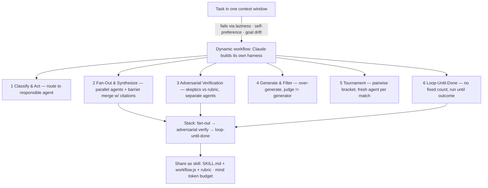

# Master All 6 Claude Code Dynamic Workflows
Source: https://www.youtube.com/watch?v=g9b9G8dcS8Y · Course: Loop Engineering · Added: 2026-07-27

## Summary
Mark Kashef's TLDR of Anthropic's engineers' masterclass on **Claude Code dynamic workflows** — distilled to the **six core design patterns** everything else builds on. The real unlock isn't "a fancier way to spin up agents"; it's that Claude Code **designs and builds its own harness on the fly** — a custom little machine shaped for the task. Workflows exist to fix the **three failure modes of a single context window** (agent laziness, self-preference, goal drift) by spinning up many agents (default **Sonnet 4.6**), each with its own clean context, to solve pieces separately. The six patterns: **Classify & Act, Fan-Out & Synthesize, Adversarial Verification, Generate & Filter, Tournament, and Loop-Until-Done** — plus how to **stack** them, **share** a workflow as a skill (a JS file + `SKILL.md`), set a **token budget**, and when **not** to use workflows.

## Glossary

**Dynamic workflow**:
A Claude Code feature where Claude **builds its own harness on the fly** — a custom orchestration "machine" for a task — rather than running everything in one session. Under the hood a workflow is a **JavaScript file** that deterministically spawns agents.

**The 3 failure modes of one context window**:
Why workflows exist. **Agent laziness** (given 15 tasks, claims all done but finishes 7), **self-preference** (a single session auditing itself is biased to say its own output is great), **goal drift** (the original goal withers across long conversations, auto-compactions, tool calls, and summarizations).

**Individual context windows**:
The fix — a workflow spins up a **series of agents** (default Sonnet 4.6), each with its **own clean context**, so no cross-contamination, no self-grading bias, and no drift.

**Classify & Act (Pattern 1)**:
A "receptionist at the front door" — a light model classifies a task/input and **routes it to the responsible agent** (the critical path). Example: inbox triage (bug / refund / lead / spam), deduping against what's tracked before any handler acts. Quarantines *what to do* before the next stage.

**Fan-Out & Synthesize (Pattern 2)**:
Break a task into **mutually-exclusive micro-parts**, assign one agent each (in its own clean context so files never cross-contaminate), run in parallel, then a **barrier synthesize step** waits for all and merges results. Emphasis on **citations** — every claim links back to its source path. Uses: deep research (one agent per angle), due-diligence red-flag memos.

**Adversarial Verification (Pattern 3)**:
Plugs the **self-preference** hole — intentionally employ **3 skeptics / devil's advocates** to cross-check output against a **rubric** (built first, as a pseudo-plan). Use different agents than the drafter to avoid inherited bias. Use: fact-checking — extract each claim → a separate agent verifies each against the real source → return failed claims + why.

**Rubric**:
A checklist/criteria you build **before** running a verification/judging workflow — the source of truth skeptics or judges push against.

**Generate & Filter (Pattern 4)**:
**Over-generate** many ideas (e.g. 500 titles) then narrow — easier to go from 1,000 → 3 than 10 → 3. Add a **judge** stage: generators propose, separate **judge agents** score against a rubric ("quality-control the quality controllers"). Key rule: **the generator and the judge must be different agents.** Use wherever taste is required.

**Tournament (Pattern 5)**:
**Pairwise bracket** — instead of dividing work, send single ideas/options to **fresh unbiased agents** asking "should we pick A or B, and why?"; winners advance round by round to a final. Each match is its own comparison agent with a clean context; the **deterministic loop holds the brackets** so only the running order stays in context. Each round can use its **own rubric**. Use: ranking 5,000 resumes without one session's bias/context bloat.

**Loop-Until-Done (Pattern 6)**:
Like `/goal` — don't say "do X 10 times," say **"don't stop until this outcome is reached."** Spawns fresh agents/attempts with **no fixed pass count**. Use: hunt a flaky test that fails ~1/50 runs — keep forming theories and adversarially testing each in its own isolated **work tree** until a clean pass.

**Stacking patterns**:
Chaining patterns into one workflow via keywords — e.g. **fan-out** to find issues → **adversarial verify** (agents refute each finding) → **loop-until-done** (`/goal`, keep going until a clean pass) → return only confirmed issues with file + exact line. You don't design it by hand; the right keywords produce it.

**Workflow-as-skill**:
Share a workflow like a skill — a folder with `SKILL.md` + the workflow **`.js` file** + any dependency markdown (e.g. the rubric). `/workflows` lists running workflows and lets you **save** one to its JS file.

## Key Notes

### The real unlock & mechanics
- Not "fancier agents" — Claude Code **builds a bespoke harness per task**. Learn the six shapes the machine can take and apply them anywhere.
- One context window is a "glorified short-term memory" — fine for most tasks, but at 500k–600k tokens it unwinds into **laziness / self-preference / goal drift**. Workflows split work across many single-purpose agents (default Sonnet 4.6) to avoid all three.

### The six patterns (each: what · how · use · example prompt)
1. **Classify & Act** — router/receptionist → responsible agent. *Prompt:* triage inbox by spawning a classifier that routes each ticket to bug/refund/lead/spam and dedupes before any handler acts.
2. **Fan-Out & Synthesize** — one sub-agent per part in a clean context → barrier merge with citations. *Prompt:* due diligence, one sub-agent per folder, each returns a structured summary with exact source paths; barrier step merges into one memo where every claim links to its file.
3. **Adversarial Verification** — skeptics vs rubric, separate agents. *Prompt:* verify each factual/technical claim in a blog by extracting claims then spinning a separate checker per claim against the real source; return failed claims + exact reasons.
4. **Generate & Filter** — over-generate, then a **separate** judge scores vs criteria. *Prompt:* brainstorm 40 title/headline angles with one generator, hand to a judge that scores against criteria — generator ≠ judge.
5. **Tournament** — pairwise comparison agents, fresh context each, deterministic loop holds brackets, per-round rubric. *Prompt:* rank resumes for a role via pairwise comparisons against a rubric, each head-to-head its own agent.
6. **Loop-Until-Done** — no fixed count, run until outcome, isolated work trees. *Prompt:* hunt a flaky test failing ~1/50 runs, form theories and adversarially test each in its own work tree until clean.

### Sharing, budget, and when NOT to use
- **Share/save**: workflows are JS files; bundle with `SKILL.md` (+ rubric md) as one folder. Use `/workflows` to view/save.
- **Token budget**: workflows are **token-hungry** — tell Claude Code its budget; reserve them for large or multi-layered tasks.
- **When not to use**: basic tasks (e.g. change a button color / add a pulse) — just prompt directly. As models improve (4.8 → 4.9 → 5), you'll need agent swarms less often, but they're there for genuinely complex work.

## Understanding Diagram

