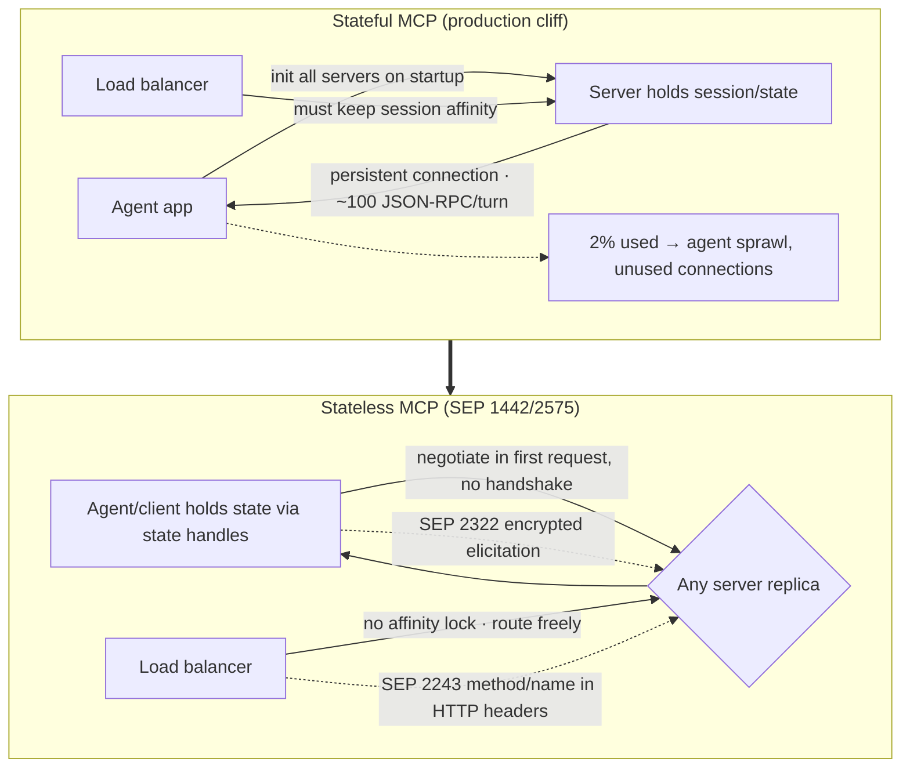

# Google engineer talks Internet-Scale Agent Skills
Source: https://www.youtube.com/watch?v=jkUg7b4v9-w · Course: MCP · Added: 2026-07-27

## Summary
An MCP Summit talk by **Prashant (Google)** on taking MCP to **internet scale**. Local MCP is magic — but it hits a **production cliff**: servers run fine locally over STDIO yet break against firewalls, compliance, and enterprise VPCs, and telemetry shows only **~2% of MCP initialization events become actual tool usage** → mass unused **stateful connections** and "agent sprawl." The core bottleneck is MCP's **persistent, stateful session**, which forces **session affinity** on load balancers and defeats elastic cloud scaling. Google + the MCP community's fix is to make the protocol **stateless**: **SEP 1442/2575** drop the init handshake and move state to client-held **state handles** (no "affinity lock" → any replica serves any request), **SEP 2322** handles elicitation via an encrypted request-state round trip, and **SEP 2243** lifts routing keys into HTTP headers. It closes with productization: **Apigee** wrapping REST APIs as MCP endpoints, every Google Cloud product as a managed MCP server, agent identity via **Envoy + Model Armor**, and **ADK / Antigravity** — "managing missions, not machines."

## Glossary

**Internet-scale MCP**:
Running MCP servers in production for hundreds of clients/agents, not just locally — the theme of the talk, and where the protocol's current design strains.

**The production cliff**:
Local MCP (over **STDIO**, often `npx`-launched) is trivial to run, but **doesn't survive production**: firewalls, compliance, and databases/resources isolated inside enterprise VPCs all break the local-MCP model.

**The 2% problem / agent sprawl**:
Open telemetry shows only **~2% of MCP initialization events translate to active tool usage** — every server an agent app knows is initialized on startup (stateful sessions opened), but most connections are never used per turn. More agents × more servers = a huge web of point-to-point open connections → **agent sprawl** and inefficient resource use.

**Stateful session / persistent connection**:
MCP's core design keeps a persistent connection open so the server can push/stream to clients (the "magic"). At scale this is the **biggest bottleneck** — agent traffic is chatty (~**100 JSON-RPC messages** per tool turn), and the open TCP session is all the "demand" there is, so servers can't elastically scale up/down.

**Session affinity / affinity lock**:
Because state lives on the server that opened the session, a load balancer **must route each client call back to the same server replica**; if it can't maintain affinity, context breaks and the agent fails. This "affinity lock" is what statelessness removes.

**SEP 1442 / SEP 2575 (stateless MCP)**:
The enhancement (Google Cloud + Hugging Face + MCP core) that makes MCP stateless — **drop the init handshake**; negotiate tools/protocol capabilities in the **first request** instead.

**State handles**:
The mechanism that preserves statefulness's benefits without a server-held session — context is passed **back and forth to the client**, letting the **client manage state** and decide what to send. Result: **no affinity lock** → load balancers treat each request independently and route to any replica.

**Elicitation (SEP 2322)**:
MCP can ask the user back for info (auth/authorization). This SEP round-trips the **request state in an encrypted packet**; the client returns approvals/tokens + the state so the server **resumes exactly where it left off** — without a persistent session.

**Routing (SEP 2243)**:
Lifts key values (the **MCP method** and **MCP name**) into **HTTP headers** so load balancers can route by reading headers, without heavy parsing of the JSON-RPC payload.

**Apigee (REST → MCP)**:
Google Cloud's API-management platform that **packages existing REST APIs into MCP-compliant endpoints** — so a decade of built services isn't wasted or re-architected as new MCP servers.

**Agent identity (Envoy + Model Armor)**:
Production security — **Envoy** (open-source gateway) **cryptographically verifies** agent calls; **Model Armor** inspects traffic to ensure secure requests reach the backend and users.

**ADK / Antigravity ("manage missions, not machines")**:
Google's open-source **ADK** agent framework (incorporates the statelessness discussed) for building graph agents, and **Antigravity**, a no-code agentic app — the shift from managing servers/connections/clients to managing **goals/missions**, letting the infrastructure handle the rest.

## Key Notes

### Why MCP struggles in production
- **Production cliff**: local MCP over STDIO is effortless (his own agent IDEs have ~15–20 each, 50–60% `npx`), but talking to real production systems breaks against firewalls, compliance, and VPC-isolated resources.
- **The 2% problem**: all known servers initialize on app startup and open **stateful sessions**, yet only ~2% of inits become active tool usage — a growing web of **unused connections** and **agent sprawl**.

### The core bottleneck: stateful connections
- The persistent connection enables server→client streaming (the magic) but is heavy at scale: chatty agent traffic (~100 JSON-RPC msgs/turn), and if load balancers can't hold **session affinity**, context breaks and agents fail. There's nothing to autoscale on but the open TCP session → inefficient, non-elastic.

### What cloud scale also demands
- **Isolated sandboxes** (you can't grant unfettered server/script access in enterprise/cloud), **decoupled long-term memory** (remember user context over *months*), and **discoverability + trust** (which servers are secure enough for production/user data) → a distributed, centralized infrastructure rather than local machines.

### The stateless-MCP proposals
- **SEP 1442 / 2575**: drop the init handshake, negotiate in the first request; use **state handles** so the *client* manages state → **no affinity lock**, any replica serves any request, real horizontal scaling.
- **SEP 2322 (elicitation)**: encrypted request-state round trip so auth/approval flows resume in place without a session.
- **SEP 2243 (routing)**: MCP method/name in HTTP headers → cheap header-based load-balancer routing (no JSON-RPC deep-parsing).

### Putting it into practice (Google)
- **Apigee** turns existing REST APIs into MCP endpoints; **every Google Cloud product** is being offered as a **managed MCP server** (proof it's implemented, not just proposals).
- **Agent identity**: Envoy gateway verifies agent calls cryptographically; Model Armor vets traffic.
- **ADK** (open-source agent framework, statelessness built in) and **Antigravity** (no-code agentic app) — the framing shift to **"managing missions, not machines."** Call to action: try it and feed use cases back to the MCP core community.

## Understanding Diagram

