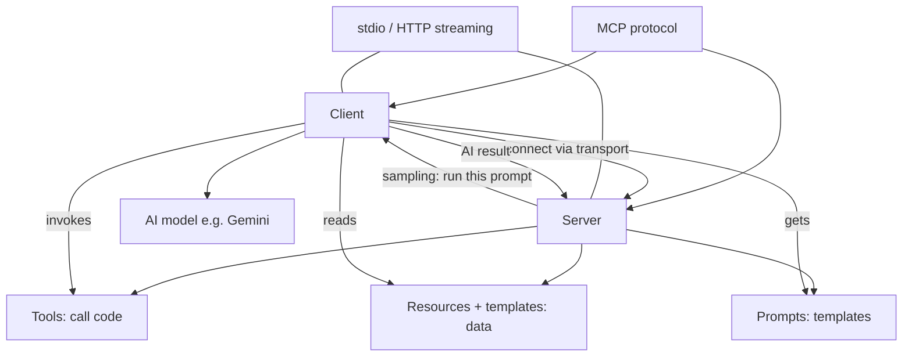

# The Ultimate MCP Crash Course - Build From Scratch
Source: https://www.youtube.com/watch?v=ZoZxQwp1PiM · Course: MCP/Overview · Added: 2026-06-17

## Summary
A hands-on, build-it-from-scratch crash course (WebDev Simplified / Kyle) on the Model Context Protocol. It first explains what MCP is — a communication protocol between an AI client and a server, exposing **tools, resources, prompts, and sampling** — then implements all of it in TypeScript using the official SDK: a server (with each capability built and tested in the MCP Inspector and GitHub Copilot) and a custom CLI client that connects to that server and drives Gemini. The big takeaway: MCP is "just a protocol" like REST/GraphQL, and the SDK is a thin wrapper — tools let the AI call your code, resources feed it data, prompts are reusable templates, and sampling lets the *server* ask the *client's* AI to run a prompt. Worth revisiting as a practical reference for the shape of an MCP server/client and the role of each primitive.

## Glossary
**Model Context Protocol (MCP)**:
A communication protocol (like REST or GraphQL) that standardizes how an AI **client** and a **server** exchange messages, so either side knows how to talk to the other. One client can connect to many servers.
_Avoid_: model context protocol, the protocol

**MCP server**:
The side that exposes capabilities — tools, resources, prompts — wrapping some program or data (e.g. Excel, a database). It advertises what it can do when a client connects.

**MCP client**:
The side (an AI chat app or your own program) that connects to one or more servers, lists their capabilities, and invokes them. Declares its own capabilities too (e.g. sampling).

**Tool**:
A way for the client/AI to **call code on the server** — essentially a function the AI can invoke (e.g. "create user"). The most-used primitive. Each has a name, description, typed parameters, and optional annotation hints.
_Avoid_: function, action

**Resource**:
A read-only **set of data** the server exposes (database records, files, images) identified by a URI. The AI attaches it as context (e.g. "all users").

**Resource template**:
A resource with a **dynamic URI** (e.g. `users://{userId}/profile`) so the client can request a specific item by filling in parameters, instead of one fixed URI.

**Prompt**:
A **pre-written, reusable prompt** the server hands to the client on request, often parameterized (e.g. "generate a fake user named X"). Lets the server ship well-crafted prompts for the user/AI to run.

**Sampling**:
The **reverse** flow: the *server* asks the *client's* AI to run a prompt and return the result (method `sampling/createMessage`). Used when the server itself wants the AI to generate something (e.g. random user data). The client typically asks the user to approve the request.

**Annotations (tool hints)**:
Optional metadata on a tool that helps the AI use it well: `readOnlyHint`, `destructiveHint`, `idempotentHint`, `openWorldHint`, plus a human-readable `title`. All optional; they just give the AI more context.

**Idempotent**:
A property meaning running the operation multiple times with the same input has no extra effect (like a pure function). `create user` is *not* idempotent — each call makes a new user.

**Transport**:
How client and server physically communicate. **stdio** (standard input/output) for local processes on the same machine; **HTTP streaming** for remote/web setups. (Server-Sent Events is a deprecated third option, replaced by HTTP streaming.)
_Avoid_: transport protocol, transport layer

**MCP Inspector**:
An official dev tool (`@modelcontextprotocol/inspector`) that connects to your server to list and run its tools/resources/prompts — "Postman for MCP." Used to test the server before wiring it to a real AI client.

**SDK**:
The official Model Context Protocol library (here `@modelcontextprotocol/sdk` for TypeScript) — a **thin wrapper over the protocol**; you still write most of the logic yourself. SDKs exist for most languages.

**Zod**:
A TypeScript schema/validation library used to declare a tool's input parameters. The SDK also accepts raw JSON Schema, but Zod is easier to author. [[mcp-sampling-flow]]

**Elicitation**:
A server→client request that asks the **user** for additional information (contrasted with sampling, which asks the AI to run a prompt). Mentioned but not built in the video.

## Key Notes

### Introduction
- Goal of the course: explain what MCP is, then build **both** your own MCP server (hooks up to any client) and your own MCP client (hooks up to any server).

### What is MCP
- MCP is **just a protocol** — like a REST or GraphQL API — defining how an MCP client and server send messages back and forth. One client can connect to many servers.
- A server is made of **four primitives**: **tools, resources, prompts, sampling**. Tools and resources are by far the most used (tools most of all).
- **Tool** = the AI calling code on the server (e.g. an Excel server with a "create spreadsheet" tool). Can be simple or complex.
- **Resource** = any set of data exposed by the server (DB records, files, images, chart data).
- **Prompt** = a pre-built prompt the server sends down on request for specific tasks.
- **Sampling** = the inverse: the server asks the client's AI to run a prompt and send the result back.

### Server – Setup
- Install the SDK (`@modelcontextprotocol/sdk`); TypeScript project needs `tsx`, `typescript`, `@types/node`, a `tsconfig`, and build/dev scripts. JS projects need none of the dev deps.
- Create the server: `new McpServer({ name, version })` plus a **capabilities** object declaring `resources`, `tools`, `prompts` (each an empty object). Sampling isn't declared here — it's a *client* capability.
- Pick a **transport**: `StdioServerTransport` for local (used here, since server + Copilot run on the same machine) vs HTTP streaming for remote. Most code is identical regardless of transport.
- Run inside an async `main()`, then `await server.connect(transport)`.
- Test with the **MCP Inspector**: add a `server:inspect` script running `@modelcontextprotocol/inspector npm run server:dev`; set `DANGEROUSLY_OMIT_AUTH=true` to skip the per-restart auth token while testing. "Ping server" returns an empty response = working.

### Server – Tools
- `server.tool(name, description, paramsSchema, annotations, fn)`. Name is what the AI sees; description tells the AI what it does; params declared with **Zod** (`z.string()` etc.).
- **Annotations** are optional hints: `title`, `readOnlyHint`, `destructiveHint`, `idempotentHint`, `openWorldHint` — e.g. `create user` is not read-only, not destructive, not idempotent, but open-world (touches an external DB). They help the AI use the tool safely.
- The tool function must return `{ content: [{ type: "text", text: ... }] }`. Wrap logic in try/catch and return an error message in the same shape so the AI knows it failed.
- Demo used a `users.json` file as a stand-in database; a real tool could hit a real DB or API.
- **Wiring into VS Code / Copilot**: Ctrl+Shift+P → MCP: Add Server → stdio → command `npm run server:dev`; saved to `.vscode/mcp.json`. Can add `dev.debug` (type `node`, run the built `server.js`) and a `watch` glob for hot reload. Invoke a tool with `#toolName` in Copilot, or just ask in natural language — the AI matches the tool and asks for required params.

### Server – Resources
- `server.resource(name, uri, metadata, fn)`. URI follows a URL-like scheme but can be any protocol (e.g. `users://all`). Metadata: `description`, `title`, `mimeType` (e.g. `application/json`).
- Return shape uses **`contents`** (note the plural — a common typo) as an array of `{ uri: uri.href, text, mimeType }`.
- In Copilot, attach a resource via **Add Context → MCP Resources**. Gotcha: the client caches capabilities at connect time, so after adding new resources you must **restart the server and often the client (VS Code)** before they appear.

### Server – Resource Templates
- For per-item access, use `new ResourceTemplate("users://{userId}/profile", { list: undefined })` to expose a **dynamic URI** with a `{userId}` parameter.
- The function receives both the URI and the parsed params; use the param (e.g. `users.find(u => u.id === parseInt(userId))`) to return one record, or a JSON `error: user not found` in the same `contents` shape if missing.

### Server – Prompts
- `server.prompt(name, description, paramsSchema, fn)` returns `{ messages: [{ role: "user", content: { type: "text", text } }] }`.
- The prompt text can interpolate params (e.g. "generate a fake user with the name {name}…"). Power: turn small input into a large, well-formatted prompt.
- In Copilot, run a prompt via a **`/` slash command** (`/test-mcp-video-server.generate-fake-user`), fill the param, and it inserts the rendered prompt to run.

### Server – Sampling
- Sampling bridges server→client. Implemented *inside a tool* (`create_random_user`) via `server.server.request({ method: "sampling/createMessage", params: { messages, maxTokens } }, CreateMessageResultSchema)`.
- The server sends a prompt ("generate fake user data … return JSON, no formatting"); the client's AI runs it (user must approve) and returns the result.
- Parse defensively: check `res.content.type === "text"`, then `JSON.parse(res.content.text.replace(/```json|```/g, "").trim())` — strip markdown fences and **trim AFTER replacing** (a misplaced `.trim()` before parse was the bug that broke the demo).
- Use the parsed object to `createUser(...)` and return success text. Inspector shows the sampling approval popup but returns no real data — only a real AI client completes the loop.

### Client – Setup
- Build a custom client: `new Client({ name, version, capabilities: { sampling: {} } })` — sampling is declared as a **client** capability.
- Connect with `StdioClientTransport({ command: "node", args: ["build/server.js"], stderr: "ignore" })` (ignore stderr to suppress Node's experimental-JSON-import warnings).
- On connect, fetch everything via `Promise.all([listTools, listPrompts, listResources, listResourceTemplates])`.
- CLI built with `@inquirer/prompts` (`select`, `input`, `confirm`); a `while(true)` main menu offers Query / Tools / Resources / Prompts. Gemini chosen for its **free tier**; API key in `.env`.

### Client – Tools
- `mcp.callTool({ name, arguments })`. Build `arguments` by looping `Object.entries(tool.inputSchema.properties)` and prompting the user with `input()` for each key (showing its `type`).
- Print `res.content[0].text`. TypeScript types come back as `unknown`; cast as needed.

### Client – Resources
- Same select-then-call pattern across both `resources` and `resourceTemplates`. Templates carry a `uriTemplate` instead of a fixed `uri`.
- For template URIs, regex-match `{param}` placeholders, prompt the user for each, and replace them to build the final URI, then `mcp.readResource({ uri })`.
- Pretty-print by `JSON.parse` then `JSON.stringify(obj, null, 2)` (the server returns a minified string).

### Client – Prompts
- `mcp.getPrompt({ name, arguments })` — prompt args come back as an **array** (`prompt.arguments`), unlike tools.
- Loop the returned `messages`, show each text via a helper, `confirm()` whether to run it, then call the AI with the Vercel **AI SDK**: `generateText({ model: google("gemini-2.0-flash"), prompt })`.
- Wire Gemini with `createGoogleGenerativeAI({ apiKey: process.env.API_KEY })` and `import "dotenv/config"` so the key loads.

### Client – Query AI
- "Query" lets the AI use tools automatically (like Copilot). `generateText({ model, prompt: query, tools })`.
- Reformat tools from array to object with `reduce`, each entry `{ description, parameters: jsonSchema(tool.inputSchema), execute: async (args) => mcp.callTool({ name, arguments: args }) }` (default `{}` typed as `ToolSet`).
- The AI decides when to call a tool, runs `execute`, and returns `toolResults`. Print `text` if present, else dig into `toolResults[0].result.content[0].text`, else "no text generated."
- Demo: "create a user with name/email/address/phone" worked indirectly without naming the tool.

### Client – Sampling
- Sampling isn't built into the client library, so register it manually: `mcp.setRequestHandler(CreateMessageRequestSchema, async (request) => { ... })`.
- Loop `request.params.messages`, run each through the same AI handler, collect successful texts, and return `{ role: "user", model: "gemini-2.0-flash", stopReason: "endTurn", content: { type: "text", text: texts.join("\n") } }`.
- End-to-end: invoking `create_random_user` triggers the server's sampling request → client asks user → AI generates → result returns to the server, which creates the user. (Real apps should schema-validate before saving.)

## Understanding Diagram

