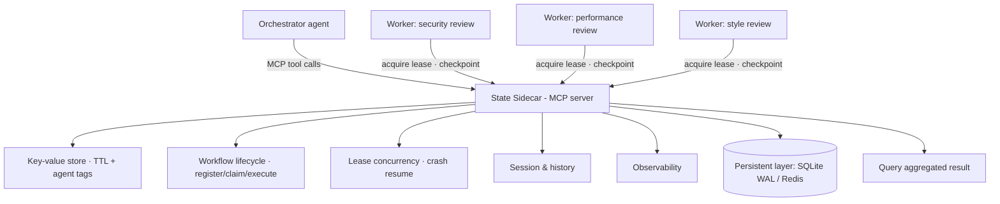

# Solving Multi-Agent State at Scale
Source: https://www.youtube.com/watch?v=y8j_ih5igoY · Course: MCP · Added: 2026-07-27

## Summary
A conference talk (Advait & Joel, Keys/Kasten Labs, via the Agentic AI Foundation) presenting the **State Sidecar** — an **MCP-native coordination layer** for managing state across distributed multi-agent systems. It reframes the "**MCP stateless paradox**": MCP is evolving into a *stateless* protocol, yet applications *still* need a coordination layer to manage application state — so make that layer native to MCP itself. The sidecar is exposed as an MCP server (**19 tools in 5 groups**) that externalizes state and handles distributed concerns (race conditions, crashes, concurrency via **leases**, atomic job claims), usable by any framework that speaks MCP. A live demo shows an agentic GitHub PR reviewer with three independent agents (security/performance/style) coordinating *only* through the sidecar — surviving crashes (checkpoint/resume) and concurrency (lease hand-off). Built with Kasten Labs + the Soda Foundation (Linux Foundation); shipped on PyPI and the MCP registry.

## Glossary

**State Sidecar**:
An **MCP-native, framework-agnostic coordination layer** for state management in distributed systems — the external state backend a stateless MCP protocol requires. Any agent/framework that speaks MCP gets a common interface to it.

**MCP stateless paradox**:
The talk's framing — MCP is moving from stateful to **stateless**, but that doesn't remove the need for a coordination layer; applications *always* need one to manage application state, regardless of the protocol's own statefulness. So expose that layer *through* MCP.

**Coordination layer**:
The externalized place where multi-agent application state lives — decoupled from any single agent so state persists whether an agent is up or down. The core idea the whole talk defends.

**Framework / runtime lock-in (the gap)**:
Why existing tools fall short — **LangGraph** session state doesn't carry to CrewAI (framework lock-in); **Letta** persistent memory imposes runtime lock-in; **Mem0**'s semantic memory gives *recall*, not *workflow progress* (what's done / to-do / where am I); and no existing MCP server manages state.

**Lease-based concurrency**:
The primitive for redundant agents — when multiple identical agents spawn, only the one that **acquires the lease** does the job; others retry. If it crashes, its lease expires and the next agent takes over **from where it stopped**.

**Atomic job claims / checkpointing**:
Distributed-safety mechanics — jobs are registered and tagged; the first matching worker atomically claims an unclaimed job; progress is **checkpointed** into the sidecar so a crashed agent's work is resumed (e.g. restart at file 2 after file 1 was finished) rather than lost.

**The 5 tool groups (19 tools)**:
**Key-value store** (CRUD with TTL + agent tags — a "whiteboard" where agent A's writes are visible/attributed to agent B), **Workflow lifecycle** (orchestration → discovery → execution: register/tag jobs, claim, execute), **Lease concurrency**, **Session & history** (context saved to the persistent layer + traces of which agent did what), **Observability**.

**Persistent layer**:
The pluggable backbone behind a unified interface — reference implementations: **SQLite (WAL mode)** — zero-config, for local dev; **Redis** — atomic ops, for production scaling. Selected via a single ENV variable.

**Flexible vs deterministic orchestration**:
Because state ops are just MCP tool calls, you can **checkpoint deterministically** (save every N files / at fixed points) *and/or* let the **orchestrator LLM decide** when to checkpoint/fetch state (e.g. flags an unexpectedly important doc) — or combine both.

## Key Notes

### The problem
- Multi-agent systems become a mess of disconnected agents where **state just breaks**. Original framing: MCP was inherently stateful (server holds client state), which mismatches distributed production infra.
- New framing (post-keynote): MCP is becoming **stateless** — but the paradox *still holds*, because applications need a coordination layer regardless. The gap: **externalize state, but there's no coordination layer native to the protocol.**
- What breaks in production: serverless routing → **session mismatch** → agent memory breaks → make sessions **sticky** → can't scale; and even stateless, you must externalize state or hit **race conditions** when multiple agents touch the same thing, forcing **bespoke coordination code**.

### The core idea
- **What if the coordination layer itself is exposed as an MCP server?** Then any agent, any framework works as long as it speaks MCP. That's the State Sidecar — the external state backend the latest MCP RC actually requires.
- Key principles: **decouple state from the agent** (persist across up/down), and let the coordination layer handle distributed complexity (race conditions, crashes, concurrency, atomic claims) — so multi-agent systems don't lean on the orchestrator to manage the whole workflow end-to-end.

### Architecture
- Orchestrator agent + distributed worker agents → **sidecar** (19 tools / 5 groups) → **persistent layer** (SQLite WAL or Redis, ENV-configured).

### Demo — agentic GitHub PR reviewer
- Three **fully independent** agents (security, performance, style) with **no agent-to-agent communication** — all coordination via the sidecar. Register a workflow → get a unique run ID → each agent acquires a lease, reviews files, checkpoints → query the sidecar for the aggregated PR result.
- **Crash**: agent reviews file 1, checkpoints, then crashes; a new agent acquires the lease and **resumes from file 2** — no lost progress.
- **Concurrency**: three security agents spawn; one acquires the lease and finishes while the others retry.
- **Crash + concurrency**: a lease-holder crashes mid-way; after its lease expires another instance takes over and continues from where it stopped.
- Extensible to any distributed setup — multi-session pipelines, LangChain + AutoGen agents processing different corpus chunks and checkpointing into the sidecar, fan-in to a final aggregating agent.

### Positioning, Q&A, and roadmap
- **Why not Kafka / a message bus?** Kafka is the gold standard for distributed deployments, but the goal is a coordination layer **native to MCP** — reducing bespoke ad-hoc code (just integrate one server) and enabling **LLM-flexible orchestration** on top of deterministic checkpointing (it's just a tool call).
- **Deterministic + flexible state saving** coexist; state is saved deterministically and the orchestrator can *additionally* call the tool whenever needed.
- **Tenant/user isolation** isn't baked in — deployment is up to you (e.g. run separate sidecar replicas per tenant against different data sources; put replicas behind a load balancer for availability/failover).
- **Origin & next steps**: idea from Kasten Labs (AI-native apps hitting this in production) + **Soda Foundation** (Linux Foundation). Roadmap: formal open-source release, adapt to the MCP RC (sessions are leaving the protocol), and **Contexture** — an open context specification for AI systems. Shipped as a **PyPI package** and on the **MCP registry**.

## Understanding Diagram

