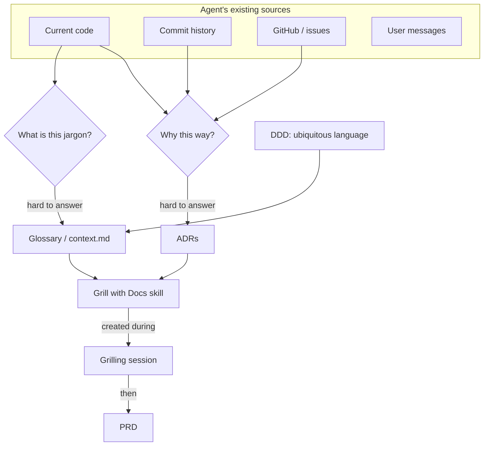

# Appendix: Grill with Docs
Source: https://www.aihero.dev/workshops/hitl-patterns~x8o98/appendix-grill-with-docs-lrk9q · Course: AI coding for real engineers · Added: 2026-06-11

> Part of the **Human-in-the-Loop (HITL) Patterns** workshop by Matt Pocock (AI Hero). Extends the earlier *Grill Me* idea with persistent project docs — a shared glossary and architectural decision records — so a coding agent stops re-asking (and re-breaking) the same things.

## Glossary

| Term | Definition |
|------|------------|
| Grill Me | A skill that runs an interrogation session: the agent relentlessly questions you about a plan or design until you reach shared understanding. Good for non-code thinking. |
| Grill with Docs | A drop-in replacement for *Grill Me* that additionally maintains a glossary (`context.md`) and offers to write ADRs during the session. Matt's default for any codebase. |
| ADR (Architectural Decision Record) | A small markdown file recording an important design decision: what was chosen, what alternatives were considered, and *why*. Lives in the repo so any agent can read it. |
| Glossary / `context.md` | A repo-root markdown file defining your project's domain jargon, giving the agent tight definitions for terms it can't infer from code. |
| Ubiquitous Language | The Domain-Driven Design idea of one shared vocabulary used by domain experts, developers, and the code itself. The glossary is how you make it real for the agent. |
| Domain-Driven Design (DDD) | The body of practice these ideas borrow from; source of "ubiquitous language." |
| PRD (Product Requirements Document) | The spec describing what you're going to build. Docs (glossary + ADRs) should exist *before* the PRD so requirements use current domain language. |
| Materialization cascade | (Example jargon from Matt's course-video app) the chain reaction when a "ghost" lesson is turned real, which in turn promotes its ghost section into a real section. |
| Ghost lesson / Ghost section | Planned-but-not-yet-real lessons/sections used while laying out a course; they become real via the materialization cascade. |
| Grilling session | The interactive Q&A with the agent at the start of work, where the glossary is hammered out and decisions become ADRs. |

## Key Notes

### The four sources an agent already has
When an agent works in your codebase, it can draw on:
1. **The code** — the current commit it can read.
2. **Commit history** — how things used to be; can bisect to find bugs.
3. **GitHub / issue tracker** — what people said about the code (via the `gh` CLI). Powerful when commit messages reference issue numbers, so the agent can trace *why* a change was made.
4. **User messages** — what you tell it directly.

### The two questions those sources struggle to answer
- **"Why did you do it this way?"** — odd trade-offs, surprising technology choices. The agent *might* reconstruct this by chaining commit history → linked issues, but it's slow, unreliable, and crucial: without it the agent will recommend repeating a choice you deliberately rejected.
- **"What on earth is an XXX?"** — business/domain jargon the agent has never seen (e.g. "materialization cascade"). No amount of code reading reveals it.

### The two fixes
- **ADRs answer "why."** Markdown decision records committed into the repo. Only write one when a decision is **hard to reverse, surprising without context, or the result of a real trade-off** — not for every choice.
- **A shared glossary answers "what is X."** Matt keeps his at `context.md` in the repo root with tight one-line definitions of every domain term. A precise definition lets him just say "the materialization cascade" instead of re-explaining it each time.

### Why this is bigger than agent prompting (DDD)
These ideas come from **Domain-Driven Design's ubiquitous language** — one vocabulary shared by domain experts, you, and the code. A maintained glossary therefore pays off three ways: you talk to the agent more precisely, you name variables consistently, and you can find things in the codebase because everything conforms to the same language.

### When to create the docs
- Create them at the **earliest possible moment — during the grilling session, before the PRD.** If you write docs after the PRD, the requirements (and the issues spun off them) are already phrased in stale domain language.
- Typical flow: **grill with the agent → hammer out new glossary terms → capture any hard decisions as ADRs → commit → then write the PRD on top.**

### The skill that automates it
- *Grill with Docs* bakes this in: instructions to update `context.md`, to offer ADRs (gated on the hard-to-reverse / surprising / trade-off test), plus pointers to a fixed **context format** and an **ADR template**.
- Rule of thumb: **use *Grill with Docs* when working in code; use *Grill Me* for non-code work.** Matt now uses it as a drop-in replacement across every codebase.

## Understanding Diagram

