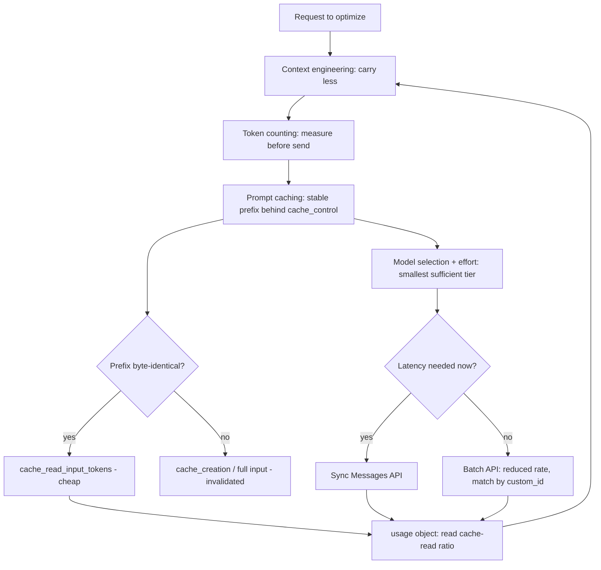

# Prompt Caching and Token Efficiency - Hidekazu Konishi
Source: https://hidekazu-konishi.com/entry/anthropic_claude_api_prompt_caching_and_token_efficiency.html · Course: Prompt Engineering · Added: 2026-07-27

## Summary
An implementation-level guide to spending fewer tokens on the Anthropic Claude API **without changing output quality** — two apps can get the identical answer, and the one that structures its request well pays a fraction of the tokens and latency. It walks five composable levers: **prompt caching** (serve a stable prefix cheaply), the **Message Batches API** (async work at a reduced rate), **token counting** (measure before you send), **context engineering** (carry less in the first place), and **model selection** (route each task to the smallest sufficient tier). Deliberately contains *no prices* — everything is expressed in the stable units that matter: tokens, cache-hit rates, and request structure. The recurring instrument is the response's `usage` object: read it on every call and judge every optimization by how its token categories move.

## Glossary

**Prompt caching**:
Storing a large, stable request *prefix* so later requests with the byte-identical prefix have those tokens served back cheaply instead of re-processed at full input rate. The single highest-leverage token optimization for most apps, because most re-send an identical prefix every call.

**Prefix match (the one invariant)**:
The rule caching is built on — the platform hashes the rendered prompt bytes up to each breakpoint; **any single byte changed anywhere in the prefix invalidates the cache for everything after it**. Hence: stable content at the front, volatile content at the back.

**Cache breakpoint (`cache_control`)**:
A marker on a content block that declares a cache boundary. The only supported type is `ephemeral`. Up to **four** explicit breakpoints per request (top-level automatic caching uses one slot).
_Avoid_: cache marker, cache tag

**Rendered prompt order**:
The fixed order the prompt is assembled in: **1. `tools` → 2. `system` → 3. `messages`**. A breakpoint on the last system block caches tools *and* system together, since both render before it.

**`cache_creation_input_tokens` / `cache_read_input_tokens` / `input_tokens`**:
The three input categories in `usage` when caching is active — tokens **written** to cache (a write costs *more* than plain input), tokens **read** from cache (a small *fraction* of plain input — where savings live), and the remaining uncached tokens after the last breakpoint. Total prompt = the sum of all three.

**TTL (5 minutes / 1 hour)**:
A cache entry's lifetime. Default **5 min**, refreshed on each read (steady traffic keeps a hot prefix alive). Optional **1h** via `"ttl": "1h"` (no beta header) — costs more to write, worth it for bursty/spaced-out traffic and batches. 1h entries must precede 5-min entries in the prefix.

**20-block lookback window**:
On a cache miss at a breakpoint, the platform walks back at most **20 content blocks** to find a prior write. A turn that adds >20 blocks (common in agent tool loops) pushes the next breakpoint out of the window and silently misses — fix with intermediate breakpoints every ~dozen blocks.

**Pre-warming (`max_tokens: 0`)**:
Sending one prefill-only request first (writes the cache, returns empty content, `stop_reason: "max_tokens"`) so a subsequent fan-out reads instead of all paying the write. A cache entry is readable only *after* the writing request begins streaming.

**Message Batches API**:
`POST /v1/messages/batches` — submit a list of ordinary Messages requests, processed asynchronously at a **reduced rate**. Each entry has a `custom_id` and a `params` object. For high-volume, latency-tolerant, offline work.

**`custom_id`**:
Your handle on each batch request. **Batch results return in any order** — always match on `custom_id`, never on line position.

**`count_tokens`**:
`POST /v1/messages/count_tokens` — returns `input_tokens` for a request *without* generating anything. **Model-specific** (pass the model you'll use) and **free** (own rate limit). An estimate, but accurate enough to budget against. Never use `tiktoken`/non-Claude tokenizers — they undercount Claude tokens.

**Context engineering**:
Reducing how much you carry *before* any other lever applies — structure inputs narrowly, trim tool output before it enters history, and externalize what can be re-fetched. Every token not carried is never paid for, waited on, or cached.

**Context editing vs Compaction**:
Two in-session context reducers. **Context editing** *prunes* stale tool results/thinking blocks (removes, doesn't summarize). **Compaction** (beta header `compact-2026-01-12`) *summarizes* earlier history server-side near the window limit — you must append the full `response.content` (the `compaction` block), not just the text.

**Effort**:
`output_config: {effort: ...}` — tunes how much a model spends thinking/acting: `low | medium | high | xhigh | max`. Default `high`; `xhigh`/`max` are Opus-tier only. Lower = fewer tool calls, terser output. For coding/agentic work, *higher* effort with the full spec up front often cuts total tokens by reducing turns.

**`usage` object**:
The ground-truth scoreboard on every response: `input_tokens`, `cache_creation_input_tokens`, `cache_read_input_tokens`, `output_tokens`. The **cache-hit rate** (cache-read ÷ total repeated input) is the metric that tells you unambiguously whether caching works.

## Key Notes

### How tokens are consumed
- Non-cached request has two quantities: **`input_tokens`** (system + tools + history + current turn, full rate) and **`output_tokens`** (the answer — usually pricier per token, bounded by `max_tokens`, shaped by prompting/`effort`).
- With caching, input splits three ways; **read the sum**, not one field. If `input_tokens` looks tiny on a turn that carried huge history, the rest was almost certainly served as `cache_read_input_tokens`.
- Consumption drivers: re-sending stable context uncached, carrying dead history (superseded turns, stale tool results, thinking blocks), over-retrieving in RAG, verbose output, and routing everything to the largest model. Each lever attacks one of these.

### Prompt caching mechanics
- **`ephemeral` is the only `cache_control` type.** On first call the prefix is written (`cache_creation_input_tokens`); on repeat calls it returns as `cache_read_input_tokens` and only the new suffix is `input_tokens`.
- **Minimum length gotcha:** a prefix below the model-specific minimum (order of ~1k–few-k tokens) is *silently* not cached — no error, `cache_creation_input_tokens` stays 0. Distinct from byte-mismatch invalidation.
- **Automatic caching:** put `cache_control` at the top level and the platform breakpoints the last cacheable block for you, advancing it as the conversation grows.
- **Economics without numbers:** write > plain input > read. Caching pays off once a written prefix is read back even a few times; a prefix written but never re-read (changes every request) is *worse* than not caching. Rule: **cache prefixes you'll reuse; don't cache prefixes that change every time.**
- **What belongs behind the breakpoint:** large/frozen system prompt, fixed tool definitions (they render first — free to cache once you cache anything after them), long fixed context (reference docs, few-shot examples). What does *not*: the current question, per-request timestamps/IDs, per-query retrieved chunks.

### Designing cache breakpoints & invalidation
- **Stable front, volatile back:** never-changes → front (pre-breakpoint); changes-per-session → after global prefix; changes-per-turn → after the last breakpoint.
- **Multi-turn:** prior history is a stable prefix — breakpoint the last block of the most recent completed turn (auto-caching advances it). Mind the 20-block window in long agent turns.
- **Large tool definitions:** serialize deterministically (sort by name — non-deterministic ordering silently invalidates); never add/remove/reorder tools mid-session (invalidates tools + everything after). Prefer **tool search** that *appends* schemas over swapping the set.
- **RAG:** breakpoint at the end of the *shared* portion (instructions + fixed few-shot); keep retrieved chunks and the question *after* it. Caching the whole assembled prompt = a fresh write every query, zero reads. Corpus-wide docs shared across queries *can* move into the cached prefix.
- **Invalidation hierarchy (tools → system → messages):** a change invalidates its own tier and later ones only.

  | Change | Tools | System | Messages |
  |---|---|---|---|
  | Tools added/removed/reordered | ✗ | ✗ | ✗ |
  | Model switch | ✗ | ✗ | ✗ |
  | System prompt edited | ✓ | ✗ | ✗ |
  | `tool_choice` / images / thinking toggled | ✓ | ✓ | ✗ |
  | Message appended | ✓ | ✓ | ✗ |

  - Switching models mid-session throws away the whole cache (caches are model-scoped) → spawn a separate call for a cheaper sub-task instead of switching the main loop.
  - Inject mid-conversation operator instructions by **appending a `{"role": "system"}` message** (beta), not mutating top-level `system`, to preserve the cached prefix.
- **Silent-invalidator audit:** if `cache_read_input_tokens` stays 0 on requests that should share a prefix, a byte differs. Usual culprits: `datetime.now()`/timestamps, UUIDs/per-request IDs near the front, `json.dumps` without `sort_keys=True`, session/user IDs in the system prompt, conditional system sections, per-user tool lists. Diff rendered bytes, move the volatile piece after the breakpoint (or make it deterministic).

### Batch processing
- **Mechanism:** async, independent processing at a reduced rate for high-volume, latency-tolerant, offline work (evals, moderation sweeps, bulk summarize/extract, one-time transforms, catalog descriptions).
- **Lifecycle:** `processing_status` goes `in_progress` → `ended`; poll the retrieve endpoint; `request_counts` tracks processing/succeeded/errored/canceled/expired.
- **Results:** a `.jsonl`, one line per request, four types — `succeeded`, `errored` (not billed), `canceled` (not billed), `expired` (24h limit hit, not billed). **Match on `custom_id` — order is not guaranteed.**
- **Limits:** ≤ **100,000 requests or 256 MB**; most finish under an hour, **24h** hard ceiling; results downloadable **29 days**; scoped to a Workspace. Rejected in batch: streaming, Fast mode (`speed`), stateful Threads params, and `max_tokens: 0` (so no cache pre-warm inside a batch).
- **Stacks with caching:** put an identical `cache_control` block (with **1h TTL**) in every request to earn cache reads on top of the batch rate. Hits are best-effort (concurrent/async) — 1h TTL + byte-identical shared block raise them.

### Token counting
- `count_tokens` is model-specific and free; call it with the same `model`/`system`/`messages`/`tools`. It excludes system-added optimization tokens you aren't billed for.
- **Never `tiktoken`:** built for other model families, undercounts Claude — worse on code and non-English — leading to overflowed limits and blown budgets.
- Buys you: catching prompt bloat in CI (measure the *delta* of a change — it's stateless), budgeting `max_tokens` deliberately, and informing model-routing. Re-baseline counts when migrating models (generations tokenize differently — never apply a blanket multiplier).

### Context engineering
- **Carry only what the next step needs:** pass specific fields/sections not whole objects; trim tool output before it enters context; externalize anything re-fetchable via a tool.
- **Context editing** prunes stale tool results/thinking blocks on thresholds (leaner transcript, no summarization cost). **Compaction** (beta `compact-2026-01-12`) summarizes near the window limit — append the full `response.content` or you discard compaction state and re-process the whole history.
- **Memory** persists durable facts across *sessions* via a file-store tool; **tool search** discovers tools on demand and *appends* schemas (context lever + caching-friendly). Long agents often use editing + compaction + memory together.
- **Over-compression caution:** the goal is the smallest *sufficient* context, not the smallest — validate quality on real traffic; savings that cause wrong answers/retries aren't savings.

### Model selection
- **Tiers (current generation):**

  | Model | ID | Context | Role |
  |---|---|---|---|
  | Opus 4.8 | `claude-opus-4-8` | 1M | Hardest reasoning, long-horizon agentic |
  | Sonnet 4.6 | `claude-sonnet-4-6` | 1M | Speed/intelligence balance; high-volume prod |
  | Haiku 4.5 | `claude-haiku-4-5` | 200K | Fastest/cheapest; classification, routing |

- **Tiered routing:** bulk mechanical work → Haiku; workhorse → Sonnet; hardest reasoning/long loops → Opus. In agents, a frontier main loop + small-model subagents keeps the expensive model's cache and context lean.
- **`effort`** (`low`–`max`, default `high`; `xhigh`/`max` Opus-only): sweep per route on your own eval set. **Adaptive thinking** (`thinking: {type: "adaptive"}`) lets the model decide how much to reason — on current Opus, fixed `budget_tokens` is removed in favor of adaptive + effort. **Task budgets** (beta) give the model a running countdown across an agentic loop (distinct from `max_tokens`, the enforced per-response cap the model can't see).

### Measuring & pitfalls
- Read `usage` on every call. Caching working = `cache_creation` spikes on request 1, then `cache_read` carries the bulk with `input_tokens` at just the volatile suffix. Context engineering working = the *total* input falls. **Judge caching by the cache-read ratio, not vibes.** Measure before/after on real traffic; watch second-order effects (a trim that raises retries is a net loss).
- **Top pitfalls:** breakpoint that never hits (silent invalidator *or* prefix below minimum length); caching a per-request-varying prefix (write premium, zero reads); TTL expiry in quiet stretches (use 1h / pre-warm); falling outside the 20-block lookback; switching models / mutating tools mid-session; over-compressing; wrong tokenizer; assuming batch result order; **assuming provider parity** — on Bedrock & Vertex AI, explicit breakpoints work but *not* automatic top-level caching, some features are first-party only, and model IDs differ.

## Understanding Diagram

