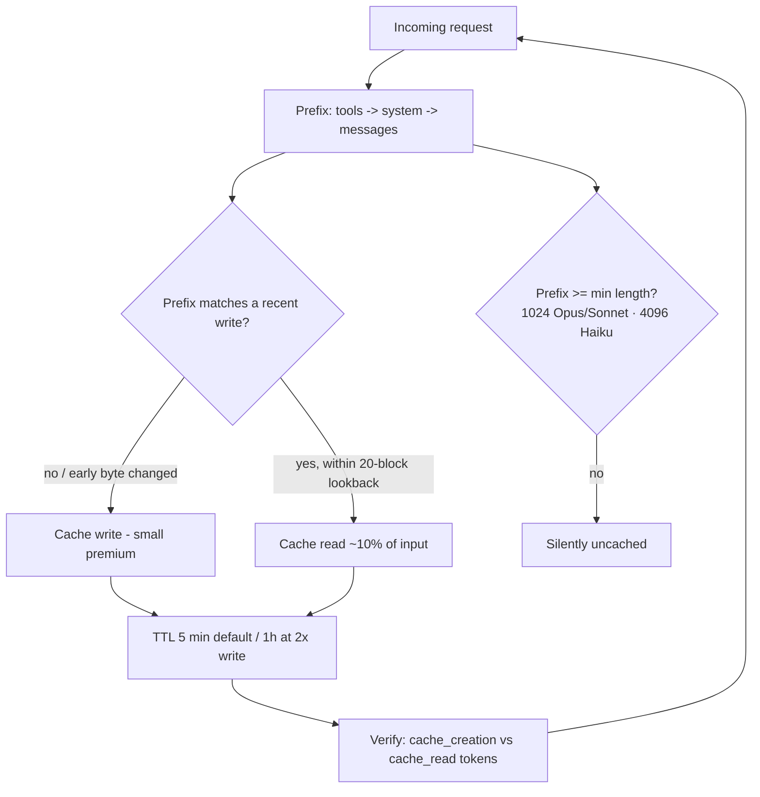

# Prompt Caching rajibdeb
Source: https://rajibdeb.substack.com/p/prompt-caching · Course: Prompt Engineering · Added: 2026-07-27

## Summary
A concise, numbers-included primer on Anthropic prompt caching — the optimization that lets Claude reuse an already-processed prompt prefix instead of re-reading it every request. It explains the mechanic (a contiguous prefix of tools → system → messages, matched from the front), the economics (cache **reads cost ~10%** of base input, writes carry a small premium that amortizes over reuse), the two ways to enable it (automatic vs up to four explicit breakpoints), and the gotchas (per-model minimum lengths, the 20-block lookback window, byte-exact matching, and what invalidates the cache). Best leverage: apps that repeatedly send large, stable context — agents, coding assistants, document Q&A. A good companion to the deeper "Prompt Caching and Token Efficiency" note in this folder.

## Glossary

**Prompt caching**:
Reusing the already-processed **beginning (prefix)** of a prompt when it matches recently seen content, so only new material is processed. Built on **KV caching** principles; the single highest-leverage optimization for apps that resend large stable context.

**Contiguous prefix (tools → system → messages)**:
The cache holds a prefix in this fixed order. Because it's a front-anchored match, **any early change invalidates everything after it** — stable content must sit at the front.

**`cache_control`**:
The field that marks a cache boundary. One at the top level triggers **automatic caching**; placed on specific blocks it defines **explicit breakpoints** (up to four).

**Automatic vs explicit caching**:
**Automatic** — a single `cache_control`; the system puts the breakpoint on the last cacheable block (great for multi-turn chat, no maintenance). **Explicit** — mark up to **four** blocks yourself for content that changes at different rates.

**Cache write / cache read tokens**:
Two reported token types beyond standard input. A **write** (`cache_creation_input_tokens`) carries a small premium; a **read** (`cache_read_input_tokens`) costs **~10% of base input**. Confirm caching is working by checking both fields in the response.

**20-block lookback window**:
Prompts are numbered blocks (each message, document, tool result). **Writes happen only at a breakpoint; reads walk backward at most 20 block positions** to find a prior write. Add intermediate breakpoints in growing conversations so the cache never slides out of the window.

**Minimum cacheable length**:
A prefix must clear a per-model floor or it silently isn't cached: **1,024 tokens** for Opus 4.8 & Sonnet 4.6; **4,096 tokens** for Haiku 4.5.

**TTL (5 min / 1 hour)**:
Default cache lifetime is **5 minutes**, the timer resetting free on each hit (a hot prompt stays cached indefinitely). An optional **1-hour** cache costs **2× the base write price** — for prompts reused hourly but not every five minutes.

**Pre-warming (`max_tokens: 0`)**:
A request that loads/writes the cache before the first real user interaction, eliminating cold-start latency.

**Zero Data Retention (ZDR) eligible**:
Prompt caching is ZDR-eligible — cache representations live in memory only, expire promptly, and store no raw text.

## Key Notes

### The core idea
- On each request Claude checks whether the prompt's **beginning matches** recently processed content; on a match it reuses the cached version and processes only the new material.
- The cached region is a **contiguous prefix** in fixed order — **tools, then system instructions, then messages** — so early changes invalidate everything downstream.
- Default entries persist **5 minutes**, refreshed free on every hit → frequently-used system prompts effectively stay cached indefinitely at no cost.

### The economics
- Three token types beyond standard input: **write** (small premium), **read** (dramatically cheaper), and normal uncached input.
- **Cache read ≈ 10% of base input rate.** Worked example: a **100,000-token** context reused in a session on **Opus 4.8** drops per-request cost from ~**$0.50 → ~$0.05**, a **90% reduction**.
- Write cost **amortizes** across multiple reuses. Savings **stack with Batch API discounts**, and **cache hits don't count against rate limits** — relieving throughput pressure.

### Turning it on
- **Automatic**: one `cache_control` field; breakpoint auto-placed on the last cacheable block. Best for multi-turn chat with no ongoing maintenance.
- **Explicit**: mark **up to 4** blocks for content that changes at different rates. The system looks **backward up to 20 blocks** from a breakpoint to find prior writes.

### The 20-block lookback window
- Two rules: **writes occur only at the breakpoint**; **reads walk backward but only within 20 block positions**.
- In a growing conversation, add **multiple breakpoints** (each within 20 blocks of the next) so the cache doesn't slide out of the lookback window.

### Where it pays off
- Maximum returns for apps sending **large, stable context repeatedly**: agents, coding assistants, and document Q&A.

### What to watch for
- **Minimum length**: 1,024 tokens (Opus 4.8 / Sonnet 4.6), 4,096 (Haiku 4.5) — below this it silently won't cache.
- **Breakpoint placement**: mark **stable** content only; timestamps or incoming messages cause misses.
- **Exact matching**: byte-for-byte identical content required (**including images**).
- **Invalidation**: **tool-definition changes wipe the entire cache**; toggling web search or citations affects system and message caches.
- **Verification**: check `cache_creation_input_tokens` and `cache_read_input_tokens` in responses.

### Beyond the basics
- **1-hour cache** (2× base write price) for hourly-but-not-5-minute reuse.
- **Pre-warming** with `max_tokens: 0` loads content before the first user turn, killing cold-start penalties.
- **ZDR-eligible**: in-memory only, expires promptly, no raw-text storage.
- **Bottom line**: start with automatic caching for quick wins; measure cache-hit rates to find where **explicit breakpoints** help (sections changing at different speeds).

## Understanding Diagram

