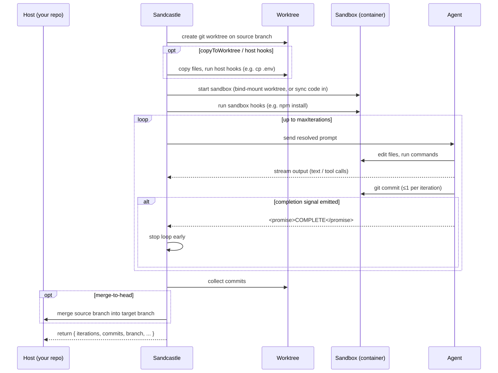

# Sandcastle — Detailed Notes

The complete picture: install, concepts, diagrams, implementation details, end-to-end recipes, and every option. For a fast skim or refresher, see the **[Overview & Quick Revision](01-overview.md)**. New to containers, worktrees, or agents? Skim **[Appendix A — Primers](#appendix-a--primers)** first.

**Contents**
- [Why Sandcastle exists](#why-sandcastle-exists)
- [Getting started (install & first run)](#getting-started-install--first-run)
- [Core concepts — the vocabulary](#core-concepts--the-vocabulary)
- [How it works end-to-end](#how-it-works-end-to-end)
- [The three slots in depth](#the-three-slots-in-depth)
  - [1. Agent](#1-the-agent-slot--who-does-the-work) · [2. Sandbox](#2-the-sandbox-slot--where-it-runs) · [3. Branch strategy](#3-the-branchstrategy-slot--how-changes-come-home)
- [Prompts](#prompts)
- [The execution model](#the-execution-model)
- [Advanced building blocks](#advanced-building-blocks)
- [Enterprise considerations](#enterprise-considerations)
- [Recipes](#recipes)
- [Troubleshooting & gotchas](#troubleshooting--gotchas)
- [Appendix A — Primers](#appendix-a--primers)
- [Appendix B — Full options reference](#appendix-b--full-options-reference)
- [Glossary](#glossary)

---

## Why Sandcastle exists

### Why sandbox an agent at all?

An agent is only **autonomous** if it isn't stopping to ask you permission for every bash command and web fetch. The blunt way to get that is skipping permission checks entirely (Claude Code's `--dangerously-skip-permissions`, a.k.a. **"YOLO mode"**) — but agents are non-deterministic, and unsupervised ones occasionally delete home directories, wreck config files, or otherwise cause chaos. The fix isn't *more* permission prompts, it's a **smaller world**: run the agent somewhere it *literally cannot reach* the rest of your machine. Then the permission question becomes moot — it can only damage what's inside the box. That's sandboxing: *stuff the agent into the smallest possible box that still makes it useful.*

Not all sandboxes are equal:

- **Claude Code's built-in `/sandbox`** only wraps the bash tool — and the agent can break out of it, so it's not safe for skip-permissions AFK runs.
- **Docker Sandbox** (`docker sandbox run claude .`) isolates the whole agent in a microVM (own Docker daemon, no host filesystem) — real isolation, but (as of early 2026) **no network isolation** (the agent can still reach the web), plus the operational problems below.
- **Sandcastle** provides the same container/microVM-grade isolation as a programmable, provider-agnostic library — the subject of these notes.

> **Test any sandbox boundary** by asking the agent to *"grab a file from my Downloads folder"*. A properly sandboxed agent replies that it has no access to your local filesystem — the fence working, and the agent able to say so.

### Why not just run the agent in your repo?

Running an AI coding agent **directly** on your repo has three problems:

1. **Risk.** The agent can trash your working tree, run destructive commands, or touch files it shouldn't. There's no blast-radius boundary.
2. **No parallelism.** You can realistically babysit one agent at a time in your working directory. You can't fan out ten.
3. **No structure.** There's no clean way to say "implement, then verify, then review, then merge" as a repeatable pipeline — locally *and* in CI, with the same code.

Sandcastle solves all three by putting the agent in a **sandbox** and choreographing the lifecycle around it: code in, agent runs, commits out, merge home. You get **isolation** (safe), **many boxes at once** (parallel), and a **programmable pipeline** (`run()` / `createSandbox()` / hooks). It is deliberately **unopinionated** about your workflow — you bring the prompts and the orchestration; Sandcastle handles sandboxing, branching, iteration, and merging.

**Origin.** Matt Pocock built Sandcastle after using Anthropic's **Docker Sandbox** to run autonomous Claude Code ("**Ralph**") loops in his *Claude Code for Real Engineers* cohort — and finding it unstable, fast-changing, opaque (agent activity ran silently), and hard to parallelize or chain (implementer → reviewer). Sandcastle is the drop-in replacement: the cohort's shell-wrapped AFK harness collapsed to a ~17-line `main.ts`, with the Ralph loop **built in as `maxIterations`** and full live logs (iteration count, sandbox setup, expanded shell expressions, every tool call). See [Recipe 5](#recipe-5--a-ralph-loop-autonomous-plan-runner) for the pattern.

---

## Getting started (install & first run)

### Prerequisites

- **Node.js** (with `npm`/`npx`) and **Git**.
- **A sandbox runtime.** Local dev: **[Docker Desktop](https://www.docker.com/)** (recommended). Alternatives: Podman (rootless), Vercel (cloud microVMs — no local Docker).
- **A Claude login** — your **Claude Pro/Max subscription** (recommended) or an Anthropic API key.
- Run inside a **git repository**.

```bash
node -v && git --version && docker info | head -1
```

### 1. Install

```bash
npm install --save-dev @ai-hero/sandcastle
```

### 2. Scaffold the config

```bash
npx @ai-hero/sandcastle init
```

Interactive: pick a **sandbox provider** (Docker/Podman), an **issue tracker** (GitHub Issues, Beads, or custom), and a **template** — `blank`, `simple-loop`, `sequential-reviewer`, `parallel-planner`, or `parallel-planner-with-review`. Creates a **`.sandcastle/`** directory with a `Dockerfile` (sandbox image), the template's prompt file(s) and `main.mts` entry calling `run()` (`main.ts` if your package is ESM), `.env.example`, and a `.gitignore` — and builds the container image unless you opt out (rebuild later with `npx @ai-hero/sandcastle docker build-image`).

### 3. Authenticate — use your Claude subscription ⭐

```bash
cp .sandcastle/.env.example .sandcastle/.env
claude setup-token   # on your host; prints a CLAUDE_CODE_OAUTH_TOKEN
```

```dotenv
# .sandcastle/.env
CLAUDE_CODE_OAUTH_TOKEN=sk-ant-oat-...   # uses your Claude subscription (recommended)
# ANTHROPIC_API_KEY=sk-ant-...           # OR pay-per-token API billing
GH_TOKEN=ghp_...                          # so the agent can use gh / push
```

The agent inside the sandbox now uses **your Claude subscription** — no per-token billing. **Team note:** each engineer uses their own token; `.sandcastle/.env` is git-ignored (never commit it). In **CI**, a subscription token usually isn't available, so pipelines use `ANTHROPIC_API_KEY` from a secret store (see [Recipe 4](#recipe-4--ci--automation)).

### 4. First run

Put a small, safe task in `.sandcastle/prompt.md`, then run the scaffolded entry script:

```typescript
// .sandcastle/main.mts
import { run, claudeCode } from "@ai-hero/sandcastle";
import { docker } from "@ai-hero/sandcastle/sandboxes/docker";

await run({
  agent: claudeCode("claude-opus-4-8"),
  sandbox: docker(),
  promptFile: ".sandcastle/prompt.md",
});
```

```bash
npx tsx .sandcastle/main.mts
```

Sandcastle builds the sandbox image → starts an isolated container → the agent works on your prompt → its commit is brought back. With Docker's default **`head`** strategy the change lands **directly on your current branch**.

### 5. Verify

```bash
git log --oneline -3   # the agent's commit
git status
```

To keep the agent off your working tree, send commits to a branch instead: `branchStrategy: { type: "branch", branch: "agent/my-task" }` — then review it like any PR. See [branch strategies](#3-the-branchstrategy-slot--how-changes-come-home).

---

## Core concepts — the vocabulary

These terms are used precisely throughout the docs (they come from the project's own glossary). Learn them once:

| Term | Meaning |
|---|---|
| **Host** | Your machine, where Sandcastle runs and the **real git repo** lives. |
| **Sandbox** | The isolation boundary around the agent — a container, VM, or similar that constrains what the agent can touch. |
| **Agent** | The AI coding tool invoked inside the sandbox (Claude Code, Codex, …). Swappable. |
| **Sandbox provider** | A pluggable implementation that creates/manages a sandbox — injected via the `sandbox` option (`docker()`, `podman()`, …). |
| **Agent provider** | A pluggable implementation that builds commands and parses output for a specific agent — injected via `agent` (`claudeCode(...)`). |
| **Branch strategy** | How the agent's changes relate to branches: `head`, `merge-to-head`, or `branch`. |
| **Worktree** | A git worktree created under `.sandcastle/worktrees/` on the host, used by `merge-to-head` and `branch` strategies. |
| **Source branch** | The branch the agent actually works on (determined by the branch strategy). |
| **Target branch** | The host's active branch at `run()` time — what `merge-to-head` merges into. |
| **Iteration** | A single invocation of the agent, producing **at most one commit**. |
| **Prompt** | The instruction text handed to the agent at the start of each iteration. |
| **Completion signal** | A marker the agent emits (default `<promise>COMPLETE</promise>`) to end the iteration loop early. Carries no data. |
| **Structured output** | A schema-validated JSON payload the agent emits inside an XML tag, returned to the caller. Separate from the completion signal. |
| **Hook** | A shell command Sandcastle runs at a lifecycle point, on the **host** or in the **sandbox**. |

---

## How it works end-to-end

A single `run()` with a non-`head` branch strategy goes through this lifecycle:



<!-- Mermaid source: diagrams/02-detailed-notes-1.mmd — edit then re-render via scripts/render_mermaid.py -->

For **bind-mount** providers (Docker/Podman), the worktree is mounted straight into the container, so the agent writes through the mount and **no sync step is needed**. For **isolated** providers (Vercel, Daytona), code is synced in and commits are pulled back out.

---

## The three slots in depth

### 1. The `agent` slot — who does the work

An **agent provider** tells Sandcastle how to launch a given AI tool, what env vars it needs, and how to parse its output stream.

**Built-in providers:** `claudeCode` (default), `codex`, `pi`, `copilot`, `cursor`, `opencode`.

```typescript
import { claudeCode } from "@ai-hero/sandcastle";
claudeCode("claude-opus-4-8");                    // model string
claudeCode("claude-opus-4-8", { effort: "high" }); // + provider options: effort · env · captureSessions · permissionMode
```

Each provider declares:
- an **env manifest** — which env vars it requires (validated before the agent starts);
- an **env check** — a pre-flight validation;
- a **Dockerfile template** — used by `init` to scaffold a sandbox image with that tool installed.

**Auth (Claude Code):** one of `CLAUDE_CODE_OAUTH_TOKEN` (your Claude **subscription** — run `claude setup-token`) or `ANTHROPIC_API_KEY` (API billing), plus `GH_TOKEN` for GitHub. **OpenCode** needs `GH_TOKEN` and is run with `--format json` so Sandcastle can parse live text, tool calls, and the session id.

**Custom agents:** providers are swappable — implement the agent-provider interface (env manifest + env check + Dockerfile template + command/stream parsing) to wrap an in-house tool. See [Recipe 3](#recipe-3--orchestrate-our-own-agents).

### 2. The `sandbox` slot — where it runs

A **sandbox provider** creates the isolated environment. There are two shapes, which is the key distinction to understand:



<!-- Mermaid source: diagrams/02-detailed-notes-2.mmd — edit then re-render via scripts/render_mermaid.py -->

- **Bind-mount** — the host worktree is mounted into the container. Fast, no sync, changes appear on the host immediately. Default branch strategy: **`head`**.
- **Isolated** — the environment has its own filesystem; code is synced in and commits synced back out. Stronger isolation, works remotely. Default branch strategy: **`merge-to-head`**.
- **No-sandbox** — no container at all; the agent runs **directly on the host**. Opt-in via `noSandbox()` for interactive/trusted runs where container isolation is undesired.

**Provider comparison**

| Provider | Import | Type | Isolation | Needs local Docker? | Best for |
|---|---|---|---|---|---|
| **Docker** ⭐ | `.../sandboxes/docker` | Bind-mount | Container | Yes | **Recommended default** for local dev |
| Podman | `.../sandboxes/podman` | Bind-mount | Container (rootless) | Podman | Security-conscious / rootless hosts |
| Vercel | `.../sandboxes/vercel` | Isolated | Firecracker microVM | No (cloud) | CI / machines without Docker; strong isolation |
| Daytona | `.../sandboxes/daytona` | Isolated | Cloud sandbox (Daytona SDK) | No (cloud; `DAYTONA_API_KEY`) | Cloud alternative to Vercel; image- or snapshot-based sandboxes |
| No-sandbox | `.../sandboxes/no-sandbox` | None | **None** | No | Interactive/trusted host runs only |

> **Our recommendation:** standardize on **Docker** for local dev (ubiquitous, fast bind-mount), and **Vercel** (or Podman) for CI/enterprise where you don't want a Docker daemon on the runner or want microVM-grade isolation. Because the slot is pluggable, the *same* `run()` code works across all of them — only the `sandbox:` argument changes.

**Provider-specific config** lives inside the factory call, e.g. `docker({...})`:

```typescript
docker({
  imageName: "sandcastle:local",
  mounts: [ // mount host dirs into the sandbox (e.g. package caches)
    { hostPath: "~/.npm", sandboxPath: "/home/agent/.npm", readonly: true },
  ],
  env: { FOO: "bar" },          // provider-level env merged at launch
  network: "my-network",         // attach to Docker network(s)
  groups: ["docker", 999],      // supplementary groups (e.g. for a mounted docker socket)
  devices: ["/dev/kvm"],        // expose host devices
  cpus: 2,                        // CPU limit (fractional allowed)
  selinuxLabel: "z",            // SELinux volume label (no-op off SELinux)
  // containerUid / containerGid — override the --user UID/GID (must match the image)
});
```

**Custom sandbox providers:** build your own with `createBindMountSandboxProvider` or `createIsolatedSandboxProvider`.

### 3. The `branchStrategy` slot — how changes come home

Set on `run()` (or defaulted by the provider). It controls where the agent's commits land.



<!-- Mermaid source: diagrams/02-detailed-notes-3.mmd — edit then re-render via scripts/render_mermaid.py -->

| Strategy | Config | Worktree? | Where commits land | Use when |
|---|---|---|---|---|
| **head** | `{ type: "head" }` | No | Your current working dir/branch | You want changes applied in place (fast, local). Default for Docker/Podman. |
| **merge-to-head** | `{ type: "merge-to-head" }` | Yes (temp) | Merged into your active branch | You want isolation during the run but the result on your current branch. Default for Vercel. |
| **branch** | `{ type: "branch", branch: "agent/x" }` | Yes | The named branch | You want a reviewable branch/PR, or parallel agents on distinct branches. |

> `copyToWorktree` and worktree-based hooks are **not** available with `head` (there's no worktree). Use `merge-to-head` or `branch` if you need to seed files into the environment.

---

## Prompts

You provide **exactly one** of `prompt` (inline) or `promptFile` (a file). Providing both, or neither, is an error.

- **Inline (`prompt: "..."`)** — passed to the agent **literally**. No `{{KEY}}` substitution, no `` !`command` `` expansion, no built-in branch-name injection. If you need interpolation, build the string in JS. Passing `promptArgs` with an inline prompt is an error.
- **File (`promptFile: "./p.md"`)** — supports the three dynamic features below. (Convention: `init` scaffolds `.sandcastle/prompt.md`, but nothing is read automatically — you must pass it as `promptFile`.)

**① Argument substitution — `{{KEY}}`.** Filled from `promptArgs`:

```typescript
await run({
  agent: claudeCode("claude-opus-4-8"),
  sandbox: docker(),
  promptFile: ".sandcastle/prompt.md",
  promptArgs: { ISSUE_NUMBER: "42" }, // replaces {{ISSUE_NUMBER}} in the file
});
```

Built-in args are injected automatically for file prompts, e.g. `{{SOURCE_BRANCH}}` / `{{TARGET_BRANCH}}`.

**② Shell expansion — `` !`command` ``.** Each backtick-command is replaced by its stdout **before** the prompt is sent. Commands run **inside the sandbox** (after `onSandboxReady` hooks), so they see the same repo state as the agent. All expressions run in parallel; a non-zero exit fails the run.

```markdown
# Open issues
!`gh issue list --state open --label Sandcastle --json number,title,body --limit 100`

# Recent commits
!`git log --oneline -10`
```

This is how you feed **live context** (open issues, diffs, test output) into a prompt without hard-coding it.

---

## The execution model

**Iteration = one agent invocation = at most one commit.** `run()` loops up to `maxIterations` (default `1`). The loop ends when either the cap is hit or the agent emits the **completion signal**.



<!-- Mermaid source: diagrams/02-detailed-notes-4.mmd — edit then re-render via scripts/render_mermaid.py -->

Key knobs and behaviors:

- **`maxIterations`** (default `1`) — cap on agent invocations. Each may add one commit; commits accumulate.
- **`completionSignal`** (default `<promise>COMPLETE</promise>`) — string(s) that end the loop early. Pure signal, no payload. Instruct the agent in your prompt to emit it when done.
- **`idleTimeoutSeconds`** (default `600`) — resets on **every** agent output event. If the agent goes silent this long, the run **fails**. This catches a genuinely stuck agent.
- **`completionTimeoutSeconds`** (default `60`) — a grace window that takes over *after* a completion signal is seen but the process hasn't exited yet (a **hanging process** — usually a spawned `gh`/git child or MCP server holding stdout open). Resets on each trailing line so late data (token usage, structured-output tags) is still captured. On expiry the run resolves **successfully** with a warning. (Contrast: idle-timeout expiry *fails* the run.)

**Structured output** — extract a typed payload from the agent's stdout:

```typescript
import { run, claudeCode, Output } from "@ai-hero/sandcastle";
import { z } from "zod";

const result = await run({
  agent: claudeCode("claude-opus-4-8"),
  sandbox: docker(),
  promptFile: ".sandcastle/analyze.md", // the prompt MUST instruct the agent to emit the <result> tag
  output: Output.object({ tag: "result", schema: z.object({ score: z.number() }) }),
  // Output.string({ tag: "summary" }) for a plain string
});
// result.output is the validated payload
```

Requires `maxIterations === 1`, and the configured tag **must appear in the prompt** (Sandcastle does not inject it — it errors early if missing). Optional **`maxRetries`** (default `0`) retries on validation failure by **resuming the same session** with the error fed back — needs a session-capable provider (`claudeCode`, `codex`, `pi`). Orthogonal to the completion signal — use either, both, or neither.

**Results** — `run()` returns `{ iterations, commits, branch, completionSignal, stdout, logFilePath }`. See [Appendix B](#appendix-b--full-options-reference).

---

## Advanced building blocks

### `createSandbox()` — reusable warm sandbox

Create the sandbox **once** and run multiple agents/rounds in it. Avoids repeated container startup and keeps deps/build artifacts warm; all runs stay on the same branch and commits accumulate.

```typescript
await using sandbox = await createSandbox({
  branch: "agent/fix-42",         // required for createSandbox
  sandbox: docker(),
  hooks: { sandbox: { onSandboxReady: [{ command: "npm install" }] } },
});

await sandbox.run({ agent: claudeCode("claude-opus-4-8"), promptFile: ".sandcastle/implement.md", maxIterations: 5 });
const tests = await sandbox.exec("npm test");           // exitCode returned, NOT thrown
if (tests.exitCode !== 0) throw new Error(tests.stderr);
await sandbox.run({ agent: claudeCode("claude-sonnet-4-6"), prompt: "Review and fix issues." });
```

- **`sandbox.run(opts)`** → invoke an agent in the existing sandbox (`SandboxRunResult` with `.resume()` / `.fork()` when the provider captured a session).
- **`sandbox.exec(cmd, opts?)`** → run a shell command in the warm sandbox; non-zero `exitCode` is **returned**, not thrown. Great for test gates.
- **`sandbox.interactive(opts)`** → drop into an interactive TUI session in the sandbox.
- **`sandbox.close()`** → tears down container **and** worktree; if the worktree is dirty, it's **preserved** on disk (returns `preservedWorktreePath`).
- **`await using`** → auto-`close()` when the block exits.

### `createWorktree()` — worktree as a first-class thing

Use when you want a git worktree independent of any sandbox — e.g. run an **interactive** session first, then hand the *same* worktree to a sandboxed AFK agent. Accepts only `branch` or `merge-to-head` (not `head` — that means "no worktree", a compile-time error).

```typescript
await using wt = await createWorktree({
  branchStrategy: { type: "branch", branch: "agent/fix-42" },
  copyToWorktree: ["node_modules"],
});

await wt.interactive({ agent: claudeCode("claude-opus-4-8"), prompt: "Explore the bug." }); // defaults to noSandbox
const res = await wt.run({ agent: claudeCode("claude-opus-4-8"), sandbox: docker(), prompt: "Fix it.", maxIterations: 3 });
await using sandbox = await wt.createSandbox({ sandbox: docker() }); // long-lived sandbox on this worktree
```

**Split ownership:** with `wt.createSandbox()`, `sandbox.close()` tears down the **container only** — `wt.close()` owns worktree cleanup (preserves if dirty). The worktree persists across `run()`/`interactive()`/`createSandbox()` so you can hand it around.

### `interactive()` — hands-on sessions

Launches the agent's interactive TUI (optionally with an initial prompt). `interactive()` and `wt.interactive()` default to **`noSandbox()`** — i.e. directly on the host — unless you pass a sandbox. Useful for exploration before kicking off an AFK run.

### Sessions — resume & fork

Agents that support sessions (Claude Code, Codex, Pi) expose:
- **`resumeSession: "<id>"`** on `run()` — continue a prior session (incompatible with `maxIterations > 1`; the session file must exist on host).
- **`result.resume(prompt)`** — continue the captured session for one more iteration in the same warm sandbox.
- **`result.fork(prompt)`** — branch off the captured session, leaving the parent intact.
- Session-transfer helpers (`transferClaudeSession`, `transferCodexSession`, …) move session state between host and sandbox.

### Hooks — lifecycle commands

Run shell commands at lifecycle points, grouped by **where** they run:

```typescript
hooks: {
  host:    { onWorktreeReady: [{ command: "cp .env.example .env" }],
             onSandboxReady:  [{ command: "echo host setup done" }] },
  sandbox: { onSandboxReady:  [{ command: "npm install", sudo: false }] },
}
```

- **Host hooks** run on your machine (`{ command, timeoutMs? }` — no `sudo`, no `cwd`), sequentially within the group.
- **Sandbox hooks** run inside the container (`{ command, sudo?, timeoutMs? }`), in parallel with the host `onSandboxReady` hooks. This is where you install deps, so `` !`command` `` prompt expansions and the agent see a ready environment.

### Mounts, network, devices, resources

Provider-level (e.g. inside `docker({...})`): `mounts` (bind host dirs like package caches), `env`, `network`, `groups` (supplementary GIDs — e.g. a mounted Docker socket), `devices` (`/dev/kvm`), `cpus`, `selinuxLabel`, `containerUid/Gid`. `copyToWorktree` (run-level) copies host files into the worktree before the container starts (not with `head`).

### Logging & observability

```typescript
logging: {
  type: "file",                       // default; writes under .sandcastle/logs/
  path: ".sandcastle/logs/my-run.log",
  verbose: true,                       // also append every raw stdout line (debugging)
  onAgentStreamEvent: (e) => myLogger.info(e), // forward each text/toolCall/raw event to your observability
}
// or: logging: { type: "stdout", verbose: true }  — terminal mode
```

`onAgentStreamEvent` fires per text chunk, tool call, and raw stdout line; callback errors are swallowed so a broken forwarder can't kill the run. `result.logFilePath` points at the file when logging to disk.

---

## Enterprise considerations

- **Isolation / blast radius.** Prefer a real sandbox (Docker/Podman/Vercel) over `noSandbox()` for anything untrusted. Vercel microVMs give the strongest isolation; `noSandbox()` gives none — reserve it for trusted interactive use.
- **Secrets.** `.sandcastle/.env` is git-ignored; never commit tokens. Each engineer uses their own `CLAUDE_CODE_OAUTH_TOKEN` (subscription). Inject only the env the agent needs. Use `readonly` mounts for caches.
- **Subscription vs API key.** Local dev → subscription token (`claude setup-token`). CI → usually `ANTHROPIC_API_KEY` from a secret store (a subscription OAuth token typically isn't available on runners). The `agent` slot is identical either way — only the env differs.
- **CI.** Use headless `run()` with `logging: { type: "stdout" }`, `structured output` for machine-readable results, and `branchStrategy: { type: "branch" }` to open PRs. On runners without Docker, use the Vercel provider.
- **Resource limits.** Cap `cpus`; set sane `idleTimeoutSeconds` / `maxIterations` to bound runaway cost. Bind-mount package-manager caches to cut install time.
- **Reproducibility.** Pin the sandbox image (`imageName`) and the agent model string. The `.sandcastle/Dockerfile` is the contract for what tools the agent has — review it like any other infra.
- **Cost.** Cost ≈ agent tokens × iterations. Subscription usage is bounded by your plan; API usage is pay-per-token. `maxIterations` and the completion signal are your main levers.

---

## Recipes

### Recipe 1 — Parallel AFK agents

Fan out N agents on N branches at once, then collect. Each gets its own sandbox + branch, so they never collide.

```typescript
import { run, claudeCode } from "@ai-hero/sandcastle";
import { docker } from "@ai-hero/sandcastle/sandboxes/docker";

const issues = [41, 42, 43];

const results = await Promise.all(
  issues.map((n) =>
    run({
      agent: claudeCode("claude-opus-4-8"),
      sandbox: docker({ imageName: "sandcastle:local" }),
      branchStrategy: { type: "branch", branch: `agent/fix-${n}` },
      promptFile: ".sandcastle/implement.md",
      promptArgs: { ISSUE_NUMBER: String(n) },
      maxIterations: 5,
      name: `fix-${n}`,
    }),
  ),
);

for (const r of results) console.log(r.branch, r.commits.length, "commits");
```



<!-- Mermaid source: diagrams/02-detailed-notes-5.mmd — edit then re-render via scripts/render_mermaid.py -->

### Recipe 2 — Implement → review pipeline

One warm sandbox, a test gate between steps (condensed version in the [Overview](01-overview.md#a-tiny-end-to-end-example-implement--verify--review)):

```typescript
await using sandbox = await createSandbox({
  branch: "agent/feature-x",
  sandbox: docker(),
  hooks: { sandbox: { onSandboxReady: [{ command: "npm ci" }] } },
});

await sandbox.run({ agent: claudeCode("claude-opus-4-8"), promptFile: ".sandcastle/implement.md", maxIterations: 6 });

const tests = await sandbox.exec("npm test");
if (tests.exitCode !== 0) {
  // feed failures back into a fix pass
  await sandbox.run({ agent: claudeCode("claude-opus-4-8"), prompt: `Tests failed:\n${tests.stdout}\nFix them.` });
}

await sandbox.run({ agent: claudeCode("claude-sonnet-4-6"), promptFile: ".sandcastle/review.md" });
```



<!-- Mermaid source: diagrams/02-detailed-notes-6.mmd — edit then re-render via scripts/render_mermaid.py -->

### Recipe 3 — Orchestrate our own agents

Swap the `agent` slot for a custom provider (implement the agent-provider interface: env manifest, env check, Dockerfile template, command + stream parsing). The rest of the spine — sandbox, branch strategy, iterations, merge — is unchanged:

```typescript
import { run } from "@ai-hero/sandcastle";
import { docker } from "@ai-hero/sandcastle/sandboxes/docker";
import { ourInHouseAgent } from "./providers/ourInHouseAgent"; // your implementation

await run({
  agent: ourInHouseAgent({ model: "internal-1" }),
  sandbox: docker(),
  promptFile: ".sandcastle/prompt.md",
});
```

You can likewise supply a custom **sandbox** provider via `createBindMountSandboxProvider` / `createIsolatedSandboxProvider` to target your own infra.

### Recipe 4 — CI / automation

Headless run from a pipeline: API key from secrets, structured output for a machine-readable result, a branch for a PR.

```typescript
import { run, claudeCode, Output } from "@ai-hero/sandcastle";
import { vercel } from "@ai-hero/sandcastle/sandboxes/vercel"; // no local Docker on the runner
import { z } from "zod";

const result = await run({
  agent: claudeCode("claude-opus-4-8"),          // reads ANTHROPIC_API_KEY from CI secrets
  sandbox: vercel(),
  branchStrategy: { type: "branch", branch: `bot/issue-${process.env.ISSUE}` },
  promptFile: ".sandcastle/implement.md",
  promptArgs: { ISSUE_NUMBER: process.env.ISSUE! },
  maxIterations: 4,
  logging: { type: "stdout" },
  output: Output.object({ tag: "summary", schema: z.object({ changed: z.array(z.string()) }) }),
});

console.log(result.output);  // { changed: [...] }
// then: gh pr create --head result.branch ...
```

### Recipe 5 — A Ralph loop (autonomous plan runner)

A **Ralph loop** is running a coding agent **autonomously across many fresh context windows**: each iteration re-reads the repo state, does one chunk of a plan/backlog, commits, and the next iteration starts clean. Sandcastle has this loop **built in** — `maxIterations` *is* the Ralph loop. The whole harness is a tiny script (a shell wrapper just forwards CLI args):

```typescript
// main.ts — ~17 lines replaces a pile of Docker-wrangling shell script
import { run, claudeCode } from "@ai-hero/sandcastle";
import { docker } from "@ai-hero/sandcastle/sandboxes/docker";

const [, , inputs, maxIterations] = process.argv;

await run({
  sandbox: docker(),
  agent: claudeCode("claude-sonnet-4-6"),
  promptFile: ".sandcastle/ralph.md",
  maxIterations: Number(maxIterations) || 3,
  promptArgs: { INPUTS: inputs },                 // e.g. "plan-x prd-y"
  hooks: { sandbox: { onSandboxReady: [{ command: "pnpm install" }] } },
});
```

The prompt file assembles the context **dynamically** each iteration:

```markdown
<commits>
!`git log -n 5 --format="%H%n%ad%n%B---" --date=short 2>/dev/null || echo "No commits found"`
</commits>

<inputs>
{{INPUTS}}
</inputs>

!`cat ralph/prompt.md`
```

Tricks worth stealing from this prompt:

- **Recent commits are the loop's memory.** Each iteration is a fresh context window; injecting the last N commits tells the agent what previous iterations already did.
- **Guard shell expressions with `|| echo ...`.** A non-zero exit fails the whole run — so fallback anything that can fail (e.g. `git log` on an empty branch).
- **Compose prompts from files with `` !`cat …` ``.** Keep the stable instructions in one file and assemble live context around it.
- **Backlog variant:** swap `{{INPUTS}}` for `` !`gh issue list …` `` so the agent picks its own tasks from GitHub issues (needs `GH_TOKEN` in `.sandcastle/.env`) — fully AFK.

While it runs, ctrl/cmd-click the log path Sandcastle prints to watch live: iteration count, sandbox setup, expanded shell expressions, and every agent tool call.

---

## Troubleshooting & gotchas

| Symptom | Cause / fix |
|---|---|
| Run **fails** after silence | **Idle timeout** (600s) — agent produced no output. Make the prompt actionable; inspect `.sandcastle/logs/`. |
| Run **succeeds with a warning** about a hanging process | A child process (`gh`/git/MCP) held stdout open after the completion signal. Resolved by the **completion timeout** (60s) — usually fine. |
| `promptArgs` "error with inline prompt" | `promptArgs` only works with `promptFile`. Switch from `prompt:` to `promptFile:`, or build the string in JS. |
| Structured output throws / empty | `output` requires `maxIterations === 1` **and** the tag must literally appear in the prompt. Add the tag instruction to the prompt. |
| `copyToWorktree` ignored / errors | Not supported with `branchStrategy: { type: "head" }` (no worktree). Use `merge-to-head` or `branch`. |
| Changes didn't appear on my branch | With `merge-to-head` the temp branch is **deleted after merge**; with `branch` they're on the named branch. Check `result.branch`. |
| Permissions on bind-mounted files | UID/GID mismatch — set `containerUid`/`containerGid` to match the image (a pre-flight check flags this). On SELinux, set `selinuxLabel`. |
| Agent can't reach a service | Attach the container to the right Docker `network`, or expose `devices`. |
| Sandbox image stale (old tools/deps) | Rebuild it: `npx @ai-hero/sandcastle docker build-image` (or `podman build-image`); `docker remove-image` to start clean. |
| Tests "pass" but `exec` seemed to fail | `sandbox.exec()` **returns** non-zero `exitCode` (doesn't throw) — check `exitCode` explicitly. |

---

## Appendix A — Primers

### Containers / sandboxes in 90 seconds

A **container** is a lightweight, isolated environment with its own filesystem and processes, created from an **image** (a snapshot of an OS + tools). Docker/Podman run containers locally; Vercel runs **microVMs** (even stronger isolation) in the cloud. Sandcastle uses one as a **blast-radius boundary**: the agent can install packages, run commands, and edit files inside it without touching your real machine. A **bind-mount** shares a host folder into the container (changes are live on both sides); an **isolated** environment has its own disk and must **sync** files in and out. The payoff for agents: with the blast radius contained, you can safely skip permission prompts and let the agent run fully autonomously — see [Why sandbox an agent at all?](#why-sandbox-an-agent-at-all)

### Git worktrees & branch strategies in 90 seconds

A **git worktree** is a second working directory attached to the same repo, checked out to a different branch — so you can have multiple branches "live" at once without stashing. Sandcastle uses worktrees (under `.sandcastle/worktrees/`) to give an agent its own branch to work on without disturbing your main working directory. The **branch strategy** picks the flavor: `head` (no worktree — write in place), `merge-to-head` (temp worktree/branch, merge back, delete), or `branch` (a named worktree/branch you keep, e.g. for a PR).

### AI coding agents & the prompt→commit loop in 90 seconds

An **AI coding agent** (Claude Code, Codex, …) is a tool that reads a **prompt**, then autonomously edits files, runs commands, and commits — iterating until the task is done. Sandcastle calls the agent once per **iteration** (each producing at most one commit), streams its output, and stops when the agent emits a **completion signal** or hits `maxIterations`. You never talk to the model directly; you hand Sandcastle a prompt and get **commits** back.

---

## Appendix B — Full options reference

### `run(options)`

| Option | Type | Default | Notes |
|---|---|---|---|
| `agent` | AgentProvider | — | **Required.** `claudeCode(model, opts?)`, `codex(...)`, etc. |
| `sandbox` | SandboxProvider | — | **Required.** `docker()`, `podman()`, `vercel()`, `noSandbox()`, custom. |
| `prompt` \| `promptFile` | string | — | **One required.** Inline (literal) vs file (supports substitution/expansion). |
| `promptArgs` | object | — | `{{KEY}}` values; file prompts only. |
| `cwd` | string | `process.cwd()` | Host repo dir; anchors `.sandcastle/` + git ops. (`promptFile` still resolves against `process.cwd()`.) |
| `branchStrategy` | object | `head` (bind-mount) / `merge-to-head` (isolated) | `{type:"head"}` \| `{type:"merge-to-head"}` \| `{type:"branch",branch}`. |
| `maxIterations` | number | `1` | Max agent invocations. |
| `completionSignal` | string \| string[] | `<promise>COMPLETE</promise>` | Ends the loop early. |
| `idleTimeoutSeconds` | number | `600` | Silence → **fail**. Resets on output. |
| `completionTimeoutSeconds` | number | `60` | Grace after signal seen; expiry → **success + warning**. |
| `name` | string | — | Log prefix. |
| `hooks` | object | — | `host.{onWorktreeReady,onSandboxReady}`, `sandbox.onSandboxReady`. |
| `copyToWorktree` | string[] | — | Host files → worktree (not with `head`). |
| `timeouts` | object | see defaults | `copyToWorktreeMs`(60k), `gitSetupMs`(10k), `commitCollectionMs`(30k), `mergeToHostMs`(30k). |
| `logging` | object | file | `{type:"file",path,verbose?,onAgentStreamEvent?}` or `{type:"stdout",verbose?}`. |
| `output` | OutputDefinition | — | `Output.object({tag,schema,maxRetries?})` / `Output.string({tag})`; needs `maxIterations===1` + tag in prompt; `maxRetries` retries via session resume. |
| `resumeSession` | string | — | Resume a session id (not with `maxIterations>1`). |
| `signal` | AbortSignal | — | Cancels the run; handle stays usable. |

**`run()` result:** `iterations: IterationResult[]` · `commits: {sha}[]` · `branch: string` · `completionSignal?: string` · `stdout: string` · `logFilePath?: string` · `output?` (when configured).

### `createSandbox(options)` → `Sandbox`

Options: `branch` (**required**), `sandbox` (**required**), `cwd`, `hooks`, `copyToWorktree`, `timeouts`.
Sandbox: `branch` · `worktreePath` · `run()` · `interactive()` · `exec(cmd,opts?)` (returns `{stdout,stderr,exitCode}`) · `close()` → `{preservedWorktreePath?}` · `await using`.
`sandbox.run()` result adds `.resume(prompt)` / `.fork(prompt)` when a session was captured.

### `createWorktree(options)` → `Worktree`

Options: `branchStrategy` (**required**, `branch` or `merge-to-head` only) · `copyToWorktree` · `timeouts` · `cwd`.
Worktree: `branch` · `worktreePath` · `run({agent, sandbox (**required**), ...})` · `interactive({agent, sandbox=noSandbox, ...})` · `createSandbox({sandbox, ...})` · `close()` · `await using`.

---

## Glossary

See the concise table under [Core concepts](#core-concepts--the-vocabulary). Additional terms:

- **Bind-mount sandbox provider** — provider where the host filesystem is mounted into the environment (Docker, Podman).
- **Isolated sandbox provider** — provider with its own filesystem; syncs code in and commits out (Vercel, Daytona).
- **No-sandbox provider** — runs the agent directly on the host; no container.
- **Hanging process** — an agent that emitted its completion signal but whose process hasn't exited (a child holding stdout open). Resolved by the completion timeout, not the idle timeout.
- **Structured output** — schema-validated JSON in a caller-specified XML tag, returned from `run()`. Distinct from the completion signal.
- **Shell expression** — a `` !`command` `` marker in a file prompt, evaluated inside the sandbox and replaced by stdout.
- **Ralph loop** — running a coding agent autonomously over many iterations/context windows against a plan or backlog. In Sandcastle: `maxIterations > 1` + a prompt that re-reads repo state (recent commits, open issues) each round. See [Recipe 5](#recipe-5--a-ralph-loop-autonomous-plan-runner).
- **YOLO mode** — running an agent with all permission checks skipped (e.g. `--dangerously-skip-permissions`). Required for true AFK autonomy; sane only when the agent's whole world is a disposable sandbox.

---

## Links

- Repo: <https://github.com/mattpocock/sandcastle>
- Package: `@ai-hero/sandcastle` (npm)
- Workshop lesson (origin + Ralph loop): [AIHero — Day 5: Ralph › Sandcastle](https://www.aihero.dev/workshops/day-5-ralph-dj2dh/sandcastle-4iebn) (cohort access)
- Overview: [01-overview.md](01-overview.md) · Index: [README.md](README.md)

_Written against the repo README, `docs/` site, `CONTEXT.md`, `src/`, and the AIHero cohort lesson. Verify version-specific details against the package version you install (lesson code was v0.4.x; API shapes here follow the current repo)._
